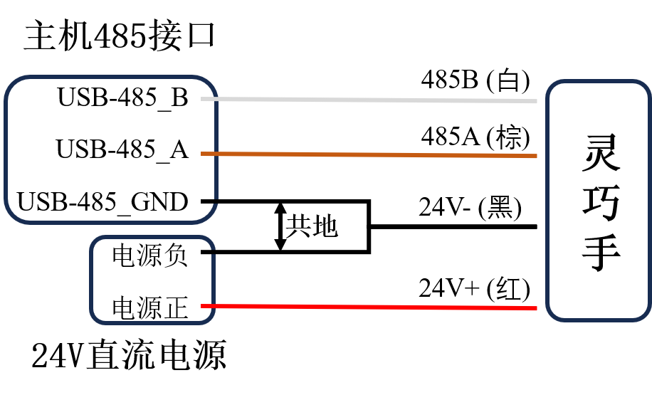

# ROHand 灵巧手问答

## 一、电气

### 1.问：ROHand如何接线？

    答：ROHand从手腕处引出一根四芯线，颜色定义为：

| 线色  | 端子定义 |
| :---: | :------: |
| 红色  | 电源24V+ |
| 黑色  | 电源24V- |
| 棕色  | RS485_A  |
| 白色  | RS485_B  |

当主机和灵巧手供电电源不为同一电源时，需要将灵巧手和主机进行共地处理，具体做法为将电源负和USB转485模块的GND短接。

若灵巧手连接其他设备，如机械臂，以睿尔曼RM65机械臂为例(定制版)，测试线颜色定义为：

| 序号  | 端子定义 |
| :---: | :------: |
|   1   | RS485_A  |
|   2   | RS485_B  |
|   3   |    空    |
|   4   |    空    |
|   5   | 电源24V- |
|   6   | 电源24V+ |

接线方式如下图所示：


### 2.问：ROHand通讯异常、无法升级如何解决？

    答：按照以下流程进行检测：当灵巧手通讯异常，或在升级固件时提示升级失败，请首先检查线路连接有无接触不良或断开的情况，其次确认供电电源和USB转485模块之间是否做了共地处理，参考上方接线图。若线路连接正确，仍无法升级，请联系傲意技术支持。

### 3.问: ROHand的工作电压范围？

    答: ROHand工作电压可接受范围在12 ~ 32V，额定功率为48W，额定电压为24V. 使用超过32V的电压请注意不要带电热插拔，否则会造成电子器件损坏。

### 4.问：ROHand的电流参数？

    答：一代版本的ROHand在24V电压下的静态电流为0.12A，空载运动平均电流为0.25A，最大握力抓取电流为1.9A。

## 二、协议

### 1.问: 如何编程控制灵巧手？

    答: 基于ModBus-RTU协议，使用*write_registers*指令，写手指位置寄存器*ROH_FINGER_POS_TARGET0 ~ ROH_FINGER_POS_TARGET5*，分别对应大拇指弯曲、食指弯曲、中指弯曲、无名指弯曲、小指弯曲、大拇指旋转，寄存器值为0 ~ 65535，0表示手指完全伸直，65535表示手指完全弯曲，大拇指旋转0为0°侧掌位，65535表示90°对掌位。详情请参考[roh_registers_v1.h](roh_registers_v1.h)/[roh_registers_v1.py](roh_registers_v1.py)，示例代码见附录1。

### 2.问: 如何获取手指角度以及控制手指角度？

    答: 获取手指角度是通过读手指角度寄存器*ROH_FINGER_ANGLE0 ~ ROH_FINGER_ANGLE5*，获取值为-32768 ~ 32767的有符号数，是实际角度\*100之后的值；控制手指角度是通过写手指角度寄存器*ROH_FINGER_ANGLE_TARGET0 ~ ROH_FINGER_ANGLE_TARGET5*，输入值为-32768 ~ 32767的有符号数，是实际角度\*100之后的值。例：欲控制食指弯曲到101.01°，则将10101写入*ROH_FINGER_ANGLE_TARGET1*寄存器，此时读*ROH_FINGER_ANGLE1*寄存器的值为10101，则手指角度为101.01°。手指角度默认为手指第一关节和掌平面的夹角，详细定义请参考[OHandModBusRTUProtocol_CN.md](OHandModBusRTUProtocol_CN.md)协议文档。

### 3.问: 如何获取手指角度范围？

    答: 每个灵巧手的手指角度范围因工艺会有细微差别，因此需要获取实际的角度范围，可通过分别在*ROH_FINGER_POS_TARGET0 ~ ROH_FINGER_POS_TARGET5*寄存器中写入0和65535，对应手指的最大角度和最小角度。此时读取*ROH_FINGER_ANGLE0 ~ ROH_FINGER_POS_ANGLE5*寄存器，获取到的值即为实际的角度上限和下限。代码参考附录2

### 4.问: 如何简单判断灵巧手是否抓取到物体？

    答: 力反馈功能将在下一个版本发布，目前版本是通过*read_holding_registers*指令，读取手指状态寄存器*ROH_FINGER_STATUS0 ~ ROH_FINGER_STATUS5*，判断电机状态码是否为5(STATUS_STUCK)电机堵转，堵转则为抓取到物体。或者通过写电流限制值寄存器*ROH_FINGER_CURRENT_LIMIT0 ~ ROH_FINGER_CURRENT_LIMIT5*，将电流限制值设置为特定值，电机堵转电流超过限制值后停止运行，重新写入目标位置值后会自动重启。

### 5.问：手指运动时为什么会有抖动？

    答: 灵巧手内部采用PID控制算法，抖动是由于PID参数设置不合理导致的，建议用户根据实际使用场景，在OHandSetting目录下的桌面端工具OHandSetting.exe调整PID参数，使灵巧手运动更加平滑。

### 6.问：灵巧手最高波特率和命令处理频率是多少？

    答：一代灵巧手最高波特率为115200，最高波特率下，用原生的USB转485，可以支持60Hz的命令处理频率，用专用串行控制协议复合指令，可达到90-100左右。下一代灵巧手支持自动波特率，最高波特率可达921600。

## 三、附录

### 1.控制灵巧手示例python代码

```python
import time

from pymodbus import FramerType
from pymodbus.client import ModbusSerialClient
from roh_registers_v1 import *

COM_PORT = 'COM1'
NODE_ID = 2

client = ModbusSerialClient(COM_PORT, FramerType.RTU, 115200)
client.connect()

if __name__ == "__main__":

    # 握拳
    resp = client.write_registers(ROH_FINGER_POS_TARGET1, [65535, 65535, 65535, 65535, 65535], NODE_ID)
    time.sleep(2)
    resp = client.write_registers(ROH_FINGER_POS_TARGET0, 65535, NODE_ID)
    time.sleep(2)

    # 张开
    resp = client.write_registers(ROH_FINGER_POS_TARGET0, 0, NODE_ID)
    time.sleep(2)
    resp = client.write_registers(ROH_FINGER_POS_TARGET1, [0, 0, 0, 0, 0], NODE_ID)
    time.sleep(2)

    # 写手指角度, 写入值为实际值*100
    real_angle = 15.05
    target_angle = round(real_angle * 100)

    if (target_angle < 0) :
        target_angle += 65536

    resp = client.write_registers(ROH_FINGER_ANGLE_TARGET0, [target_angle], NODE_ID)
    time.sleep(2)
    
    # 读手指当前角度, 实际值为输出值/100
    resp = client.read_holding_registers(ROH_FINGER_ANGLE0, 1, NODE_ID)
    current_angle = resp.registers

    if (current_angle > 32767) :
        current_angle -= 65536

    current_angle = current_angle  / 100.0

    print("当前手指角度：", current_angle)
```

### 2.获取灵巧手角度范围示例

```python
import time

from pymodbus import FramerType
from pymodbus.client import ModbusSerialClient
from roh_registers_v1 import *

COM_PORT = 'COM1'
NODE_ID = 2

client = ModbusSerialClient(COM_PORT, FramerType.RTU, 115200)
client.connect()

if __name__ == "__main__":

    # 握拳
    resp = client.write_registers(ROH_FINGER_POS_TARGET1, [65535, 65535, 65535, 65535, 65535], NODE_ID)
    time.sleep(2)
    resp = client.write_registers(ROH_FINGER_POS_TARGET0, 65535, NODE_ID)
    time.sleep(2)

    # 张开
    resp = client.write_registers(ROH_FINGER_POS_TARGET0, 0, NODE_ID)
    time.sleep(2)
    resp = client.write_registers(ROH_FINGER_POS_TARGET1, [0, 0, 0, 0, 0], NODE_ID)
    time.sleep(2)

    # 写手指角度, 写入值为实际值*100
    real_angle = 15.05
    target_angle = round(real_angle * 100)

    if (target_angle < 0) :
        target_angle += 65536

    resp = client.write_registers(ROH_FINGER_ANGLE_TARGET0, [target_angle], NODE_ID)
    time.sleep(2)
    
    # 读手指当前角度, 实际值为输出值/100
    resp = client.read_holding_registers(ROH_FINGER_ANGLE0, 1, NODE_ID)
    current_angle = resp.registers

    if (current_angle > 32767) :
        current_angle -= 65535

    current_angle = current_angle  / 100.0

    print("当前手指角度：", current_angle)
```
