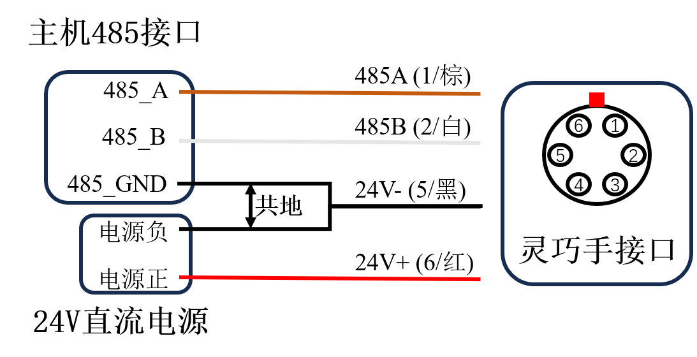

# ROHand 灵巧手问答

## 硬件

### 1. 问：ROHand如何接线？

**答:** ROHand从手腕处引出一根四芯线，颜色定义为：

| 线色  |   端子定义    |
| :---: | :-----------: |
| 红色  |   电源24V+    |
| 黑色  |   电源24V-    |
| 棕色  | RS485_A/CAN_L |
| 白色  | RS485_B/CAN_H |

**重要事项:** 当主机和灵巧手供电电源不为同一电源时，需要将灵巧手和主机进行共地处理，具体做法为将电源负和USB转485模块的GND短接。


**与机械臂链接 (如 RM65):**

| 序号  | 颜色  | 端子定义 |
| :---: | :---: | :------: |
|   1   | 棕色  | RS485_A  |
|   2   | 白色  | RS485_B  |
|   3   |  空   |    空    |
|   4   |  空   |    空    |
|   5   | 黑色  | 电源24V- |
|   6   | 红色  | 电源24V+ |

接线方式如下图所示：


---

### 2. 问：ROHand通讯异常、无法升级如何解决？

**答:** 按照以下步骤:

1. 确认通讯接口相同，请勿使用RS485对CAN版本的灵巧手进行通讯。
2. 确认使用的是OYMotion提供的USB转RS485模块或USB转PCAN模块。
3. 检查接线是否松动或损坏，使用快速接线端子时，确保接触线缆金属部分,或使用接线端子钳将线缆装好端子。
   
4. 确认是否做了共地处理（参考上方接线图）
5. 若线路连接正确，仍通讯异常，尝试接上120Ω终端电阻，即将所提供的USB转RS485模块的A端口和R端口短接（端口2和3）。如下图所示：
   
6. 若仍无法解决，请联系傲意技术支持。

---

### 3. 问: ROHand的工作电压范围？

**答:** ROHand工作电压可接受范围在12 ~ 24V:

- 额定电压: 24 V
- 额定功率: 48 W  
**注:** 功率低于额定功率时，蜂鸣器会周期性地发声。

---

### 4. 问：ROHand的电流参数？

**答:** 24V供电时，电流参数如下:

- 静态电流: 约0.12 A
- 空载运动电流: 约0.25 A
- 最大握力五指抓取电流: 约2.0 A

---

### 5. 问：为什么在零位时，手指会有持续电流输出，且大拇指旋转无法归零？

**答:** 属正常现象:

- PID控制算法在零位时保持位置精度
- 大拇指有预设1°的偏移以减少手皮产生的阻力

---

### 6. 问：ROHand手指自检时无法张开？

**答:** 灵巧手开机自检所有手指会张开，若遇到无法张开的情况:

1. 首先检查结构损伤:
   - 关节弹簧是否断裂
   - 手指丝杆螺母和手指的连接件是否脱落
   - 丝杆内部是否有异物或者液体
2. 检查是否手指互相干涉(食指和大拇指之间)

---

## 软件

### 1. 问: 如何编程控制灵巧手？

**答:** 使用ModBus-RTU协议写入位置寄存器:

- 寄存器地址: 从 `ROH_FINGER_POS_TARGET0` 到 `ROH_FINGER_POS_TARGET5`
- 数值: 从0 (完全打开) 到 65535 (完全闭合)  
大拇指旋转: 从0 (0° 侧掌位) 到 65535 (90° 对掌位)

参考:  
[roh_registers_v1.h](../protocol/roh_registers_v1.h) / [roh_registers_v1.py](../protocol/roh_registers_v1.py)  
示例程序：[附录1](#附录-1-基础控制)

---

### 2. 问: 如何获取手指角度以及控制手指角度？

**答:**
**1.获取角度:**  

- 寄存器地址: 从`ROH_FINGER_ANGLE0` 到 `ROH_FINGER_ANGLE5`
- 读取数值（带符号整型） ≥ 32768: `实际角度 = (获取角度 - 65535) ÷ 100`
- 读取数值（带符号整型） < 32768: `实际角度 = (获取角度) ÷ 100`

**2.设置角度:**  

- 写寄存器: 从 `ROH_FINGER_ANGLE_TARGET0` 到 `ROH_FINGER_ANGLE_TARGET5`  
- 输入数值（带符号整型） ≥ 32768: `设置角度 = (期望角度 - 65535) × 100`
- 输入数值（带符号整型） < 32768: `设置角度 = (期望角度) × 100`  

**重要事项:**

- 角度下限 ≤ 设置角度 ≤ 角度上限：`获取角度 = 设置角度`
- 设置角度 ≥ 角度上限：`获取角度 = 角度上限`
- 设置角度 ≤ 角度下限：`获取角度 = 角度下限`

**示例:**  

- 设置食指运动到 101.01° → 写入 10101 到 `ROH_FINGER_ANGLE_TARGET1`  
- 示例程序：[附录1](#附录-1-基础控制)

**注:**  
手指角度默认为手指第一关节和掌平面的夹角。详细定义请参考: [OHandModBusRTUProtocol_CN.md](../protocol/OHandModBusRTUProtocol_CN.md)

---

### 3. 问: 如何获取手指角度范围？

**答:** 每台灵巧手的角度范围会有细微差别. 获取实际范围:  

1. 写入 0 到寄存器 `ROH_FINGER_POS_TARGETx` → 读取寄存器 `ROH_FINGER_ANGLEX` (最大角度)
2. 写入 65535 到寄存器 `ROH_FINGER_POS_TARGETx` → 读取寄存器 `ROH_FINGER_ANGLEX` (最小角度)  

示例程序: [附录2](#附录-2-获取手指角度范围)

---

### 4. 问：如何检测抓到物体？

**答:** 通过读取状态寄存器 `ROH_FINGER_STATUSx`

- 通过读取状态寄存器 `ROH_FINGER_STATUS0`-`ROH_FINGER_STATUS5`
- 状态码 5 (`STATUS_STUCK`) 表示电机堵转，则为抓到物体

---

### 5. 问：手指运动时为什么会有抖动？

**答:** 抖动是由于PID参数设置不合理导致的. 使用 OHandSetting.exe 调整参数.

---

### 6. 问：灵巧手最高波特率和命令处理频率是多少？

**答:**

- **RS485:** 115200 bps 波特率
- 在波特率 115200 bps: 60 Hz 命令处理频率
- 用专用串行控制协议复合指令: 90-100 Hz
- **CAN:** 1 Mbps 波特率

---

### 7. 问：灵巧手支持哪些控制模式？

**答:** 支持以下模式：

- **位置控制:** 直接电机定位
- **角度控制:** 角度→位置转换

---

### 8. 问: 电机采用什么控制算法？

**答:** 基于PID的位置控制，具备：

- 实时速度/电流监控
- 堵转保护（>500mA时脉冲式重试）
- 堵转发热时保护逻辑：[附录3](#附录-3-减少灵巧手堵转发热程序示例)

---

### 9. 问：Ubuntu上怎么安装CH340驱动？

**答:**

1. 安装CH340驱动: [Download](https://www.wch.cn/downloads/CH341SER_EXE.html)
2. 设备将显示为:  `/dev/ttyUSB0`
3. 验证: `ls /dev/ttyUSB*`
4. 若未识别，检查其他服务冲突，如`brltty`

---

### 10. 问: 如何避免抖动和过热?

**答:**

- 减少目标值频繁更新
- 实现基于运动方向控制:[附录4](#附录-4-灵巧手避免抖动和发热程序示例)
- 仅在方向变化时发送指令

---

### 11. 问: 如何获取工厂数据?

**答:**  使用ModBus-RTU协议读取位置寄存器:

- 寄存器地址: `ROH_MANU_DATA0` - `ROH_MANU_DATA12`  
  - 子类型: `ROH_MANU_DATA0` 读取到的数据字节的高位  
  - 硬件修改版本: `ROH_MANU_DATA0` 读取到的数据字节的低位  
  - 序列号: `ROH_MANU_DATA1` - `ROH_MANU_DATA8`  
  - 客户标记: `ROH_MANU_DATA9` - `ROH_MANU_DATA12`

示例代码：[附录5](#附录-5-获取工厂数据)

---

### 12. 问: 如何设置堵转保护?

**答:**  使用ModBus-RTU协议写入位置寄存器:

- 寄存器地址:  
  - 堵转速度: `ROH_FINGER_STALL_SPEED0` - `ROH_FINGER_STALL_SPEED5`, 当电机的运行速度低于该设定值时，电机进入堵转保护模式  
  - 堵转电流: `ROH_FINGER_STALL_CURRENT0` - `ROH_FINGER_STALL_CURRENT5`, 当电机运行时电流大于该设定值，电机进入堵转保护模式，单位 mA   
  - 堵转时间: `ROH_FINGER_STOP_AFTER_PERIOD0` - `ROH_FINGER_STOP_AFTER_PERIOD5`, 电机堵转时单次尝试运行的时间，单位ms  
  - 重试时间: `ROH_FINGER_RETRY_AFTER_PERIOD0` - `ROH_FINGER_RETRY_AFTER_PERIOD5`, 堵转时电机两次尝试运行之间的时间间隔，单位 ms  

示例代码：[附录6](#附录-6-设置堵转保护)

---

### 13. 问: 如何设置速度控制?

**答:**  使用ModBus-RTU协议写入位置寄存器:

- 寄存器地址:  
  - 刹车距离: `ROH_SPEED_CTRL_BRAKE_DISTANCE`, 手指在距离目标位置只有设置值时开始减速，直到平稳停在目标位置  
  - 加速距离: `ROH_SPEED_CTRL_ACCEL_DISTANCE`, 手指在开始运动时的这段位置开始逐步加速至最大速度  
  - 速度系数: `ROH_SPEED_CTRL_PID_SPEED_RATIO`, 加速度系数  

示例代码：[附录7](#附录-7-设置速度控制)

---

## 附录

### 附录 1. 基础控制

```python
import time

from pymodbus import FramerType
from pymodbus.client import ModbusSerialClient
from roh_registers_v1 import *

COM_PORT = 'COM1'
NODE_ID = 2

client = ModbusSerialClient(COM_PORT, FramerType.RTU, 115200)
client.connect()

if __name__ == "__main__":

    # Make a fist
    resp = client.write_registers(ROH_FINGER_POS_TARGET1, [65535, 65535, 65535, 65535, 65535], NODE_ID)
    time.sleep(2)
    resp = client.write_registers(ROH_FINGER_POS_TARGET0, 65535, NODE_ID)
    time.sleep(2)

    # Open
    resp = client.write_registers(ROH_FINGER_POS_TARGET0, 0, NODE_ID)
    time.sleep(2)
    resp = client.write_registers(ROH_FINGER_POS_TARGET1, [0, 0, 0, 0, 0], NODE_ID)
    time.sleep(2)

    # Write finger angle, the value written is actual value * 100
    real_angle = 15.05
    target_angle = round(real_angle * 100)

    if (target_angle < 0) :
        target_angle += 65536

    resp = client.write_registers(ROH_FINGER_ANGLE_TARGET0, [target_angle], NODE_ID)
    time.sleep(2)
    
    # Read the current finger angle, the actual value is output value / 100
    resp = client.read_holding_registers(ROH_FINGER_ANGLE0, 1, NODE_ID)
    current_angle = resp.registers

    if (current_angle > 32767) :
        current_angle -= 65536

    current_angle = current_angle  / 100.0

    print("Current finger angle：", current_angle)
```

### 附录 2. 获取手指角度范围

```python
import time

from pymodbus import FramerType
from pymodbus.client import ModbusSerialClient
from roh_registers_v1 import *

COM_PORT = 'COM1'
NODE_ID = 2

client = ModbusSerialClient(COM_PORT, FramerType.RTU, 115200)
client.connect()

if __name__ == "__main__":

    # Make a fist
    resp = client.write_registers(ROH_FINGER_POS_TARGET1, [65535, 65535, 65535, 65535, 65535], NODE_ID)
    time.sleep(2)
    resp = client.write_registers(ROH_FINGER_POS_TARGET0, 65535, NODE_ID)
    time.sleep(2)

    # Open
    resp = client.write_registers(ROH_FINGER_POS_TARGET0, 0, NODE_ID)
    time.sleep(2)
    resp = client.write_registers(ROH_FINGER_POS_TARGET1, [0, 0, 0, 0, 0], NODE_ID)
    time.sleep(2)

    # Write finger angle, the value written is actual value * 100
    real_angle = 15.05
    target_angle = round(real_angle * 100)

    if (target_angle < 0) :
        target_angle += 65536

    resp = client.write_registers(ROH_FINGER_ANGLE_TARGET0, [target_angle], NODE_ID)
    time.sleep(2)
    
    # Read the current finger angle, the actual value is output value / 100
    resp = client.read_holding_registers(ROH_FINGER_ANGLE0, 1, NODE_ID)
    current_angle = resp.registers

    if (current_angle > 32767) :
        current_angle -= 65536

    current_angle = current_angle  / 100.0

    print("Current finger angle：", current_angle)
```

### 附录 3. 减少灵巧手堵转发热程序示例

```python
# Sample code to get glove data and controls ROHand via ModBus-RTU protocol

import asyncio
import os
import signal
import sys
import time

from pymodbus import FramerType
from pymodbus.client import ModbusSerialClient

from roh_registers_v1 import *

# ROHand configuration
COM_PORT = "COM1"
NODE_ID = 2
NUM_FINGERS = 6

current_dir = os.path.dirname(os.path.realpath(__file__))
parent_dir = os.path.dirname(current_dir)
sys.path.append(parent_dir)


class Application:

    def __init__(self):
        signal.signal(signal.SIGINT, lambda signal, frame: self._signal_handler())
        self.terminated = False

    def _signal_handler(self):
        print("You pressed ctrl-c, exit")
        self.terminated = True

    def write_registers(self, client, address, values, node_id):
        resp = client.write_registers(address, values, node_id)
        if resp.isError():
            print("client.write_registers() returned", resp)
            return False
        else :
            return True

    async def main(self):
        client = ModbusSerialClient(COM_PORT, FramerType.RTU, 115200)
        client.connect()

        self.write_registers(client, ROH_FINGER_SPEED0, [65535, 65535, 65535, 65535, 65535], NODE_ID)

        # Open all fingers
        self.write_registers(client, ROH_FINGER_POS_TARGET0, [0, 0, 0, 0, 0], NODE_ID)
        time.sleep(1.5)

        # Rotate thumb root to opposite
        print("Moving thumb root...")
        status_tmbRoot = client.read_holding_registers(ROH_FINGER_STATUS5, 1, NODE_ID)

        while status_tmbRoot.registers == 5:
            print("Thumb root stuck, retrying...")
            self.write_registers(client, ROH_FINGER_POS_TARGET5, [0], NODE_ID)
            status = client.read_holding_registers(ROH_FINGER_STATUS5, 1, NODE_ID)

        self.write_registers(client, ROH_FINGER_POS_TARGET5, [65535], NODE_ID)
        time.sleep(1.5)

        pos = [65535, 65535, 65535, 65535, 65535]
        pos_copy = pos.copy()

        while not self.terminated:

            status = client.read_holding_registers(ROH_FINGER_STATUS0, 5, NODE_ID)

            for i in range(5):
                if status.registers[i] == 5:
                    print("Finger", i, "is stuck")
                    # If finger is stuck, set target position to current position
                    resp = client.read_holding_registers(ROH_FINGER_POS0 + i, 1, NODE_ID)
                    pos_copy[i] = resp.registers
                else:
                    pos_copy[i] = pos[i]

            self.write_registers(client, ROH_FINGER_POS_TARGET0, pos, NODE_ID)


if __name__ == "__main__":
    app = Application()
    asyncio.run(app.main())
```

### 附录 4. 灵巧手避免抖动和发热程序示例

```python

TOLERANCE = round(65536 / 32)  # 判断目标位置变化的阈值，位置控制模式时为整数，角度控制模式时为浮点数
SPEED_CONTROL_THRESHOLD = 8192 # 位置变化低于该值时，线性调整手指运动速度

prev_dir = [0 for _ in range(NUM_FINGERS)]
prev_finger_data = [0 for _ in range(NUM_FINGERS)]

while True:
    finger_data = get_latest_data() # Obtain target position/angle

    dir = [0 for _ in range(NUM_FINGERS)]
    pos = [0 for _ in range(NUM_FINGERS)]
    target_changed = False

    for i in range(NUM_FINGERS):
        if finger_data[i] > prev_finger_data[i] + TOLERANCE:
            prev_finger_data[i] = finger_data[i]
            dir[i] = 1
        elif finger_data[i] < prev_finger_data[i] - TOLERANCE:
            prev_finger_data[i] = finger_data[i]
            dir[i] = -1

        # 只在方向发生变化时发送目标位置/角度
        if dir[i] != prev_dir[i]:
            prev_dir[i] = dir[i]
            target_changed = True

        if dir[i] == -1:
            pos = 0
        elif dir[i] == 0:
            pos = finger_data[i]
        else:
            pos = 65535

        if target_changed:
            # 获取当前位置
            curr_pos = [0 for _ in range(NUM_FINGERS)]
            resp = client.read_holding_registers(ROH_FINGER_POS0, NUM_FINGERS, NODE_ID)
            curr_pos = resp.registers

            speed = [0 for _ in range(NUM_FINGERS)]

            for i in range(NUM_FINGERS):
                temp = interpolate(abs(curr_pos[i] - finger_data[i]), 0, SPEED_CONTROL_THRESHOLD, 0, 65535)
                speed[i] = clamp(round(temp), 0, 65535)

            # 设置速度
            resp = client.write_register(ROH_FINGER_SPEED0, speed, NODE_ID)
            print(f"client.write_register({ROH_FINGER_SPEED0}, {speed}, {NODE_ID}) returned", resp)

            # 控制ROHand
            resp = client.write_register(ROH_FINGER_POS_TARGET0, pos, NODE_ID)
            print(f"client.write_register({ROH_FINGER_POS_TARGET0}, {pos}, {NODE_ID}) returned", resp)
```

### 附录 5: 获取工厂数据

```python

import sys
import os

from pymodbus import FramerType
from pymodbus.client import ModbusSerialClient
from pymodbus.exceptions import ModbusException
from serial.tools import list_ports


sys.path.append(os.path.abspath(os.path.join(os.path.dirname(__file__), '..')))
from roh_registers_v1 import *

NODE_ID = 2

def find_comport(port_name):
    """
    Find available serial port automatically
    :param port_name: Characterization of the port description, such as "CH340"
    :return: Comport of device if successful, None otherwise
    """
    ports = list_ports.comports()
    for port in ports:
        if port_name in port.description:
            return port.device
    return None

def read_registers(client, address, count):
    """
    Read data from Modbus device.
    :param client: Modbus client instance
    :param address: Register address
    :param count: Register count to be read
    :return: List of registers if successful, None otherwise
    """
    try:
        resp = client.read_holding_registers(address, count, NODE_ID)
        if resp.isError():
            return None
        return resp.registers
    except ModbusException as e:
        print("ModbusException:{0}".format(e))
        return None

def register_value_to_chars(register_value):
    char1 = chr((register_value >> 8) & 0xFF)
    char2 = chr(register_value & 0xFF)
    return char1, char2

def main():
    sub_model = 0
    hw_modify_version = 0
    serial_number = ''
    customer_tag = ''

    client = ModbusSerialClient(find_comport("CH340"), FramerType.RTU, 115200)

    if not client.connect():
        print("Failed to connect to Modbus device")
        exit(-1)

    resp = read_registers(client, ROH_MANU_DATA0, 1)
    if resp is not None:
        sub_model = (resp[0] >> 8) & 0xFF
        hw_modify_version = (resp[0]) & 0xFF
        print(f"sub_model: {sub_model}, hw_modify_version: {hw_modify_version}")

    # serial_number
    for i in range(8):
        resp = read_registers(client, ROH_MANU_DATA1 + i, 1)
        if resp is not None:
            c1, c2 = register_value_to_chars(resp[0])
            if c1 != '\0':
                serial_number += c1
            if c2 != '\0':
                serial_number += c2
            print(f"serial_number: {serial_number}")

    # customer_tag
    for i in range(4):
        resp = read_registers(client, ROH_MANU_DATA9 + i, 1)
        if resp is not None:
            c1, c2 = register_value_to_chars(resp[0])
            customer_tag += c1 + c2
            print(f"customer_tag: {customer_tag}")

if __name__ == "__main__":
    main()

```

### 附录 6: 设置堵转保护

```python

import sys
import os

from pymodbus import FramerType
from pymodbus.client import ModbusSerialClient
from pymodbus.exceptions import ModbusException
from serial.tools import list_ports

sys.path.append(os.path.abspath(os.path.join(os.path.dirname(__file__), '..')))
from common.roh_registers_v1 import *

NODE_ID = 2
NUM_MOTORS = 6

STALL_SPEED = 16
STALL_CURRENT = 200
STOP_AFTER_PERIOD = 300
RETRY_AFTER_PERIOD = 500

def find_comport(port_name):
    """
    Find available serial port automatically
    :param port_name: Characterization of the port description, such as "CH340"
    :return: Comport of device if successful, None otherwise
    """
    ports = list_ports.comports()
    for port in ports:
        if port_name in port.description:
            return port.device
    return None

def write_registers(client, address, values):
    """
    Write data to Modbus device.
    :param client: Modbus client instance
    :param address: Register address
    :param values: Data to be written
    :return: True if successful, False otherwise
    """
    try:
        resp = client.write_registers(address, values, NODE_ID)
        if resp.isError():
            print("client.write_registers() returned", resp)
            return False
        return True
    except ModbusException as e:
        print("ModbusException:{0}".format(e))
        return False

def main():
    client = ModbusSerialClient(find_comport("CH340"), FramerType.RTU, 115200)

    if not client.connect():
        print("Failed to connect to Modbus device")
        exit(-1)

    for i in range(NUM_MOTORS):
        if not write_registers(client, ROH_FINGER_STALL_SPEED0 + i, STALL_SPEED):
            print(f"Failed to write finger{i} stall speed")
        if not write_registers(client, ROH_FINGER_STALL_CURRENT0 + i, STALL_CURRENT):
            print(f"Failed to write finger{i} stall current")
        if not write_registers(client, ROH_FINGER_STOP_AFTER_PERIOD0 + i, STOP_AFTER_PERIOD):
            print(f"Failed to write finger{i} stop after period")
        if not write_registers(client, ROH_FINGER_RETRY_AFTER_PERIOD0 + i, RETRY_AFTER_PERIOD):
            print(f"Failed to write finger{i} retry after period")

if __name__ == "__main__":
    main()

```

### 附录 7: 设置速度控制

```python

import sys
import os

from pymodbus import FramerType
from pymodbus.client import ModbusSerialClient
from pymodbus.exceptions import ModbusException
from serial.tools import list_ports

sys.path.append(os.path.abspath(os.path.join(os.path.dirname(__file__), '..')))
from common.roh_registers_v1 import *

NODE_ID = 2
NUM_MOTORS = 6

PID_FACTOR = 100

BRAKE_DISTANCE = 1024
ACCEL_DISTANCE = 1024
PID_SPEED_RATIO = 0.5

def find_comport(port_name):
    """
    Find available serial port automatically
    :param port_name: Characterization of the port description, such as "CH340"
    :return: Comport of device if successful, None otherwise
    """
    ports = list_ports.comports()
    for port in ports:
        if port_name in port.description:
            return port.device
    return None

def write_registers(client, address, values):
    """
    Write data to Modbus device.
    :param client: Modbus client instance
    :param address: Register address
    :param values: Data to be written
    :return: True if successful, False otherwise
    """
    try:
        resp = client.write_registers(address, values, NODE_ID)
        if resp.isError():
            print("client.write_registers() returned", resp)
            return False
        return True
    except ModbusException as e:
        print("ModbusException:{0}".format(e))
        return False

def main():
    client = ModbusSerialClient(find_comport("CH340"), FramerType.RTU, 115200)

    if not client.connect():
        print("Failed to connect to Modbus device")
        exit(-1)

    if not write_registers(client, ROH_SPEED_CTRL_BRAKE_DISTANCE, BRAKE_DISTANCE):
        print(f"Failed to write speed ctrl brake distance")
    if not write_registers(client, ROH_SPEED_CTRL_ACCEL_DISTANCE, ACCEL_DISTANCE):
        print(f"Failed to write speed ctrl accel distance")
    if not write_registers(client, ROH_SPEED_CTRL_PID_SPEED_RATIO, int(PID_SPEED_RATIO * PID_FACTOR)):
        print(f"Failed to write speed ctrl pid speed ratio")

if __name__ == "__main__":
    main()

```