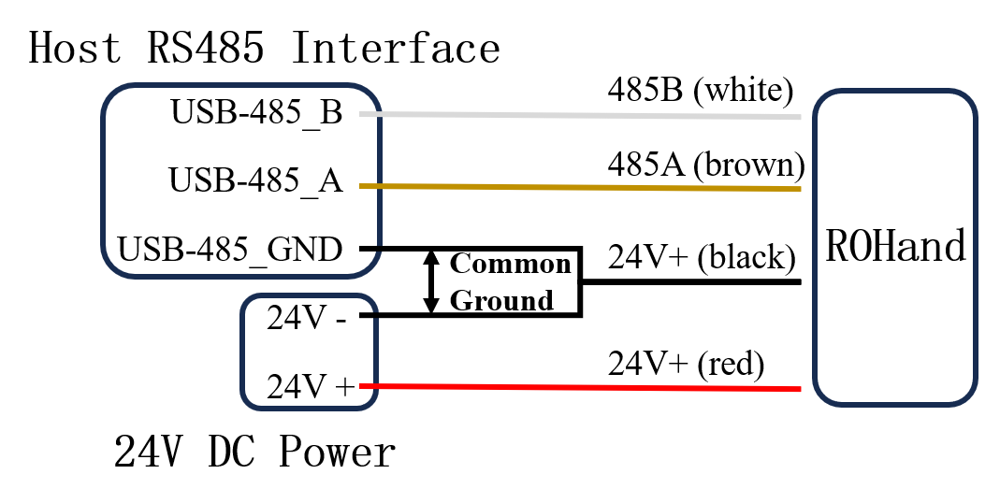
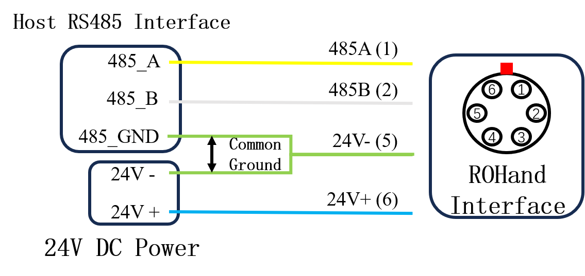

# ROHand Q&A

## Electrical

### 1.Q:How to connect ROHand?

A: ROHand has a four-core cable connected from the wrist, the color definition is:

| Color | Definition |
| :---: | :--------: |
|  Red  | Power 24V+ |
| Black | Power 24V- |
| Brown |  RS485_A   |
| White |  RS485_B   |

When the power supply of the host and the ROHand is not the same power supply, it is necessary to connect the ROHand and the host to the same ground, that is, short-circuit the negative power supply of the power supply and the GND of the USB to 485 module.

When ROHand is connected to other devices, such as a robotic arm, for example, the RM65 robotic arm (custom version), the test line color definition is:

| Serial No. |     Color      | Definition |
| :--------: | :------------: | :--------: |
|     1      |     Green      |  RS485_A   |
|     2      |      Blue      |  RS485_B   |
|     3      |      NULL      |    NULL    |
|     4      |      NULL      |    NULL    |
|     5      | Yellow & Black | Power 24V- |
|     6      |      Red       | Power 24V+ |

Wiring method is as follows:


### 2. Q: How to solve the problem that ROHand communication is abnormal and cannot be upgraded?

A: Please make sure the USB to RS485 module is provided by OYMotion, and test it according to the following process: When the communication of ROHand is abnormal, or the upgrade fails when upgrading the firmware, please firstly, check the wiring connection with or without poor contact or disconnection, and secondly, make sure the power supply and the USB to RS485 module have been processed with a common ground, please refer to the wiring diagram above. If the wiring connection is correct, but the communication is still abnormal, please try to connect the 120Ω termination resistor, i.e. short the A port and R port of the provided USB to RS485 module. If the problem still cannot be solved, please contact technical support.

### 3.Q: What is the working voltage range of ROHand?

A: ROHand can accept a working voltage range of 12 ~ 32V, rated power of 48W, and rated voltage of 24V. Please note that do not hot plug and unplug the power supply over 32V, otherwise it may cause damage to the electronic components.

### 4.Q: What is the current parameter of ROHand?

A: The static current of the first-generation ROHand under 24V voltage is 0.12A, the average current under no-load motion is 0.25A, and the maximum gripping current under maximum gripping force is 1.9A.

### 5. Q: Why is there a continuous current output in the finger at zero position and the thumb rotation cannot be zeroed?

A: Due to the PID control algorithm inside the dexterous hand, when the motor position has internal or external reasons for error, the algorithm to make it maintain in the zero position, so there will be a continuous current output in the zero position, which is a normal phenomenon. Thumb rotation can not be zeroed in order to reduce the side of the hand skin accumulation of stress, set 1 ° offset angle to reduce the range of motion, also belongs to the normal phenomenon.

## Software

### 1.Q: How to program ROHand?

A:Based on the ModBus-RTU protocol, use the *write_registers* command to write to the finger position registers *ROH_FINGER_POS_TARGET0 ~ ROH_FINGER_POS_TARGET5*. These correspond to the bending of the thumb, index finger, middle finger, ring finger, little finger, and thumb rotation, respectively. The register values range from 0 to 65535, where 0 indicates the finger is fully extended and 65535 indicates the finger is fully bent. For thumb rotation, 0 represents 0° side palm position, and 65535 represents 90° palm position. For details, please refer to [roh_registers_v1.h](roh_registers_v1.h)/[roh_registers_v1.py](roh_registers_v1.py). Example code is provided in Appendix 1.

### 2.Q: How to get the finger angle and control the finger angle?

A:To get the finger angles, read the finger angle registers *ROH_FINGER_ANGLE0 ~ ROH_FINGER_ANGLE5*. The values are signed integers ranging from -32768 to 32767, representing the actual angle multiplied by 100. To control the finger angles, write to the finger angle target registers *ROH_FINGER_ANGLE_TARGET0 ~ ROH_FINGER_ANGLE_TARGET5*. The input values are also signed integers ranging from -32768 to 32767, representing the actual angle multiplied by 100. For example, to bend the index finger to 101.01°, write 10101 to the *ROH_FINGER_ANGLE_TARGET1* register. At this point, reading the *ROH_FINGER_ANGLE1* register will return 10101, indicating that the finger angle is 101.01°. The default finger angle is the angle between the first joint of the finger and the palm plane. For detailed definitions, please refer to the [OHandModBusRTUProtocol_EN.md](OHandModBusRTUProtocol_EN.md) protocol documentation.

### 3.Q： How to get the finger angle range?

A:The range of finger angles for each dexterous hand may vary slightly due to manufacturing differences. To get the actual angle range, write 0 and 65535 to the *ROH_FINGER_POS_TARGET0 ~ ROH_FINGER_POS_TARGET5* registers, corresponding to the maximum and minimum angles of the fingers, respectively. At this point, reading the *ROH_FINGER_ANGLE0 ~ ROH_FINGER_ANGLE5* registers will provide the actual upper and lower limits of the angles. For example, writing 0 to *ROH_FINGER_POS_TARGET1* will extend the index finger, and writing 65535 will bend it to its maximum extent. The resulting values in the *ROH_FINGER_ANGLE1* register will indicate the actual angles. The default finger angle is the angle between the first joint of the finger and the palm plane. For detailed definitions, please refer to the [OHandModBusRTUProtocol_EN.md](OHandModBusRTUProtocol_EN.md) protocol documentation. Example code is provided in Appendix 2.

### 4. Q: How can I simply tell if a dexterity hand is grabbing an object? Can it be judged by the force value?

A: The force feedback function will be released in the next version of ROH-AP001. Currently, the force value of ROH-A001 is based on the motor current and torque curves, and it is not possible to accurately determine the force of the fingers after the mechanical structure is conducted. And the judgment to grab the object is through *read_holding_registers* instruction, read the finger status register *ROH_FINGER_STATUS0 ~ ROH_FINGER_STATUS5*, judge the motor status code is 5 (STATUS_STUCK) motor blocking, blocking is grabbing the object. Or by writing current limit value register *ROH_FINGER_CURRENT_LIMIT0 ~ ROH_FINGER_CURRENT_LIMIT5*, set the current limit value to a specific value, the motor stops running when the blocking current exceeds the limit value, and it will restart automatically after rewriting the value of target position.

### 5.Q: Why does the finger shake when it moves?

A:The ROHand uses a PID control algorithm internally. The shaking is caused by an inappropriate setting of the PID parameters. It is recommended that users adjust the PID parameters in the OHandSetting directory on the desktop using the OHandSetting.exe tool according to their actual usage scenarios to make the dexterous hand's movement smoother.

### 6.Q: What is the maximum baud rate and command processing frequency of ROHand?

A:ROH-A001 dexterous hand supports a maximum baud rate of 115200. At this maximum baud rate, using a native USB-485 module can support a command processing frequency of around 60Hz. Using the specialized serial control protocol with compound commands, the frequency can reach around 90-100. The next generation dexterous hand supports automatic baud rate detection, with a maximum baud rate of up to 921600.

### 7. Q: What are the controls for the dexterous hand? How does each control convert?

A: ROH-A001 dexterous hand supports position control and angle control. Position control directly controls the motor screw's position, which is divided into logical position and absolute position. The absolute position is the value of the motor encoder after factory calibration. Logical position, on the other hand, is the value after mapping the range of absolute position to 0-65535. The essence of finger angle control is that the input angle is derived from the formula and then converted to the corresponding absolute position to control the motor, and vice versa, the finger angle can also be deduced from the motor screw position.

### 8. Q: Dexterous hand internal motor control algorithm is based on what parameters?

A: The internal motor control of the Dexterous Hand is based on the PID control algorithm of the position loop to realize the precise control of the finger. It also detects the running speed and running current in real time, and the current value can be used as part of the factor to judge the motor blocking. When the motor is blocked for a long time, ROHand will heat up, the control logic can be optimized to reduce the heat, the strategy is to detect the blockage when no longer send commands greater than the current finger position, but send commands less than or equals to the current finger position until the blockage is lifted, refer to Appendix 3.

### 9.Where can I install the driver for the USB-to-485 module? How does Ubuntu recognize it?

A:The USB-to-485 module uses the CH340 chip, and the driver can be downloaded from [CH340 Driver](https://www.wch.cn/downloads/CH341SER_EXE.html).After Ubuntu detects the USB-to-485 module, it will automatically generate a serial port device file, typically located at /dev/ttyUSB0. You can check for connected devices using the command:*ls /dev/ttyUSB** .If no ttyUSB-related device appears, check whether another driver (e.g., brltty) is occupying the port.

## Appendix

### 1.Example python code for controlling the dexterous hand

```python
import time

from pymodbus import FramerType
from pymodbus.client import ModbusSerialClient
from roh_registers_v1 import *

COM_PORT = 'COM1'
NODE_ID = 2

client = ModbusSerialClient(COM_PORT, FramerType.RTU, 115200)
client.connect()

if __name__ == "__main__":

    # Make a fist
    resp = client.write_registers(ROH_FINGER_POS_TARGET1, [65535, 65535, 65535, 65535, 65535], NODE_ID)
    time.sleep(2)
    resp = client.write_registers(ROH_FINGER_POS_TARGET0, 65535, NODE_ID)
    time.sleep(2)

    # Open
    resp = client.write_registers(ROH_FINGER_POS_TARGET0, 0, NODE_ID)
    time.sleep(2)
    resp = client.write_registers(ROH_FINGER_POS_TARGET1, [0, 0, 0, 0, 0], NODE_ID)
    time.sleep(2)

    # Write finger angle, the value written is actual value * 100
    real_angle = 15.05
    target_angle = round(real_angle * 100)

    if (target_angle < 0) :
        target_angle += 65536

    resp = client.write_registers(ROH_FINGER_ANGLE_TARGET0, [target_angle], NODE_ID)
    time.sleep(2)
    
    # Read the current finger angle, the actual value is output value / 100
    resp = client.read_holding_registers(ROH_FINGER_ANGLE0, 1, NODE_ID)
    current_angle = resp.registers

    if (current_angle > 32767) :
        current_angle -= 65536

    current_angle = current_angle  / 100.0

    print("Current finger angle：", current_angle)
```

### 2.Example of geting the angle range of the dexterous hand

```python
import time

from pymodbus import FramerType
from pymodbus.client import ModbusSerialClient
from roh_registers_v1 import *

COM_PORT = 'COM1'
NODE_ID = 2

client = ModbusSerialClient(COM_PORT, FramerType.RTU, 115200)
client.connect()

if __name__ == "__main__":

    # Make a fist
    resp = client.write_registers(ROH_FINGER_POS_TARGET1, [65535, 65535, 65535, 65535, 65535], NODE_ID)
    time.sleep(2)
    resp = client.write_registers(ROH_FINGER_POS_TARGET0, 65535, NODE_ID)
    time.sleep(2)

    # Open
    resp = client.write_registers(ROH_FINGER_POS_TARGET0, 0, NODE_ID)
    time.sleep(2)
    resp = client.write_registers(ROH_FINGER_POS_TARGET1, [0, 0, 0, 0, 0], NODE_ID)
    time.sleep(2)

    # Write finger angle, the value written is actual value * 100
    real_angle = 15.05
    target_angle = round(real_angle * 100)

    if (target_angle < 0) :
        target_angle += 65536

    resp = client.write_registers(ROH_FINGER_ANGLE_TARGET0, [target_angle], NODE_ID)
    time.sleep(2)
    
    # Read the current finger angle, the actual value is output value / 100
    resp = client.read_holding_registers(ROH_FINGER_ANGLE0, 1, NODE_ID)
    current_angle = resp.registers

    if (current_angle > 32767) :
        current_angle -= 65536

    current_angle = current_angle  / 100.0

    print("Current finger angle：", current_angle)
```

### 3.Example of reducing heat generation due to motor stuck

```python
# Sample code to get glove data and controls ROHand via ModBus-RTU protocol

import asyncio
import os
import signal
import sys
import time

from pymodbus import FramerType
from pymodbus.client import ModbusSerialClient

from roh_registers_v1 import *

# ROHand configuration
COM_PORT = "COM1"
NODE_ID = 2
NUM_FINGERS = 6

current_dir = os.path.dirname(os.path.realpath(__file__))
parent_dir = os.path.dirname(current_dir)
sys.path.append(parent_dir)


class Application:

    def __init__(self):
        signal.signal(signal.SIGINT, lambda signal, frame: self._signal_handler())
        self.terminated = False

    def _signal_handler(self):
        print("You pressed ctrl-c, exit")
        self.terminated = True

    def write_registers(self, client, address, values, node_id):
        resp = client.write_registers(address, values, node_id)
        if resp.isError():
            print("client.write_registers() returned", resp)
            return False
        else :
            return True

    async def main(self):
        client = ModbusSerialClient(COM_PORT, FramerType.RTU, 115200)
        client.connect()

        self.write_registers(client, ROH_FINGER_SPEED0, [65535, 65535, 65535, 65535, 65535], NODE_ID)

        # Open all fingers
        self.write_registers(client, ROH_FINGER_POS_TARGET0, [0, 0, 0, 0, 0], NODE_ID)
        time.sleep(1.5)

        # Rotate thumb root to opposite
        print("Moving thumb root...")
        status_tmbRoot = client.read_holding_registers(ROH_FINGER_STATUS5, 1, NODE_ID)

        while status_tmbRoot.registers == 5:
            print("Thumb root stuck, retrying...")
            self.write_registers(client, ROH_FINGER_POS_TARGET5, [0], NODE_ID)
            status = client.read_holding_registers(ROH_FINGER_STATUS5, 1, NODE_ID)

        self.write_registers(client, ROH_FINGER_POS_TARGET5, [65535], NODE_ID)
        time.sleep(1.5)

        pos = [65535, 65535, 65535, 65535, 65535]
        pos_copy = pos.copy()

        while not self.terminated:

            status = client.read_holding_registers(ROH_FINGER_STATUS0, 5, NODE_ID)

            for i in range(5):
                if status.registers[i] == 5:
                    print("Finger", i, "is stuck")
                    # If finger is stuck, set target position to current position
                    resp = client.read_holding_registers(ROH_FINGER_POS0 + i, 1, NODE_ID)
                    pos_copy[i] = resp.registers
                else:
                    pos_copy[i] = pos[i]

            self.write_registers(client, ROH_FINGER_POS_TARGET0, pos, NODE_ID)


if __name__ == "__main__":
    app = Application()
    asyncio.run(app.main())
```
