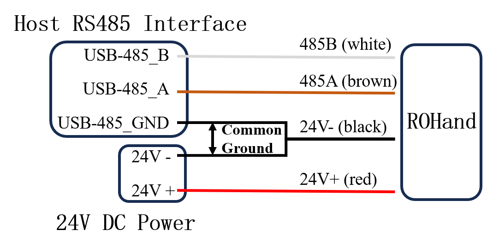

# ROHand Q&A

## Electrical

### 1.Q:How to connect ROHand?

    A: ROHand has a four-core cable connected from the wrist, the color definition is:

| Color | Definition |
| :---: | :--------: |
|  Red  | Power 24V+ |
| Black | Power 24V- |
| Brown |  RS485_A   |
| White |  RS485_B   |

When the power supply of the host and the ROHand is not the same power supply, it is necessary to connect the ROHand and the host to the same ground, that is, short-circuit the negative power supply of the power supply and the GND of the USB to 485 module.

When ROHand is connected to other devices, such as a robotic arm, for example, the RM65 robotic arm (custom version), the test line color definition is:

| Serial No. |     Color      | Definition |
| :--------: | :------------: | :--------: |
|     1      |     Green      |  RS485_A   |
|     2      |      Blue      |  RS485_B   |
|     3      |      NULL      |    NULL    |
|     4      |      NULL      |    NULL    |
|     5      | Yellow & Black | Power 24V- |
|     6      |      Red       | Power 24V+ |

Wiring method is as follows:


### 2.Q: What is the working voltage range of ROHand?

    A: ROHand can accept a working voltage range of 12 ~ 32V, rated power of 48W, and rated voltage of 24V. Please note that do not hot plug and unplug the power supply over 32V, otherwise it may cause damage to the electronic components.

### 3.Q: What is the current parameter of ROHand?

    A: The static current of the first-generation ROHand under 24V voltage is 0.12A, the average current under no-load motion is 0.25A, and the maximum gripping current under maximum gripping force is 1.9A.

## Protocol

### 1.Q: How to program ROHand?

    A:Based on the ModBus-RTU protocol, use the *write_registers* command to write to the finger position registers *ROH_FINGER_POS_TARGET0 ~ ROH_FINGER_POS_TARGET5*. These correspond to the bending of the thumb, index finger, middle finger, ring finger, little finger, and thumb rotation, respectively. The register values range from 0 to 65535, where 0 indicates the finger is fully extended and 65535 indicates the finger is fully bent. For thumb rotation, 0 represents 0° side palm position, and 65535 represents 90° palm position. For details, please refer to [roh_registers_v1.h](roh_registers_v1.h)/[roh_registers_v1.py](roh_registers_v1.py). Example code is provided in Appendix 1.

### 2.Q: How to get the finger angle and control the finger angle?

    A:To get the finger angles, read the finger angle registers *ROH_FINGER_ANGLE0 ~ ROH_FINGER_ANGLE5*. The values are signed integers ranging from -32768 to 32767, representing the actual angle multiplied by 100. To control the finger angles, write to the finger angle target registers *ROH_FINGER_ANGLE_TARGET0 ~ ROH_FINGER_ANGLE_TARGET5*. The input values are also signed integers ranging from -32768 to 32767, representing the actual angle multiplied by 100. For example, to bend the index finger to 101.01°, write 10101 to the *ROH_FINGER_ANGLE_TARGET1* register. At this point, reading the *ROH_FINGER_ANGLE1* register will return 10101, indicating that the finger angle is 101.01°. The default finger angle is the angle between the first joint of the finger and the palm plane. For detailed definitions, please refer to the [OHandModBusRTUProtocol_EN.md](OHandModBusRTUProtocol_EN.md) protocol documentation.

### 3.Q： How to get the finger angle range?

    A:The range of finger angles for each dexterous hand may vary slightly due to manufacturing differences. To get the actual angle range, write 0 and 65535 to the *ROH_FINGER_POS_TARGET0 ~ ROH_FINGER_POS_TARGET5* registers, corresponding to the maximum and minimum angles of the fingers, respectively. At this point, reading the *ROH_FINGER_ANGLE0 ~ ROH_FINGER_ANGLE5* registers will provide the actual upper and lower limits of the angles. For example, writing 0 to *ROH_FINGER_POS_TARGET1* will extend the index finger, and writing 65535 will bend it to its maximum extent. The resulting values in the *ROH_FINGER_ANGLE1* register will indicate the actual angles. The default finger angle is the angle between the first joint of the finger and the palm plane. For detailed definitions, please refer to the [OHandModBusRTUProtocol_EN.md](OHandModBusRTUProtocol_EN.md) protocol documentation. Example code is provided in Appendix 2.

### 4.Q: How to simply determine if ROHand has grasped an object?

    A:The force feedback feature will be released in the next version. Currently, the version uses the *read_holding_registers* command to read the finger status registers *ROH_FINGER_STATUS0 ~ ROH_FINGER_STATUS5* to determine if the motor status code is 5 (STATUS_STUCK), indicating that the motor is stuck and an object has been grasped. Alternatively, it can write to the current limit value registers *ROH_FINGER_CURRENT_LIMIT0 ~ ROH_FINGER_CURRENT_LIMIT5* to set a specific current limit value. When the motor's stuck current exceeds the limit value, it will stop running. After rewriting the target position value, it will automatically restart.

### 5.Q: Why does the finger shake when it moves?

    A:The dexterous hand uses a PID control algorithm internally. The shaking is caused by an inappropriate setting of the PID parameters. It is recommended that users adjust the PID parameters in the OHandSetting directory on the desktop using the OHandSetting.exe tool according to their actual usage scenarios to make the dexterous hand's movement smoother.

### 6.Q: How to solve the problem of ROHand upgrading failure?

    A: When the dexterous hand prompts an 'upgrade failure' or 'device no response' during upgrade, please first check for any loose or disconnected connections, and confirm that the power supply and USB-485 module have been properly grounded, refer to the wiring diagram above. If the connection is correct, but the upgrade still fails, please contact our technical support.

### 7.Q: What is the maximum baud rate and command processing frequency of ROHand?

    A:The first-generation dexterous hand supports a maximum baud rate of 115200. At this maximum baud rate, using a native USB-485 module can support a command processing frequency of around 60Hz. Using the specialized serial control protocol with compound commands, the frequency can reach around 90-100. The next generation dexterous hand supports automatic baud rate detection, with a maximum baud rate of up to 921600.

## Appendix

### 1.Example python code for controlling the dexterous hand

```python
import time

from pymodbus import FramerType
from pymodbus.client import ModbusSerialClient
from roh_registers_v1 import *

COM_PORT = 'COM1'
NODE_ID = 2

client = ModbusSerialClient(COM_PORT, FramerType.RTU, 115200)
client.connect()

if __name__ == "__main__":

    # Make a fist
    resp = client.write_registers(ROH_FINGER_POS_TARGET1, [65535, 65535, 65535, 65535, 65535], NODE_ID)
    time.sleep(2)
    resp = client.write_registers(ROH_FINGER_POS_TARGET0, 65535, NODE_ID)
    time.sleep(2)

    # Open
    resp = client.write_registers(ROH_FINGER_POS_TARGET0, 0, NODE_ID)
    time.sleep(2)
    resp = client.write_registers(ROH_FINGER_POS_TARGET1, [0, 0, 0, 0, 0], NODE_ID)
    time.sleep(2)

    # Write finger angle, the value written is actual value * 100
    real_angle = 15.05
    target_angle = round(real_angle * 100)

    if (target_angle < 0) :
        target_angle += 65536

    resp = client.write_registers(ROH_FINGER_ANGLE_TARGET0, [target_angle], NODE_ID)
    time.sleep(2)
    
    # Read the current finger angle, the actual value is output value / 100
    resp = client.read_holding_registers(ROH_FINGER_ANGLE0, 1, NODE_ID)
    current_angle = resp.registers

    if (current_angle > 32767) :
        current_angle -= 65536

    current_angle = current_angle  / 100.0

    print("Current finger angle：", current_angle)
```

### 2.Example of geting the angle range of the dexterous hand

```python
import time

from pymodbus import FramerType
from pymodbus.client import ModbusSerialClient
from roh_registers_v1 import *

COM_PORT = 'COM1'
NODE_ID = 2

client = ModbusSerialClient(COM_PORT, FramerType.RTU, 115200)
client.connect()

if __name__ == "__main__":

    # Make a fist
    resp = client.write_registers(ROH_FINGER_POS_TARGET1, [65535, 65535, 65535, 65535, 65535], NODE_ID)
    time.sleep(2)
    resp = client.write_registers(ROH_FINGER_POS_TARGET0, 65535, NODE_ID)
    time.sleep(2)

    # Open
    resp = client.write_registers(ROH_FINGER_POS_TARGET0, 0, NODE_ID)
    time.sleep(2)
    resp = client.write_registers(ROH_FINGER_POS_TARGET1, [0, 0, 0, 0, 0], NODE_ID)
    time.sleep(2)

    # Write finger angle, the value written is actual value * 100
    real_angle = 15.05
    target_angle = round(real_angle * 100)

    if (target_angle < 0) :
        target_angle += 65536

    resp = client.write_registers(ROH_FINGER_ANGLE_TARGET0, [target_angle], NODE_ID)
    time.sleep(2)
    
    # Read the current finger angle, the actual value is output value / 100
    resp = client.read_holding_registers(ROH_FINGER_ANGLE0, 1, NODE_ID)
    current_angle = resp.registers

    if (current_angle > 32767) :
        current_angle -= 65536

    current_angle = current_angle  / 100.0

    print("Current finger angle：", current_angle)
```
