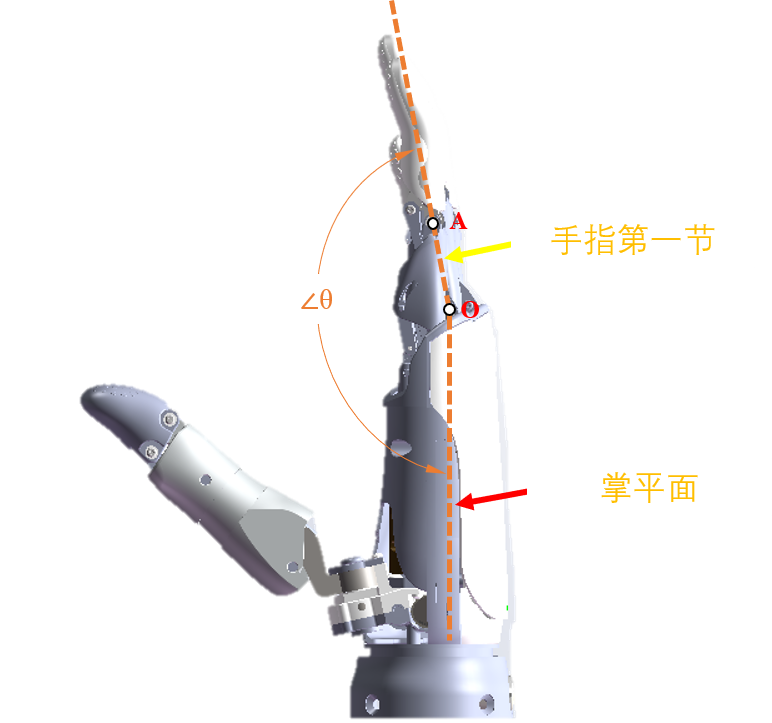
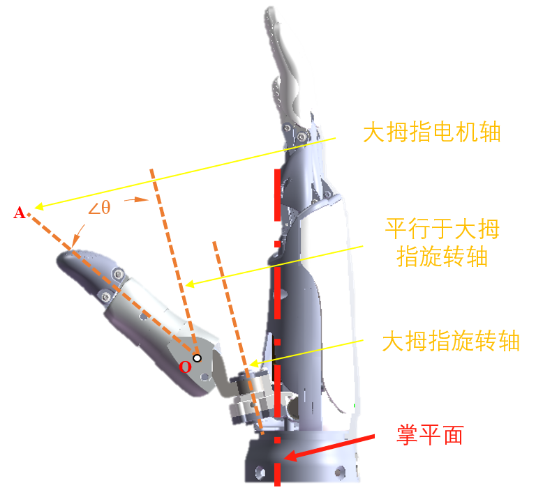

# OHand ModBus-RTU 协议 V1.0

## 1. ModBus 通信协议概要

ModBus-RTU 协议使用的是主从请求应答通讯方式，协议帧包括了功能码、数据域、和 CRC16 校验。
ModBus-RTU 主控单元通过读写 ROH 灵巧手内部寄存器来实现对灵巧手的状态获取和控制。
*读寄存器*是指上位系统读取 ROH 灵巧手内部寄存器数值（可成组读取，成组的是指若干名称相同地址相邻寄存器），上位系统向 ROH 灵巧手发送读请求帧（包含寄存器组首地址、寄存器组的长度等内容），ROH 灵巧手收到请求帧并校验成功后，灵巧手将包含寄存器数据内容的应答帧返回给上位系统。
*写寄存器*是指上位系统向 ROH 灵巧手内部寄存器写入相应的数据（可成组写入），上位系统向 ROH 灵巧手发送写请求帧（包含寄存器组首地址、欲写入的数据内容）发送给灵巧手，ROH 灵巧手收到请求帧并校验成功后，返回应答帧给上位系统。

ROH ModBus 协议支持 读取保持寄存器（功能码 0x03）、预置单寄存器（功能码 0x06）、预置多寄存器（功能码 0x10）操作。

## 2. RS232、RS485 通讯参数

RS232、RS485 通讯参数都是 115200bps、8 数据位、1 停止位、无奇偶校验。

## 3. ROH ModBus 数据帧格式

### 3.1. 读取保持寄存器（功能码 0x03）

主站请求帧格式：

| 从站地址 | 功能码 | 起始寄存器（高位） | 起始寄存器（低位） | 寄存器数量（高位） | 寄存器数量（低位） | CRC16 |
| -------- | ------ | ------------------ | ------------------ | ------------------ | ------------------ | ----- |
| 0x11     | 0x03   | 0x6B               | 0x00               | 0x00               | 0x02               | XXXX  |

含义：读 17 号（0x11）号从站保持寄存器，起始地址=0x006B；寄存器个数=0x0002，结束地址=0x006B+2-1=0x006C，即读 17 号从站保持寄存器 0x006B-0x006C，共两个寄存器。

从站应答帧格式：

| 从站地址 | 功能码 | 字节计数 | 寄存器（高位） | 寄存器（低位） | 寄存器（高位） | 寄存器（低位） | CRC16 |
| -------- | ------ | -------- | -------------- | -------------- | -------------- | -------------- | ----- |
| 0x11     | 0x03   | 0x04     | 0x00           | 0x01           | 0x00           | 0x02           | XXXX  |

含义：返回 17（0x11）号从站保持寄存器 0x006B-0x006C，共两个寄存器，0x006B 寄存器数值是 0x0001，0x0062 寄存器数值是 0x0002。

从站执行请求帧发生错误时，应答帧格式：

| 从站地址 | 功能码 | 错误码 | CRC16 |
| -------- | ------ | ------ | ----- |
| 0x11     | 0x83   | XX     | XXXX  |

其中，功能码为请求帧功能码和 0x80 位或后的值。

### 3.2. 预置单寄存器（功能码 0x06）

主站请求帧格式：

| 从站地址 | 功能码 | 起始寄存器（高位） | 起始寄存器（低位） | 数据内容（高位） | 数据内容量（低位） | CRC16 |
| -------- | ------ | ------------------ | ------------------ | ---------------- | ------------------ | ----- |
| 0x11     | 0x06   | 0x00               | 0x6B               | 0x10             | 0x00               | XXXX  |

含义：设置 17 号（0x11）号从站保持寄存器，寄存器地址 0x006B，数据内容是 0x1000。

从站应答帧格式：

| 从站地址 | 功能码 | 起始寄存器（高位） | 起始寄存器（低位） | 数据内容（高位） | 数据内容量（低位） | CRC16 |
| -------- | ------ | ------------------ | ------------------ | ---------------- | ------------------ | ----- |
| 0x11     | 0x06   | 0x00               | 0x6B               | 0x10             | 0x00               | XXXX  |

含义：为请求帧的原样复制。

从站执行请求帧发生错误时，应答帧格式：

| 从站地址 | 功能码 | 错误码 | CRC16 |
| -------- | ------ | ------ | ----- |
| 0x11     | 0x86   | XX     | XXXX  |

其中，功能码为请求帧功能码和 0x80 位或后的值。

### 3.3 预置多寄存器（功能码 0x10）

主站请求帧格式：

| 从站地址 | 功能码 | 起始寄存器（高位） | 起始寄存器（低位） | 寄存器数量（高位） | 寄存器数量（低位） | 字节计数 | 数据（高位） | 数据（低位） | 数据（高位） | 数据（低位） | CRC16 |
| -------- | ------ | ------------------ | ------------------ | ------------------ | ------------------ | -------- | ------------ | ------------ | ------------ | ------------ | ----- |
| 0x11     | 0x10   | 0x00               | 0x01               | 0x00               | 0x02               | 0x04     | 0x00         | 0x0A         | 0x01         | 0x02         | XXXX  |

含义：设置 17 号（0x11）号从站保持寄存器，寄存器起始地址 0x0001，寄存器个数为 0x0002，数据内容字节计数是 0x04，数据内容分别是 0x000A、0x0102。

从站应答帧格式：

| 从站地址 | 功能码 | 起始寄存器（高位） | 起始寄存器（低位） | 寄存器数量（高位） | 寄存器数量（低位） | CRC16 |
| -------- | ------ | ------------------ | ------------------ | ------------------ | ------------------ | ----- |
| 0x11     | 0x10   | 0x00               | 0x01               | 0x00               | 0x02               | XXXX  |

含义：从站地址、功能码 、起始寄存器、寄存器数量和请求帧保持一致。

从站执行请求帧发生错误时，应答帧格式：

| 从站地址 | 功能码 | 错误码 | CRC16 |
| -------- | ------ | ------ | ----- |
| 0x11     | 0x90   | XX     | XXXX  |

其中，功能码为请求帧功能码和 0x80 位或后的值。

## 3.4. ROH 灵巧手错误代码

| 错误名                     | 代码 | 说明                           |
| -------------------------- | ---: | ------------------------------ |
| EC01_ILLEGAL_FUNCTION      |    1 | 无效的功能码                   |
| EC02_ILLEGAL_DATA_ADDRESS  |    2 | 无效的数据地址                 |
| EC03_ILLEGAL_DATA_VALUE    |    3 | 无效的数据（协议层，非应用层） |
| EC04_SERVER_DEVICE_FAILURE |    4 | 设备故障                       |

在错误码为 EC04_SERVER_DEVICE_FAILURE 的情况下，寄存器 ROH_SUB_EXCEPTION 保存了具体的错误代码：

| 子错误名         | 代码 | 说明                                       |
| ---------------- | ---: | ------------------------------------------ |
| ERR_STATUS_INIT  |    1 | 等待初始化或者正在初始化，不接受此读写操作 |
| ERR_STATUS_CALI  |    2 | 等待校正，不接受此读写操作                 |
| ERR_INVALID_DATA |    3 | 无效的寄存器值                             |
| ERR_STATUS_STUCK |    4 | 电机堵转                                   |
| ERR_OP_FAILED    |    5 | 操作失败                                   |
| ERR_SAVE_FAILED  |    6 | 保存失败                                   |

## 4. ModBus 寄存器说明

### 4.1. 寄存器表

| 寄存器名称                | 寄存器地址 | 读/写权限 | 设置项的出厂默认值 | 说明                                                                                                                             |
| ------------------------- | ---------: | --------- | ------------------ | -------------------------------------------------------------------------------------------------------------------------------- |
| ROH_PROTOCOL_VERSION      |       1000 | R         |                    | 协议版本号（uint16），高字节为主版本号，低字节为次版本号                                                                         |
| ROH_FW_VERSION            |       1001 | R         |                    | 固件版本号（uint16），高字节为主版本号，低字节为次版本号                                                                         |
| ROH_FW_REVISION           |       1002 | R         |                    | 固件修订版本号（uint16）                                                                                                         |
| ROH_HW_VERSION            |       1003 | R         |                    | 硬件版本号（uint16），高字节为硬件类型，低字节为硬件版本                                                                         |
| ROH_BOOT_VERSION          |       1004 | R         |                    | boot loader 版本号（uint6），高字节为主版本号，低字节为次版本号                                                                  |
| ROH_NODE_ID               |       1005 | R/W       | 2                  | ROH 灵巧手 ID，仅低 8 位有效，写入成功后 ROH 会保存并重启                                                                        |
| ROH_SUB_EXCEPTION         |       1006 | R         |                    | 错误子代码                                                                                                                       |
| ROH_BATTERY_VOLTAGE       |       1007 | R         |                    | ROH 电压值，单位 mV，暂时不可用                                                                                                  |
| ROH_SELF_TEST_LEVEL       |       1008 | R/W       | 1                  | 开机自检开关，设成 0 时等待 ROH_START_INIT 写 1 自检，设成 1 时允许开机归零，设成 2 时允许开机完整自检，设置时保存到非易失存储器 |
| ROH_BEEP_SWITCH           |       1009 | R/W       | 1                  | 蜂鸣器开关，设成 1 时允许发声，设成 0 时蜂鸣器静音，设置时保存到非易失存储器                                                     |
| ROH_BEEP_PERIOD           |       1010 | W         |                    | 蜂鸣器发声，单位毫秒                                                                                                             |
| ROH_BUTTON_PRESS_CNT      |       1011 | R/W       |                    | 按键按下次数，对 ROH 而言是作为校正时确认用                                                                                      |
| ROH_RECALIBRATE           |       1012 | W         |                    | 重新校正，写入特定值（非公开）会让 ROH 灵巧手进入校正状态                                                                        |
| ROH_START_INIT            |       1013 | W         |                    | 开始自检，仅等待自检状态下有效                                                                                                   |
| ROH_RESET                 |       1014 | W         |                    | 复位，写入非 0 值时进入 DFU 模式，写入 0 时重启到工作模式                                                                        |
| ROH_POWER_OFF             |       1015 | W         |                    | 关机，暂时不可用                                                                                                                 |
| ROH_RESERVED0             |       1016 | R/W       |                    | 保留                                                                                                                             |
| ROH_RESERVED1             |       1017 | R/W       |                    | 保留                                                                                                                             |
| ROH_RESERVED2             |       1018 | R/W       |                    | 保留                                                                                                                             |
| ROH_RESERVED3             |       1019 | R/W       |                    | 保留                                                                                                                             |
| ROH_CALI_END0             |       1020 | R/W       | 出厂校正值         | 大拇指运行区间（绝对位置）上限（uint16），设置时保存到非易失存储器，用户无需设置                                                 |
| ROH_CALI_END1             |       1021 | R/W       | 出厂校正值         | 食指运行区间（绝对位置）上限（uint16），设置时保存到非易失存储器，用户无需设置                                                   |
| ROH_CALI_END2             |       1022 | R/W       | 出厂校正值         | 中指运行区间（绝对位置）上限（uint16），设置时保存到非易失存储器，用户无需设置                                                   |
| ROH_CALI_END3             |       1023 | R/W       | 出厂校正值         | 无名指运行区间（绝对位置）上限（uint16），设置时保存到非易失存储器，用户无需设置                                                 |
| ROH_CALI_END4             |       1024 | R/W       | 出厂校正值         | 小指运行区间（绝对位置）上限（uint16），设置时保存到非易失存储器，用户无需设置                                                   |
| ROH_CALI_END5             |       1025 | R/W       | 出厂校正值         | 大拇指旋转运行区间（绝对位置）上限（uint16），设置时保存到非易失存储器，用户无需设置                                             |
| ROH_CALI_END6             |       1026 | R/W       |                    | 保留                                                                                                                             |
| ROH_CALI_END7             |       1027 | R/W       |                    | 保留                                                                                                                             |
| ROH_CALI_END8             |       1028 | R/W       |                    | 保留                                                                                                                             |
| ROH_CALI_END9             |       1029 | R/W       |                    | 保留                                                                                                                             |
| ROH_CALI_START0           |       1030 | R/W       | 出厂校正值         | 大拇指运行区间（绝对位置）下限（uint16），设置时保存到非易失存储器，用户无需设置                                                 |
| ROH_CALI_START1           |       1031 | R/W       | 出厂校正值         | 食指运行区间（绝对位置）下限（uint16），设置时保存到非易失存储器，用户无需设置                                                   |
| ROH_CALI_START2           |       1032 | R/W       | 出厂校正值         | 中指运行区间（绝对位置）下限（uint16），设置时保存到非易失存储器，用户无需设置                                                   |
| ROH_CALI_START3           |       1033 | R/W       | 出厂校正值         | 无名指运行区间（绝对位置）下限（uint16），设置时保存到非易失存储器，用户无需设置                                                 |
| ROH_CALI_START4           |       1034 | R/W       | 出厂校正值         | 小指运行区间（绝对位置）下限（uint16），设置时保存到非易失存储器，用户无需设置                                                   |
| ROH_CALI_START5           |       1035 | R/W       | 出厂校正值         | 大拇指旋转运行区间（绝对位置）下限（uint16），设置时保存到非易失存储器，用户无需设置                                             |
| ROH_CALI_START6           |       1036 | R/W       |                    | 保留                                                                                                                             |
| ROH_CALI_START7           |       1037 | R/W       |                    | 保留                                                                                                                             |
| ROH_CALI_START8           |       1038 | R/W       |                    | 保留                                                                                                                             |
| ROH_CALI_START9           |       1039 | R/W       |                    | 保留                                                                                                                             |
| ROH_CALI_THUMB_POS0       |       1040 | R/W       | 出厂校正值         | 大拇指侧掌位预设位置（绝对位置，uint16），设置时保存到非易失存储器，用户无需设置                                                 |
| ROH_CALI_THUMB_POS1       |       1041 | R/W       | 出厂校正值         | 大拇指对掌位 1 预设位置（绝对位置，uint16），设置时保存到非易失存储器，用户无需设置                                              |
| ROH_CALI_THUMB_POS2       |       1042 | R/W       | 出厂校正值         | 大拇指对掌位 2 预设位置（绝对位置，uint16），设置时保存到非易失存储器，用户无需设置                                              |
| ROH_CALI_THUMB_POS3       |       1043 | R/W       |                    | 保留                                                                                                                             |
| ROH_CALI_THUMB_POS4       |       1044 | R/W       |                    | 保留                                                                                                                             |
| ROH_FINGER_P0             |       1045 | R/W       | 500 \* 100         | 大拇指弯曲 P 值\*100（uint16），设置时保存到非易失存储器                                                                         |
| ROH_FINGER_P1             |       1046 | R/W       | 500 \* 100         | 食指弯曲 P 值\*100（uint16），设置时保存到非易失存储器                                                                           |
| ROH_FINGER_P2             |       1047 | R/W       | 500 \* 100         | 中指弯曲 P 值\*100（uint16），设置时保存到非易失存储器                                                                           |
| ROH_FINGER_P3             |       1048 | R/W       | 500 \* 100         | 无名指弯曲 P 值\*100（uint16），设置时保存到非易失存储器                                                                         |
| ROH_FINGER_P4             |       1049 | R/W       | 500 \* 100         | 小指弯曲 P 值\*100（uint16），设置时保存到非易失存储器                                                                           |
| ROH_FINGER_P5             |       1050 | R/W       | 500 \* 100         | 大拇指旋转 P 值\*100（uint16），设置时保存到非易失存储器                                                                         |
| ROH_FINGER_P6             |       1051 | R/W       |                    | 保留                                                                                                                             |
| ROH_FINGER_P7             |       1052 | R/W       |                    | 保留                                                                                                                             |
| ROH_FINGER_P8             |       1053 | R/W       |                    | 保留                                                                                                                             |
| ROH_FINGER_P9             |       1054 | R/W       |                    | 保留                                                                                                                             |
| ROH_FINGER_I0             |       1055 | R/W       | 1 \* 100           | 大拇指弯曲 I 值\*100（uint16），设置时保存到非易失存储器                                                                         |
| ROH_FINGER_I1             |       1056 | R/W       | 1 \* 100           | 食指弯曲 I 值\*100（uint16），设置时保存到非易失存储器                                                                           |
| ROH_FINGER_I2             |       1057 | R/W       | 1 \* 100           | 中指弯曲 I 值\*100（uint16），设置时保存到非易失存储器                                                                           |
| ROH_FINGER_I3             |       1058 | R/W       | 1 \* 100           | 无名指弯曲 I 值\*100（uint16），设置时保存到非易失存储器                                                                         |
| ROH_FINGER_I4             |       1059 | R/W       | 1 \* 100           | 小指弯曲 I 值\*100（uint16），设置时保存到非易失存储器                                                                           |
| ROH_FINGER_I5             |       1060 | R/W       | 1 \* 100           | 大拇指旋转 I 值\*100（uint16），设置时保存到非易失存储器                                                                         |
| ROH_FINGER_I6             |       1061 | R/W       |                    | 保留                                                                                                                             |
| ROH_FINGER_I7             |       1062 | R/W       |                    | 保留                                                                                                                             |
| ROH_FINGER_I8             |       1063 | R/W       |                    | 保留                                                                                                                             |
| ROH_FINGER_I9             |       1064 | R/W       |                    | 保留                                                                                                                             |
| ROH_FINGER_D0             |       1065 | R/W       | 250 \* 100         | 大拇指弯曲 D 值\*100（uint16），设置时保存到非易失存储器                                                                         |
| ROH_FINGER_D1             |       1066 | R/W       | 250 \* 100         | 食指弯曲 D 值\*100（uint16），设置时保存到非易失存储器                                                                           |
| ROH_FINGER_D2             |       1067 | R/W       | 250 \* 100         | 中指弯曲 D 值\*100（uint16），设置时保存到非易失存储器                                                                           |
| ROH_FINGER_D3             |       1068 | R/W       | 250 \* 100         | 无名指弯曲 D 值\*100（uint16），设置时保存到非易失存储器                                                                         |
| ROH_FINGER_D4             |       1069 | R/W       | 250 \* 100         | 小指弯曲 D 值\*100（uint16），设置时保存到非易失存储器                                                                           |
| ROH_FINGER_D5             |       1070 | R/W       | 250 \* 100         | 大拇指旋转 D 值\*100（uint16），设置时保存到非易失存储器                                                                         |
| ROH_FINGER_D6             |       1071 | R/W       |                    | 保留                                                                                                                             |
| ROH_FINGER_D7             |       1072 | R/W       |                    | 保留                                                                                                                             |
| ROH_FINGER_D8             |       1073 | R/W       |                    | 保留                                                                                                                             |
| ROH_FINGER_D9             |       1074 | R/W       |                    | 保留                                                                                                                             |
| ROH_FINGER_G0             |       1075 | R/W       | 1.00 \* 100        | 大拇指弯曲 G 值\*100（uint16），设置时保存到非易失存储器                                                                         |
| ROH_FINGER_G1             |       1076 | R/W       | 0.10 \* 100        | 食指弯曲 G 值\*100（uint16），设置时保存到非易失存储器                                                                           |
| ROH_FINGER_G2             |       1077 | R/W       | 0.10 \* 100        | 中指弯曲 G 值\*100（uint16），设置时保存到非易失存储器                                                                           |
| ROH_FINGER_G3             |       1078 | R/W       | 0.10 \* 100        | 无名指弯曲 G 值\*100（uint16），设置时保存到非易失存储器                                                                         |
| ROH_FINGER_G4             |       1079 | R/W       | 0.10 \* 100        | 小指弯曲 G 值\*100（uint16），设置时保存到非易失存储器                                                                           |
| ROH_FINGER_G5             |       1080 | R/W       | 1.00 \* 100        | 大拇指旋转 G 值\*100（uint16），设置时保存到非易失存储器                                                                         |
| ROH_FINGER_G6             |       1081 | R/W       |                    | 保留                                                                                                                             |
| ROH_FINGER_G7             |       1082 | R/W       |                    | 保留                                                                                                                             |
| ROH_FINGER_G8             |       1083 | R/W       |                    | 保留                                                                                                                             |
| ROH_FINGER_G9             |       1084 | R/W       |                    | 保留                                                                                                                             |
| ROH_FINGER_STATUS0        |       1085 | R         |                    | 大拇指状态（uint16）                                                                                                             |
| ROH_FINGER_STATUS1        |       1086 | R         |                    | 食指状态（uint16）                                                                                                               |
| ROH_FINGER_STATUS2        |       1087 | R         |                    | 中指状态（uint16）                                                                                                               |
| ROH_FINGER_STATUS3        |       1088 | R         |                    | 无名指状态（uint16）                                                                                                             |
| ROH_FINGER_STATUS4        |       1089 | R         |                    | 小指状态（uint16）                                                                                                               |
| ROH_FINGER_STATUS5        |       1090 | R         |                    | 大拇指旋转状态（uint16）                                                                                                         |
| ROH_FINGER_STATUS6        |       1091 | R         |                    | 保留                                                                                                                             |
| ROH_FINGER_STATUS7        |       1092 | R         |                    | 保留                                                                                                                             |
| ROH_FINGER_STATUS8        |       1093 | R         |                    | 保留                                                                                                                             |
| ROH_FINGER_STATUS9        |       1094 | R         |                    | 保留                                                                                                                             |
| ROH_FINGER_CURRENT_LIMIT0 |       1095 | R/W       | 1200               | 大拇指弯曲电机电流限制值（uint16），单位 mA，开机时恢复为默认值                                                                  |
| ROH_FINGER_CURRENT_LIMIT1 |       1096 | R/W       | 1200               | 食指弯曲电机电流限制值（uint16），单位 mA，开机时恢复为默认值                                                                    |
| ROH_FINGER_CURRENT_LIMIT2 |       1097 | R/W       | 1200               | 中指弯曲电机电流限制值（uint16），单位 mA，开机时恢复为默认值                                                                    |
| ROH_FINGER_CURRENT_LIMIT3 |       1098 | R/W       | 1200               | 无名指弯曲电机电流限制值（uint16），单位 mA，开机时恢复为默认值                                                                  |
| ROH_FINGER_CURRENT_LIMIT4 |       1099 | R/W       | 1200               | 小指弯曲电机电流限制值（uint16），单位 mA，开机时恢复为默认值                                                                    |
| ROH_FINGER_CURRENT_LIMIT5 |       1100 | R/W       | 1200               | 大拇指旋转电机电流限制值（uint16），单位 mA，开机时恢复为默认值                                                                  |
| ROH_FINGER_CURRENT_LIMIT6 |       1101 | R/W       |                    | 保留                                                                                                                             |
| ROH_FINGER_CURRENT_LIMIT7 |       1102 | R/W       |                    | 保留                                                                                                                             |
| ROH_FINGER_CURRENT_LIMIT8 |       1103 | R/W       |                    | 保留                                                                                                                             |
| ROH_FINGER_CURRENT_LIMIT9 |       1104 | R/W       |                    | 保留                                                                                                                             |
| ROH_FINGER_CURRENT0       |       1105 | R         |                    | 大拇指弯曲电机电流值（uint16），单位 mA                                                                                          |
| ROH_FINGER_CURRENT1       |       1106 | R         |                    | 食指弯曲电机电流值（uint16），单位 mA                                                                                            |
| ROH_FINGER_CURRENT2       |       1107 | R         |                    | 中指弯曲电机电流值（uint16），单位 mA                                                                                            |
| ROH_FINGER_CURRENT3       |       1108 | R         |                    | 无名指弯曲电机电流值（uint16），单位 mA                                                                                          |
| ROH_FINGER_CURRENT4       |       1109 | R         |                    | 小指弯曲电机电流值（uint16），单位 mA                                                                                            |
| ROH_FINGER_CURRENT5       |       1110 | R         |                    | 大拇指旋转电机电流值（uint16），单位 mA                                                                                          |
| ROH_FINGER_CURRENT6       |       1111 | R         |                    | 保留                                                                                                                             |
| ROH_FINGER_CURRENT7       |       1112 | R         |                    | 保留                                                                                                                             |
| ROH_FINGER_CURRENT8       |       1113 | R         |                    | 保留                                                                                                                             |
| ROH_FINGER_CURRENT9       |       1114 | R         |                    | 保留                                                                                                                             |
| ROH_FINGER_FORCE_LIMIT0   |       1115 | R/W       | 15000              | 大拇指力量限制值（uint16），单位 mN，开机时恢复为默认值                                                                          |
| ROH_FINGER_FORCE_LIMIT1   |       1116 | R/W       | 15000              | 食指力量限制值（uint16），单位 mN，开机时恢复为默认值                                                                            |
| ROH_FINGER_FORCE_LIMIT2   |       1117 | R/W       | 15000              | 中指力量限制值（uint16），单位 mN，开机时恢复为默认值                                                                            |
| ROH_FINGER_FORCE_LIMIT3   |       1118 | R/W       | 15000              | 无名指力量限制值（uint16），单位 mN，开机时恢复为默认值                                                                          |
| ROH_FINGER_FORCE_LIMIT4   |       1119 | R/W       | 15000              | 小指力量限制值（uint16），单位 mN，开机时恢复为默认值                                                                            |
| ROH_FINGER_FORCE0         |       1120 | R         |                    | 大拇指力量值（uint16），单位 mN                                                                                                  |
| ROH_FINGER_FORCE1         |       1121 | R         |                    | 食指力量值（uint16），单位 mN                                                                                                    |
| ROH_FINGER_FORCE2         |       1122 | R         |                    | 中指力量值（uint16），单位 mN                                                                                                    |
| ROH_FINGER_FORCE3         |       1123 | R         |                    | 无名指力量值（uint16），单位 mN                                                                                                  |
| ROH_FINGER_FORCE4         |       1124 | R         |                    | 小指力量值（uint16），单位 mN                                                                                                    |
| ROH_FINGER_SPEED0         |       1125 | R/W       | 65535              | 大拇指弯曲逻辑速度（uint16），单位 逻辑位置/秒，开机时恢复为默认值                                                               |
| ROH_FINGER_SPEED1         |       1126 | R/W       | 65535              | 食指弯曲逻辑速度（uint16），单位 逻辑位置/秒，开机时恢复为默认值                                                                 |
| ROH_FINGER_SPEED2         |       1127 | R/W       | 65535              | 中指弯曲逻辑速度（uint16），单位 逻辑位置/秒，开机时恢复为默认值                                                                 |
| ROH_FINGER_SPEED3         |       1128 | R/W       | 65535              | 无名指弯曲逻辑速度（uint16），单位 逻辑位置/秒，开机时恢复为默认值                                                               |
| ROH_FINGER_SPEED4         |       1129 | R/W       | 65535              | 小指弯曲逻辑速度（uint16），单位 逻辑位置/秒，开机时恢复为默认值                                                                 |
| ROH_FINGER_SPEED5         |       1130 | R/W       | 65535              | 大拇旋转指逻辑速度（uint16），单位 逻辑位置/秒，开机时恢复为默认值                                                               |
| ROH_FINGER_SPEED6         |       1131 | R/W       |                    | 保留                                                                                                                             |
| ROH_FINGER_SPEED7         |       1132 | R/W       |                    | 保留                                                                                                                             |
| ROH_FINGER_SPEED8         |       1133 | R/W       |                    | 保留                                                                                                                             |
| ROH_FINGER_SPEED9         |       1134 | R/W       |                    | 保留                                                                                                                             |
| ROH_FINGER_POS_TARGET0    |       1135 | R/W       |                    | 大拇指弯曲逻辑目标位置（uint16）                                                                                                 |
| ROH_FINGER_POS_TARGET1    |       1136 | R/W       |                    | 食指弯曲逻辑目标位置（uint16）                                                                                                   |
| ROH_FINGER_POS_TARGET2    |       1137 | R/W       |                    | 中指弯曲逻辑目标位置（uint16）                                                                                                   |
| ROH_FINGER_POS_TARGET3    |       1138 | R/W       |                    | 无名指弯曲逻辑目标位置（uint16）                                                                                                 |
| ROH_FINGER_POS_TARGET4    |       1139 | R/W       |                    | 小指弯曲逻辑目标位置（uint16）                                                                                                   |
| ROH_FINGER_POS_TARGET5    |       1140 | R/W       |                    | 大拇旋转指逻辑目标位置（uint16）                                                                                                 |
| ROH_FINGER_POS_TARGET6    |       1141 | R/W       |                    | 保留                                                                                                                             |
| ROH_FINGER_POS_TARGET7    |       1142 | R/W       |                    | 保留                                                                                                                             |
| ROH_FINGER_POS_TARGET8    |       1143 | R/W       |                    | 保留                                                                                                                             |
| ROH_FINGER_POS_TARGET9    |       1144 | R/W       |                    | 保留                                                                                                                             |
| ROH_FINGER_POS0           |       1145 | R         |                    | 大拇指弯曲逻辑位置（uint16）                                                                                                     |
| ROH_FINGER_POS1           |       1146 | R         |                    | 食指弯曲逻辑位置（uint16）                                                                                                       |
| ROH_FINGER_POS2           |       1147 | R         |                    | 中指弯曲逻辑位置（uint16）                                                                                                       |
| ROH_FINGER_POS3           |       1148 | R         |                    | 无名指弯曲逻辑位置（uint16）                                                                                                     |
| ROH_FINGER_POS4           |       1149 | R         |                    | 小指弯曲逻辑位置（uint16）                                                                                                       |
| ROH_FINGER_POS5           |       1150 | R         |                    | 大拇旋转指逻辑位置（uint16）                                                                                                     |
| ROH_FINGER_POS6           |       1151 | R         |                    | 保留                                                                                                                             |
| ROH_FINGER_POS7           |       1152 | R         |                    | 保留                                                                                                                             |
| ROH_FINGER_POS8           |       1153 | R         |                    | 保留                                                                                                                             |
| ROH_FINGER_POS9           |       1154 | R         |                    | 保留                                                                                                                             |
| ROH_FINGER_ANGLE_TARGET0  |       1155 | R/W       |                    | 大拇指电机轴与旋转轴夹角的目标值（int16），等于实际角度\*100，单位度                                                             |
| ROH_FINGER_ANGLE_TARGET1  |       1156 | R/W       |                    | 食指第一节与掌平面夹角的目标值（int16），等于实际角度\*100，单位度                                                               |
| ROH_FINGER_ANGLE_TARGET2  |       1157 | R/W       |                    | 中指第一节与掌平面夹角的目标值（int16），等于实际角度\*100，单位度                                                               |
| ROH_FINGER_ANGLE_TARGET3  |       1158 | R/W       |                    | 无名指第一节与掌平面夹角的目标值（int16），等于实际角度\*100，单位度                                                             |
| ROH_FINGER_ANGLE_TARGET4  |       1159 | R/W       |                    | 小指第一节与掌平面夹角的目标值（int16），等于实际角度\*100，单位度                                                               |
| ROH_FINGER_ANGLE_TARGET5  |       1160 | R/W       |                    | 大拇旋转目标角度（int16），等于实际角度\*100，单位度                                                                             |
| ROH_FINGER_ANGLE_TARGET6  |       1161 | R/W       |                    | 保留                                                                                                                             |
| ROH_FINGER_ANGLE_TARGET7  |       1162 | R/W       |                    | 保留                                                                                                                             |
| ROH_FINGER_ANGLE_TARGET8  |       1163 | R/W       |                    | 保留                                                                                                                             |
| ROH_FINGER_ANGLE_TARGET9  |       1164 | R/W       |                    | 保留                                                                                                                             |
| ROH_FINGER_ANGLE0         |       1165 | R         |                    | 大拇指电机轴与旋转轴夹角（int16），等于实际角度\*100，单位度                                                                     |
| ROH_FINGER_ANGLE1         |       1166 | R         |                    | 食指第一节与掌平面夹角（int16），等于实际角度\*100，单位度                                                                       |
| ROH_FINGER_ANGLE2         |       1167 | R         |                    | 中指第一节与掌平面夹角（int16），等于实际角度\*100，单位度                                                                       |
| ROH_FINGER_ANGLE3         |       1168 | R         |                    | 无名指第一节与掌平面夹角（int16），等于实际角度\*100，单位度                                                                     |
| ROH_FINGER_ANGLE4         |       1169 | R         |                    | 小指第一节与掌平面夹角（int16），等于实际角度\*100，单位度                                                                       |
| ROH_FINGER_ANGLE5         |       1170 | R         |                    | 大拇旋转角度（int16），等于实际角度\*100，单位度                                                                                 |
| ROH_FINGER_ANGLE6         |       1171 | R         |                    | 保留                                                                                                                             |
| ROH_FINGER_ANGLE7         |       1172 | R         |                    | 保留                                                                                                                             |
| ROH_FINGER_ANGLE8         |       1173 | R         |                    | 保留                                                                                                                             |
| ROH_FINGER_ANGLE9         |       1174 | R         |                    | 保留                                                                                                                             |

附寄存器C/C++宏定义：

```C
/* ModBus-RTU registers */

#define ROH_PROTOCOL_VERSION       (1000) /* R   */
#define ROH_FW_VERSION             (1001) /* R   */
#define ROH_FW_REVISION            (1002) /* R   */
#define ROH_HW_VERSION             (1003) /* R   */
#define ROH_BOOT_VERSION           (1004) /* R   */
#define ROH_NODE_ID                (1005) /* R/W */
#define ROH_SUB_EXCEPTION          (1006) /* R   */
#define ROH_BATTERY_VOLTAGE        (1007) /* R   */
#define ROH_SELF_TEST_LEVEL        (1008) /* R/W */
#define ROH_BEEP_SWITCH            (1009) /* R/W */
#define ROH_BEEP_PERIOD            (1010) /* W   */
#define ROH_BUTTON_PRESS_CNT       (1011) /* R/W */
#define ROH_RECALIBRATE            (1012) /* W   */
#define ROH_START_INIT             (1013) /* W   */
#define ROH_RESET                  (1014) /* W   */
#define ROH_POWER_OFF              (1015) /* W   */
#define ROH_RESERVED0              (1016) /* R/W */
#define ROH_RESERVED1              (1017) /* R/W */
#define ROH_RESERVED2              (1018) /* R/W */
#define ROH_RESERVED3              (1019) /* R/W */
#define ROH_CALI_END0              (1020) /* R/W */
#define ROH_CALI_END1              (1021) /* R/W */
#define ROH_CALI_END2              (1022) /* R/W */
#define ROH_CALI_END3              (1023) /* R/W */
#define ROH_CALI_END4              (1024) /* R/W */
#define ROH_CALI_END5              (1025) /* R/W */
#define ROH_CALI_END6              (1026) /* R/W */
#define ROH_CALI_END7              (1027) /* R/W */
#define ROH_CALI_END8              (1028) /* R/W */
#define ROH_CALI_END9              (1029) /* R/W */
#define ROH_CALI_START0            (1030) /* R/W */
#define ROH_CALI_START1            (1031) /* R/W */
#define ROH_CALI_START2            (1032) /* R/W */
#define ROH_CALI_START3            (1033) /* R/W */
#define ROH_CALI_START4            (1034) /* R/W */
#define ROH_CALI_START5            (1035) /* R/W */
#define ROH_CALI_START6            (1036) /* R/W */
#define ROH_CALI_START7            (1037) /* R/W */
#define ROH_CALI_START8            (1038) /* R/W */
#define ROH_CALI_START9            (1039) /* R/W */
#define ROH_CALI_THUMB_POS0        (1040) /* R/W */
#define ROH_CALI_THUMB_POS1        (1041) /* R/W */
#define ROH_CALI_THUMB_POS2        (1042) /* R/W */
#define ROH_CALI_THUMB_POS3        (1043) /* R/W */
#define ROH_CALI_THUMB_POS4        (1044) /* R/W */
#define ROH_FINGER_P0              (1045) /* R/W */
#define ROH_FINGER_P1              (1046) /* R/W */
#define ROH_FINGER_P2              (1047) /* R/W */
#define ROH_FINGER_P3              (1048) /* R/W */
#define ROH_FINGER_P4              (1049) /* R/W */
#define ROH_FINGER_P5              (1050) /* R/W */
#define ROH_FINGER_P6              (1051) /* R/W */
#define ROH_FINGER_P7              (1052) /* R/W */
#define ROH_FINGER_P8              (1053) /* R/W */
#define ROH_FINGER_P9              (1054) /* R/W */
#define ROH_FINGER_I0              (1055) /* R/W */
#define ROH_FINGER_I1              (1056) /* R/W */
#define ROH_FINGER_I2              (1057) /* R/W */
#define ROH_FINGER_I3              (1058) /* R/W */
#define ROH_FINGER_I4              (1059) /* R/W */
#define ROH_FINGER_I5              (1060) /* R/W */
#define ROH_FINGER_I6              (1061) /* R/W */
#define ROH_FINGER_I7              (1062) /* R/W */
#define ROH_FINGER_I8              (1063) /* R/W */
#define ROH_FINGER_I9              (1064) /* R/W */
#define ROH_FINGER_D0              (1065) /* R/W */
#define ROH_FINGER_D1              (1066) /* R/W */
#define ROH_FINGER_D2              (1067) /* R/W */
#define ROH_FINGER_D3              (1068) /* R/W */
#define ROH_FINGER_D4              (1069) /* R/W */
#define ROH_FINGER_D5              (1070) /* R/W */
#define ROH_FINGER_D6              (1071) /* R/W */
#define ROH_FINGER_D7              (1072) /* R/W */
#define ROH_FINGER_D8              (1073) /* R/W */
#define ROH_FINGER_D9              (1074) /* R/W */
#define ROH_FINGER_G0              (1075) /* R/W */
#define ROH_FINGER_G1              (1076) /* R/W */
#define ROH_FINGER_G2              (1077) /* R/W */
#define ROH_FINGER_G3              (1078) /* R/W */
#define ROH_FINGER_G4              (1079) /* R/W */
#define ROH_FINGER_G5              (1080) /* R/W */
#define ROH_FINGER_G6              (1081) /* R/W */
#define ROH_FINGER_G7              (1082) /* R/W */
#define ROH_FINGER_G8              (1083) /* R/W */
#define ROH_FINGER_G9              (1084) /* R/W */
#define ROH_FINGER_STATUS0         (1085) /* R   */
#define ROH_FINGER_STATUS1         (1086) /* R   */
#define ROH_FINGER_STATUS2         (1087) /* R   */
#define ROH_FINGER_STATUS3         (1088) /* R   */
#define ROH_FINGER_STATUS4         (1089) /* R   */
#define ROH_FINGER_STATUS5         (1090) /* R   */
#define ROH_FINGER_STATUS6         (1091) /* R   */
#define ROH_FINGER_STATUS7         (1092) /* R   */
#define ROH_FINGER_STATUS8         (1093) /* R   */
#define ROH_FINGER_STATUS9         (1094) /* R   */
#define ROH_FINGER_CURRENT_LIMIT0  (1095) /* R/W */
#define ROH_FINGER_CURRENT_LIMIT1  (1096) /* R/W */
#define ROH_FINGER_CURRENT_LIMIT2  (1097) /* R/W */
#define ROH_FINGER_CURRENT_LIMIT3  (1098) /* R/W */
#define ROH_FINGER_CURRENT_LIMIT4  (1099) /* R/W */
#define ROH_FINGER_CURRENT_LIMIT5  (1100) /* R/W */
#define ROH_FINGER_CURRENT_LIMIT6  (1101) /* R/W */
#define ROH_FINGER_CURRENT_LIMIT7  (1102) /* R/W */
#define ROH_FINGER_CURRENT_LIMIT8  (1103) /* R/W */
#define ROH_FINGER_CURRENT_LIMIT9  (1104) /* R/W */
#define ROH_FINGER_CURRENT0        (1105) /* R   */
#define ROH_FINGER_CURRENT1        (1106) /* R   */
#define ROH_FINGER_CURRENT2        (1107) /* R   */
#define ROH_FINGER_CURRENT3        (1108) /* R   */
#define ROH_FINGER_CURRENT4        (1109) /* R   */
#define ROH_FINGER_CURRENT5        (1110) /* R   */
#define ROH_FINGER_CURRENT6        (1111) /* R   */
#define ROH_FINGER_CURRENT7        (1112) /* R   */
#define ROH_FINGER_CURRENT8        (1113) /* R   */
#define ROH_FINGER_CURRENT9        (1114) /* R   */
#define ROH_FINGER_FORCE_LIMIT0    (1115) /* R/W */
#define ROH_FINGER_FORCE_LIMIT1    (1116) /* R/W */
#define ROH_FINGER_FORCE_LIMIT2    (1117) /* R/W */
#define ROH_FINGER_FORCE_LIMIT3    (1118) /* R/W */
#define ROH_FINGER_FORCE_LIMIT4    (1119) /* R/W */
#define ROH_FINGER_FORCE0          (1120) /* R   */
#define ROH_FINGER_FORCE1          (1121) /* R   */
#define ROH_FINGER_FORCE2          (1122) /* R   */
#define ROH_FINGER_FORCE3          (1123) /* R   */
#define ROH_FINGER_FORCE4          (1124) /* R   */
#define ROH_FINGER_SPEED0          (1125) /* R/W */
#define ROH_FINGER_SPEED1          (1126) /* R/W */
#define ROH_FINGER_SPEED2          (1127) /* R/W */
#define ROH_FINGER_SPEED3          (1128) /* R/W */
#define ROH_FINGER_SPEED4          (1129) /* R/W */
#define ROH_FINGER_SPEED5          (1130) /* R/W */
#define ROH_FINGER_SPEED6          (1131) /* R/W */
#define ROH_FINGER_SPEED7          (1132) /* R/W */
#define ROH_FINGER_SPEED8          (1133) /* R/W */
#define ROH_FINGER_SPEED9          (1134) /* R/W */
#define ROH_FINGER_POS_TARGET0     (1135) /* R/W */
#define ROH_FINGER_POS_TARGET1     (1136) /* R/W */
#define ROH_FINGER_POS_TARGET2     (1137) /* R/W */
#define ROH_FINGER_POS_TARGET3     (1138) /* R/W */
#define ROH_FINGER_POS_TARGET4     (1139) /* R/W */
#define ROH_FINGER_POS_TARGET5     (1140) /* R/W */
#define ROH_FINGER_POS_TARGET6     (1141) /* R/W */
#define ROH_FINGER_POS_TARGET7     (1142) /* R/W */
#define ROH_FINGER_POS_TARGET8     (1143) /* R/W */
#define ROH_FINGER_POS_TARGET9     (1144) /* R/W */
#define ROH_FINGER_POS0            (1145) /* R   */
#define ROH_FINGER_POS1            (1146) /* R   */
#define ROH_FINGER_POS2            (1147) /* R   */
#define ROH_FINGER_POS3            (1148) /* R   */
#define ROH_FINGER_POS4            (1149) /* R   */
#define ROH_FINGER_POS5            (1150) /* R   */
#define ROH_FINGER_POS6            (1151) /* R   */
#define ROH_FINGER_POS7            (1152) /* R   */
#define ROH_FINGER_POS8            (1153) /* R   */
#define ROH_FINGER_POS9            (1154) /* R   */
#define ROH_FINGER_ANGLE_TARGET0   (1155) /* R/W */
#define ROH_FINGER_ANGLE_TARGET1   (1156) /* R/W */
#define ROH_FINGER_ANGLE_TARGET2   (1157) /* R/W */
#define ROH_FINGER_ANGLE_TARGET3   (1158) /* R/W */
#define ROH_FINGER_ANGLE_TARGET4   (1159) /* R/W */
#define ROH_FINGER_ANGLE_TARGET5   (1160) /* R/W */
#define ROH_FINGER_ANGLE_TARGET6   (1161) /* R/W */
#define ROH_FINGER_ANGLE_TARGET7   (1162) /* R/W */
#define ROH_FINGER_ANGLE_TARGET8   (1163) /* R/W */
#define ROH_FINGER_ANGLE_TARGET9   (1164) /* R/W */
#define ROH_FINGER_ANGLE0          (1165) /* R   */
#define ROH_FINGER_ANGLE1          (1166) /* R   */
#define ROH_FINGER_ANGLE2          (1167) /* R   */
#define ROH_FINGER_ANGLE3          (1168) /* R   */
#define ROH_FINGER_ANGLE4          (1169) /* R   */
#define ROH_FINGER_ANGLE5          (1170) /* R   */
#define ROH_FINGER_ANGLE6          (1171) /* R   */
#define ROH_FINGER_ANGLE7          (1172) /* R   */
#define ROH_FINGER_ANGLE8          (1173) /* R   */
#define ROH_FINGER_ANGLE9          (1174) /* R   */
```

```Python
# ModBus-RTU registers for ROH

ROH_PROTOCOL_VERSION      = (1000) # R
ROH_FW_VERSION            = (1001) # R
ROH_FW_REVISION           = (1002) # R
ROH_HW_VERSION            = (1003) # R
ROH_BOOT_VERSION          = (1004) # R
ROH_NODE_ID               = (1005) # R/W
ROH_SUB_EXCEPTION         = (1006) # R
ROH_BATTERY_VOLTAGE       = (1007) # R
ROH_SELF_TEST_LEVEL       = (1008) # R/W
ROH_BEEP_SWITCH           = (1009) # R/W
ROH_BEEP_PERIOD           = (1010) # W
ROH_BUTTON_PRESS_CNT      = (1011) # R/W
ROH_RECALIBRATE           = (1012) # W
ROH_START_INIT            = (1013) # W
ROH_RESET                 = (1014) # W
ROH_POWER_OFF             = (1015) # W
ROH_RESERVED0             = (1016) # R/W
ROH_RESERVED1             = (1017) # R/W
ROH_RESERVED2             = (1018) # R/W
ROH_RESERVED3             = (1019) # R/W
ROH_CALI_END0             = (1020) # R/W
ROH_CALI_END1             = (1021) # R/W
ROH_CALI_END2             = (1022) # R/W
ROH_CALI_END3             = (1023) # R/W
ROH_CALI_END4             = (1024) # R/W
ROH_CALI_END5             = (1025) # R/W
ROH_CALI_END6             = (1026) # R/W
ROH_CALI_END7             = (1027) # R/W
ROH_CALI_END8             = (1028) # R/W
ROH_CALI_END9             = (1029) # R/W
ROH_CALI_START0           = (1030) # R/W
ROH_CALI_START1           = (1031) # R/W
ROH_CALI_START2           = (1032) # R/W
ROH_CALI_START3           = (1033) # R/W
ROH_CALI_START4           = (1034) # R/W
ROH_CALI_START5           = (1035) # R/W
ROH_CALI_START6           = (1036) # R/W
ROH_CALI_START7           = (1037) # R/W
ROH_CALI_START8           = (1038) # R/W
ROH_CALI_START9           = (1039) # R/W
ROH_CALI_THUMB_POS0       = (1040) # R/W
ROH_CALI_THUMB_POS1       = (1041) # R/W
ROH_CALI_THUMB_POS2       = (1042) # R/W
ROH_CALI_THUMB_POS3       = (1043) # R/W
ROH_CALI_THUMB_POS4       = (1044) # R/W
ROH_FINGER_P0             = (1045) # R/W
ROH_FINGER_P1             = (1046) # R/W
ROH_FINGER_P2             = (1047) # R/W
ROH_FINGER_P3             = (1048) # R/W
ROH_FINGER_P4             = (1049) # R/W
ROH_FINGER_P5             = (1050) # R/W
ROH_FINGER_P6             = (1051) # R/W
ROH_FINGER_P7             = (1052) # R/W
ROH_FINGER_P8             = (1053) # R/W
ROH_FINGER_P9             = (1054) # R/W
ROH_FINGER_I0             = (1055) # R/W
ROH_FINGER_I1             = (1056) # R/W
ROH_FINGER_I2             = (1057) # R/W
ROH_FINGER_I3             = (1058) # R/W
ROH_FINGER_I4             = (1059) # R/W
ROH_FINGER_I5             = (1060) # R/W
ROH_FINGER_I6             = (1061) # R/W
ROH_FINGER_I7             = (1062) # R/W
ROH_FINGER_I8             = (1063) # R/W
ROH_FINGER_I9             = (1064) # R/W
ROH_FINGER_D0             = (1065) # R/W
ROH_FINGER_D1             = (1066) # R/W
ROH_FINGER_D2             = (1067) # R/W
ROH_FINGER_D3             = (1068) # R/W
ROH_FINGER_D4             = (1069) # R/W
ROH_FINGER_D5             = (1070) # R/W
ROH_FINGER_D6             = (1071) # R/W
ROH_FINGER_D7             = (1072) # R/W
ROH_FINGER_D8             = (1073) # R/W
ROH_FINGER_D9             = (1074) # R/W
ROH_FINGER_G0             = (1075) # R/W
ROH_FINGER_G1             = (1076) # R/W
ROH_FINGER_G2             = (1077) # R/W
ROH_FINGER_G3             = (1078) # R/W
ROH_FINGER_G4             = (1079) # R/W
ROH_FINGER_G5             = (1080) # R/W
ROH_FINGER_G6             = (1081) # R/W
ROH_FINGER_G7             = (1082) # R/W
ROH_FINGER_G8             = (1083) # R/W
ROH_FINGER_G9             = (1084) # R/W
ROH_FINGER_STATUS0        = (1085) # R
ROH_FINGER_STATUS1        = (1086) # R
ROH_FINGER_STATUS2        = (1087) # R
ROH_FINGER_STATUS3        = (1088) # R
ROH_FINGER_STATUS4        = (1089) # R
ROH_FINGER_STATUS5        = (1090) # R
ROH_FINGER_STATUS6        = (1091) # R
ROH_FINGER_STATUS7        = (1092) # R
ROH_FINGER_STATUS8        = (1093) # R
ROH_FINGER_STATUS9        = (1094) # R
ROH_FINGER_CURRENT_LIMIT0 = (1095) # R/W
ROH_FINGER_CURRENT_LIMIT1 = (1096) # R/W
ROH_FINGER_CURRENT_LIMIT2 = (1097) # R/W
ROH_FINGER_CURRENT_LIMIT3 = (1098) # R/W
ROH_FINGER_CURRENT_LIMIT4 = (1099) # R/W
ROH_FINGER_CURRENT_LIMIT5 = (1100) # R/W
ROH_FINGER_CURRENT_LIMIT6 = (1101) # R/W
ROH_FINGER_CURRENT_LIMIT7 = (1102) # R/W
ROH_FINGER_CURRENT_LIMIT8 = (1103) # R/W
ROH_FINGER_CURRENT_LIMIT9 = (1104) # R/W
ROH_FINGER_CURRENT0       = (1105) # R
ROH_FINGER_CURRENT1       = (1106) # R
ROH_FINGER_CURRENT2       = (1107) # R
ROH_FINGER_CURRENT3       = (1108) # R
ROH_FINGER_CURRENT4       = (1109) # R
ROH_FINGER_CURRENT5       = (1110) # R
ROH_FINGER_CURRENT6       = (1111) # R
ROH_FINGER_CURRENT7       = (1112) # R
ROH_FINGER_CURRENT8       = (1113) # R
ROH_FINGER_CURRENT9       = (1114) # R
ROH_FINGER_FORCE_LIMIT0   = (1115) # R/W
ROH_FINGER_FORCE_LIMIT1   = (1116) # R/W
ROH_FINGER_FORCE_LIMIT2   = (1117) # R/W
ROH_FINGER_FORCE_LIMIT3   = (1118) # R/W
ROH_FINGER_FORCE_LIMIT4   = (1119) # R/W
ROH_FINGER_FORCE0         = (1120) # R
ROH_FINGER_FORCE1         = (1121) # R
ROH_FINGER_FORCE2         = (1122) # R
ROH_FINGER_FORCE3         = (1123) # R
ROH_FINGER_FORCE4         = (1124) # R
ROH_FINGER_SPEED0         = (1125) # R/W
ROH_FINGER_SPEED1         = (1126) # R/W
ROH_FINGER_SPEED2         = (1127) # R/W
ROH_FINGER_SPEED3         = (1128) # R/W
ROH_FINGER_SPEED4         = (1129) # R/W
ROH_FINGER_SPEED5         = (1130) # R/W
ROH_FINGER_SPEED6         = (1131) # R/W
ROH_FINGER_SPEED7         = (1132) # R/W
ROH_FINGER_SPEED8         = (1133) # R/W
ROH_FINGER_SPEED9         = (1134) # R/W
ROH_FINGER_POS_TARGET0    = (1135) # R/W
ROH_FINGER_POS_TARGET1    = (1136) # R/W
ROH_FINGER_POS_TARGET2    = (1137) # R/W
ROH_FINGER_POS_TARGET3    = (1138) # R/W
ROH_FINGER_POS_TARGET4    = (1139) # R/W
ROH_FINGER_POS_TARGET5    = (1140) # R/W
ROH_FINGER_POS_TARGET6    = (1141) # R/W
ROH_FINGER_POS_TARGET7    = (1142) # R/W
ROH_FINGER_POS_TARGET8    = (1143) # R/W
ROH_FINGER_POS_TARGET9    = (1144) # R/W
ROH_FINGER_POS0           = (1145) # R
ROH_FINGER_POS1           = (1146) # R
ROH_FINGER_POS2           = (1147) # R
ROH_FINGER_POS3           = (1148) # R
ROH_FINGER_POS4           = (1149) # R
ROH_FINGER_POS5           = (1150) # R
ROH_FINGER_POS6           = (1151) # R
ROH_FINGER_POS7           = (1152) # R
ROH_FINGER_POS8           = (1153) # R
ROH_FINGER_POS9           = (1154) # R
ROH_FINGER_ANGLE_TARGET0  = (1155) # R/W
ROH_FINGER_ANGLE_TARGET1  = (1156) # R/W
ROH_FINGER_ANGLE_TARGET2  = (1157) # R/W
ROH_FINGER_ANGLE_TARGET3  = (1158) # R/W
ROH_FINGER_ANGLE_TARGET4  = (1159) # R/W
ROH_FINGER_ANGLE_TARGET5  = (1160) # R/W
ROH_FINGER_ANGLE_TARGET6  = (1161) # R/W
ROH_FINGER_ANGLE_TARGET7  = (1162) # R/W
ROH_FINGER_ANGLE_TARGET8  = (1163) # R/W
ROH_FINGER_ANGLE_TARGET9  = (1164) # R/W
ROH_FINGER_ANGLE0         = (1165) # R
ROH_FINGER_ANGLE1         = (1166) # R
ROH_FINGER_ANGLE2         = (1167) # R
ROH_FINGER_ANGLE3         = (1168) # R
ROH_FINGER_ANGLE4         = (1169) # R
ROH_FINGER_ANGLE5         = (1170) # R
ROH_FINGER_ANGLE6         = (1171) # R
ROH_FINGER_ANGLE7         = (1172) # R
ROH_FINGER_ANGLE8         = (1173) # R
ROH_FINGER_ANGLE9         = (1174) # R
```

### 4.2. ROH_FINGER_ANGLE_TARGET 和 ROH_FINGER_POS 角度

角度定义及运动范围说明：

|                           角度                           |                图例说明                 |                                               角度范围                                               |
| :------------------------------------------------------: | :-------------------------------------: | :--------------------------------------------------------------------------------------------------: |
| 食指 </br></br> 中指 </br></br> 无名指 </br></br> 小拇指 |  | 100.22°~178.37° </br></br> 97.81° ~ 176.06° </br></br> 101.38° ~ 176.54° </br></br> 98.84° ~ 174.86° |
|                        大拇指弯曲                        |   |                                            2.26° ~ 36.76°                                            |
|                        大拇指旋转                        |  |                                               0° ~ 90°                                               |

### 4.3. ROH_FINGER_STATUS 状态码

| 状态名称             | 状态码 | 说明         |
| -------------------- | -----: | ------------ |
| STATUS_OPENING       |      0 | 正在展开     |
| STATUS_CLOSING       |      1 | 正在抓取     |
| STATUS_POS_REACHED   |      2 | 位置到位停止 |
| STATUS_OVER_CURRENT  |      3 | 电流保护停止 |
| STATUS_FORCE_REACHED |      4 | 力控到位停止 |
| STATUS_STUCK         |      5 | 电机堵转停止 |
