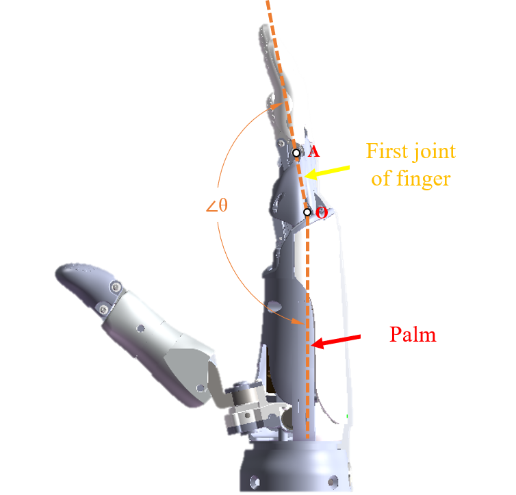

# OHand ModBus-RTU Protocol V1.0

## 1. Overview of ModBus communication protocol

ModBus-RTU protocol uses the Master-Slave Request-Answer communication method. It's protocol frame includes function code, data domain and CRC16 checking.
ModBus-RTU's master unit reads and writes internal registers of ROHand to obtain and control the status of ROHand.
_Read register_ means that upper system reads the internal registers value of ROHand(Can be read in groups, in groups mean several registers with same name and adjacency address).Upper system sends a read request frame(Includes the first address of register group, the length of register group, etc.) to ROHand. After ROHand receives the request frame and check it successfully, ROHand will send back the answer frame cotaining the contents of the register data to the upper system.
_Write register_ means that upper system writes corresponding data in the internal registers of ROHand(Can be written in groups).Upper system sends a request frame(Includes the first address of register group and contents of data to be written) to ROHand. After ROHand receives the request frame and checks it successfully, ROHand will send back answer frame to the upper system.

ROH ModBus protocol supports the opperation of reading holding register(function code '0x03'), presetting single register(function code '0x06') and presetting multiple register(function code '0x10').

## 2. Parameters of RS232、RS485 Communication

The parameters of RS232 and RS485 communication are all '115200' bps, '8' data bits, '1'stop bits and 'none' parity.

## 3. Frame of ROH ModBus data frame

### 3.1. Read holding register(function code '0x03')

The format of Master request frame:

| Slave address | Function code | Start register(high byte) | Start register(low byte) | Number of registers(high byte) | Number of registers(low byte) | CRC16 |
| ------------- | ------------- | ------------------------- | ------------------------ | ------------------------------ | ----------------------------- | ----- |
| 0x11          | 0x03          | 0x6B                      | 0x00                     | 0x00                           | 0x02                          | XXXX  |

Meaning: read NO.17(0x11) Slave holding register; Start address = 0x006B, Number of registers = 0x0002, end address = 0x006B+2-1 = 0x006C, that is, read NO.17 slave holding register 0x006B-0x006C, two registers in total.

The format of Slave answer frame:

| Slave address | Function code | Byte count | Register(high byte) | Register(low byte) | Register(high byte) | Register(low byte) | CRC16 |
| ------------- | ------------- | ---------- | ------------------- | ------------------ | ------------------- | ------------------ | ----- |
| 0x11          | 0x03          | 0x04       | 0x00                | 0x01               | 0x00                | 0x02               | XXXX  |

Meaning: return NO.17(0x11) Slave holding register 0x006B-0x006C, two registers in total. The value of register 0x006B is 0x0001, register 0x0062 is 0x0002.

When an error occurs in Slave excuting request frame, the format of answer frame is:

| Slave address | Function code | Error code | CRC16 |
| ------------- | ------------- | ---------- | ----- |
| 0x11          | 0x83          | XX         | XXXX  |

Where the function code is the value after the request frame function code executes 'OR' operation with 0x80 bit.

### 3.2. Preset single register(function code '0x06')

The format of Master request frame:

| Slave address | Function code | Start register(high byte) | Start register(low byte) | Data content(high byte) | Amount of data(low byte) | CRC16 |
| ------------- | ------------- | ------------------------- | ------------------------ | ----------------------- | ------------------------ | ----- |
| 0x11          | 0x06          | 0x00                      | 0x6B                     | 0x10                    | 0x00                     | XXXX  |

Meaning: set NO.17(0x11) Slave holding register, address of register is 0x006B, data content is 0x1000.

The format of Slave answer frame:

| Slave address | Function code | Start register(high byte) | Start register(low byte) | Data content(high byte) | Amount of data(low byte) | CRC16 |
| ------------- | ------------- | ------------------------- | ------------------------ | ----------------------- | ------------------------ | ----- |
| 0x11          | 0x06          | 0x00                      | 0x6B                     | 0x10                    | 0x00                     | XXXX  |

Meaning: the copy of original request frame.

When an error occurs in Slave excuting request frame, the format of answer frame is:

| Slave address | Function code | Error code | CRC16 |
| ------------- | ------------- | ---------- | ----- |
| 0x11          | 0x86          | XX         | XXXX  |

Where the function code is the value after the request frame function code executes 'OR' operation with 0x80 bit.

### 3.3 Preset multiple registers(function code '0x10')

The format of Master request frame:

| Slave address | Function code | Start register(high byte) | Start register(low byte) | Amount of data(high byte) | Amount of data(low byte) | Byte count | Data(high byte) | Data(low byte) | Data(high byte) | Data(low byte) | CRC16 |
| ------------- | ------------- | ------------------------- | ------------------------ | ------------------------- | ------------------------ | ---------- | --------------- | -------------- | --------------- | -------------- | ----- |
| 0x11          | 0x10          | 0x00                      | 0x01                     | 0x00                      | 0x02                     | 0x04       | 0x00            | 0x0A           | 0x01            | 0x02           | XXXX  |

Meaning: set NO.17(0x11) Slave holding register, start address of register is 0x0001, number of register is 0x0002, data content byte count is 0x04, data content is 0x000A and 0x0102.

The format of Slave request frame:

| Slave address | Function code | Start register(high byte) | Start register(low byte) | Amount of register(high byte) | Amount of register(high byte) | CRC16 |
| ------------- | ------------- | ------------------------- | ------------------------ | ----------------------------- | ----------------------------- | ----- |
| 0x11          | 0x10          | 0x00                      | 0x01                     | 0x00                          | 0x02                          | XXXX  |

Meaning: keep the address, function code, start register and amount of register same with request frame.

When an error occurs in Slave excuting request frame, the format of answer frame is:

| Slave address | Function code | Error code | CRC16 |
| ------------- | ------------- | ---------- | ----- |
| 0x11          | 0x90          | XX         | XXXX  |

Where the function code is the value after the request frame function code executes 'OR' operation with 0x80 bit.

## 3.4. Error code of ROHand

| Error name                 | Code | Description                                               |
| -------------------------- | ---: | --------------------------------------------------------- |
| EC01_ILLEGAL_FUNCTION      |    1 | Illegal function code                                     |
| EC02_ILLEGAL_DATA_ADDRESS  |    2 | Illegal data address                                      |
| EC03_ILLEGAL_DATA_VALUE    |    3 | Illegal data value(protocol layer, not application layer) |
| EC04_SERVER_DEVICE_FAILURE |    4 | Device failure                                            |

In case the error code is EC04_SERVER_DEVICE_FAILURE, the register ROH_SUB_EXCEPTION holds the specific error code:

| Suberror name    | Code | Description                                                                           |
| ---------------- | ---: | ------------------------------------------------------------------------------------- |
| ERR_STATUS_INIT  |    1 | Waiting for initialization or initializing, the read/write operation is not accepted. |
| ERR_STATUS_CALI  |    2 | Waiting for calibration, the read/write operation is not accepted.                    |
| ERR_INVALID_DATA |    3 | Invalid register value.                                                               |
| ERR_STATUS_STUCK |    4 | Motor stuck.                                                                          |
| ERR_OP_FAILED    |    5 | Operation failed.                                                                     |
| ERR_SAVE_FAILED  |    6 | Save failed.                                                                          |

## 4. Description of ModBus register

### 4.1. Table of register

| Register name             | Register address | Read/write access | Factory defaults for setting items | Description                                                                                                                                                       |
| ------------------------- | ---------------: | ----------------- | ---------------------------------- | ----------------------------------------------------------------------------------------------------------------------------------------------------------------- |
| ROH_PROTOCOL_VERSION      |             1000 | R                 |                                    | Protocol version number(uint16), high byte is the main version number, low byte is the minor version                                                              |
| ROH_FW_VERSION            |             1001 | R                 |                                    | Firmware version number(uint16), high byte is the main version number, low byte is the minor version                                                              |
| ROH_FW_REVISION           |             1002 | R                 |                                    | Firmware revision number(uint16)                                                                                                                                  |
| ROH_HW_VERSION            |             1003 | R                 |                                    | Hardware version number(uint16), high byte is the hardware type, low byte is the hardware version.                                                                |
| ROH_BOOT_VERSION          |             1004 | R                 |                                    | Boot loader version number(uint6), high byte is the main version number, low byte is the minor version number.                                                    |
| ROH_NODE_ID               |             1005 | R/W               | 2                                  | ROHand ID, only low byte is valid, ROHand will save and reboot when successfully written.                                                                         |
| ROH_SUB_EXCEPTION         |             1006 | R                 |                                    | Error subcode                                                                                                                                                     |
| ROH_BATTERY_VOLTAGE       |             1007 | R                 |                                    | Voltage value of ROH in mV, temporarily unavailable.                                                                                                              |
| ROH_SELF_TEST_LEVEL       |             1008 | R/W               | 1                                  | Self-test switch, allowed to self-test when set 1, not to self-test when set 0, saved to Non-Volatile Memory (NVM) when setting.                                  |
| ROH_BEEP_SWITCH           |             1009 | R/W               | 1                                  | Buzzer switch, allowed to vocalize when set 1, to be quiet when set 0, saved to Non-Volatile Memory (NVM) when setting.                                           |
| ROH_BEEP_PERIOD           |             1010 | W                 |                                    | Buzzer vocalize period in ms.                                                                                                                                     |
| ROH_BUTTON_PRESS_CNT      |             1011 | R/W               |                                    | Number of key presses, as a confirmation during calibration for ROH.                                                                                              |
| ROH_RECALIBRATE           |             1012 | W                 |                                    | Recalibration, writing a specific value (not public) will put the ROHand into a calibration state.                                                                |
| ROH_START_INIT            |             1013 | W                 |                                    | Start self-test, only valid while waiting for self-test status.                                                                                                   |
| ROH_RESET                 |             1014 | W                 |                                    | Reset, enter DFU mode when writing non-zero values, restart to working mode when writing 0.                                                                       |
| ROH_POWER_OFF             |             1015 | W                 |                                    | Power off, temporarily unavailable.                                                                                                                               |
| ROH_RESERVED0             |             1016 | R/W               |                                    | Reserved.                                                                                                                                                         |
| ROH_RESERVED1             |             1017 | R/W               |                                    | Reserved.                                                                                                                                                         |
| ROH_RESERVED2             |             1018 | R/W               |                                    | Reserved.                                                                                                                                                         |
| ROH_RESERVED3             |             1019 | R/W               |                                    | Reserved.                                                                                                                                                         |
| ROH_CALI_END0             |             1020 | R/W               | Factory calibration value          | Upper limit (uint16) of thumb operation interval (absolute position), saved to Non-Volatile Memory (NVM) when setting, and no need to be set by the user.         |
| ROH_CALI_END1             |             1021 | R/W               | Factory calibration value          | Upper limit (uint16) of index finger operation interval (absolute position), saved to Non-Volatile Memory (NVM) when setting, and no need to be set by the user.  |
| ROH_CALI_END2             |             1022 | R/W               | Factory calibration value          | Upper limit (uint16) of middle finger operation interval (absolute position), saved to Non-Volatile Memory (NVM) when setting, and no need to be set by the user. |
| ROH_CALI_END3             |             1023 | R/W               | Factory calibration value          | Upper limit (uint16) of ring finger operation interval (absolute position), saved to Non-Volatile Memory (NVM) when setting, and no need to be set by the user.   |
| ROH_CALI_END4             |             1024 | R/W               | Factory calibration value          | Upper limit (uint16) of little finger operation interval (absolute position), saved to Non-Volatile Memory (NVM) when setting, and no need to be set by the user. |
| ROH_CALI_END5             |             1025 | R/W               | Factory calibration value          | Upper limit (uint16) of thumb rotation interval (absolute position), saved to Non-Volatile Memory (NVM) when setting, and no need to be set by the user.          |
| ROH_CALI_END6             |             1026 | R/W               |                                    | Reserved.                                                                                                                                                         |
| ROH_CALI_END7             |             1027 | R/W               |                                    | Reserved.                                                                                                                                                         |
| ROH_CALI_END8             |             1028 | R/W               |                                    | Reserved.                                                                                                                                                         |
| ROH_CALI_END9             |             1029 | R/W               |                                    | Reserved.                                                                                                                                                         |
| ROH_CALI_START0           |             1030 | R/W               | Factory calibration value          | Lower limit (uint16) of thumb operation interval (absolute position), saved to Non-Volatile Memory (NVM) when setting, and no need to be set by the user.         |
| ROH_CALI_START1           |             1031 | R/W               | Factory calibration value          | Lower limit (uint16) of index finger operation interval (absolute position), saved to Non-Volatile Memory (NVM) when setting, and no need to be set by the user.  |
| ROH_CALI_START2           |             1032 | R/W               | Factory calibration value          | Lower limit (uint16) of middle finger operation interval (absolute position), saved to Non-Volatile Memory (NVM) when setting, and no need to be set by the user. |
| ROH_CALI_START3           |             1033 | R/W               | Factory calibration value          | Lower limit (uint16) of ring finger operation interval (absolute position), saved to Non-Volatile Memory (NVM) when setting, and no need to be set by the user.   |
| ROH_CALI_START4           |             1034 | R/W               | Factory calibration value          | Lower limit (uint16) of little finger operation interval (absolute position), saved to Non-Volatile Memory (NVM) when setting, and no need to be set by the user. |
| ROH_CALI_START5           |             1035 | R/W               | Factory calibration value          | Lower limit (uint16) of thumb rotation interval (absolute position), saved to Non-Volatile Memory (NVM) when setting, and no need to be set by the user.          |
| ROH_CALI_START6           |             1036 | R/W               |                                    | Reserved.                                                                                                                                                         |
| ROH_CALI_START7           |             1037 | R/W               |                                    | Reserved.                                                                                                                                                         |
| ROH_CALI_START8           |             1038 | R/W               |                                    | Reserved.                                                                                                                                                         |
| ROH_CALI_START9           |             1039 | R/W               |                                    | Reserved.                                                                                                                                                         |
| ROH_CALI_THUMB_POS0       |             1040 | R/W               | Factory calibration value          | Preset position (uint16) of thumb lateral palm position(absolute position), saved to Non-Volatile Memory (NVM) when setting, and no need to be set by the user.   |
| ROH_CALI_THUMB_POS1       |             1041 | R/W               | Factory calibration value          | Preset position 1 (uint16) of thumb lateral palm position(absolute position), saved to Non-Volatile Memory (NVM) when setting, and no need to be set by the user. |
| ROH_CALI_THUMB_POS2       |             1042 | R/W               | Factory calibration value          | Preset position 2 (uint16) of thumb lateral palm position(absolute position), saved to Non-Volatile Memory (NVM) when setting, and no need to be set by the user. |
| ROH_CALI_THUMB_POS3       |             1043 | R/W               |                                    | Reserved.                                                                                                                                                         |
| ROH_CALI_THUMB_POS4       |             1044 | R/W               |                                    | Reserved.                                                                                                                                                         |
| ROH_FINGER_P0             |             1045 | R/W               | 500 \* 100                         | P-value \*100 (uint16) of thumb bending, saved to Non-Volatile Memory (NVM) when setting.                                                                         |
| ROH_FINGER_P1             |             1046 | R/W               | 500 \* 100                         | P-value \*100 (uint16) of index finger bending, saved to Non-Volatile Memory (NVM) when setting.                                                                  |
| ROH_FINGER_P2             |             1047 | R/W               | 500 \* 100                         | P-value \*100 (uint16) of middle finger bending, saved to Non-Volatile Memory (NVM) when setting.                                                                 |
| ROH_FINGER_P3             |             1048 | R/W               | 500 \* 100                         | P-value \*100 (uint16) of ring finger bending, saved to Non-Volatile Memory (NVM) when setting.                                                                   |
| ROH_FINGER_P4             |             1049 | R/W               | 500 \* 100                         | P-value \*100 (uint16) of little finger bending, saved to Non-Volatile Memory (NVM) when setting.                                                                 |
| ROH_FINGER_P5             |             1050 | R/W               | 500 \* 100                         | P-value \*100 (uint16) of thumb rotation, saved to Non-Volatile Memory (NVM) when setting.                                                                        |
| ROH_FINGER_P6             |             1051 | R/W               |                                    | Reserved.                                                                                                                                                         |
| ROH_FINGER_P7             |             1052 | R/W               |                                    | Reserved.                                                                                                                                                         |
| ROH_FINGER_P8             |             1053 | R/W               |                                    | Reserved.                                                                                                                                                         |
| ROH_FINGER_P9             |             1054 | R/W               |                                    | Reserved.                                                                                                                                                         |
| ROH_FINGER_I0             |             1055 | R/W               | 1 \* 100                           | I-value \*100 (uint16) of thumb bending, saved to Non-Volatile Memory (NVM) when setting.                                                                         |
| ROH_FINGER_I1             |             1056 | R/W               | 1 \* 100                           | I-value \*100 (uint16) of index finger bending, saved to Non-Volatile Memory (NVM) when setting.                                                                  |
| ROH_FINGER_I2             |             1057 | R/W               | 1 \* 100                           | I-value \*100 (uint16) of middle finger bending, saved to Non-Volatile Memory (NVM) when setting.                                                                 |
| ROH_FINGER_I3             |             1058 | R/W               | 1 \* 100                           | I-value \*100 (uint16) of ring finger bending, saved to Non-Volatile Memory (NVM) when setting.                                                                   |
| ROH_FINGER_I4             |             1059 | R/W               | 1 \* 100                           | I-value \*100 (uint16) of little finger bending, saved to Non-Volatile Memory (NVM) when setting.                                                                 |
| ROH_FINGER_I5             |             1060 | R/W               | 1 \* 100                           | I-value \*100 (uint16) of thumb rotation, saved to Non-Volatile Memory (NVM) when setting.                                                                        |
| ROH_FINGER_I6             |             1061 | R/W               |                                    | Reserved.                                                                                                                                                         |
| ROH_FINGER_I7             |             1062 | R/W               |                                    | Reserved.                                                                                                                                                         |
| ROH_FINGER_I8             |             1063 | R/W               |                                    | Reserved.                                                                                                                                                         |
| ROH_FINGER_I9             |             1064 | R/W               |                                    | Reserved.                                                                                                                                                         |
| ROH_FINGER_D0             |             1065 | R/W               | 250 \* 100                         | D-value \*100 (uint16) of thumb bending, saved to Non-Volatile Memory (NVM) when setting.                                                                         |
| ROH_FINGER_D1             |             1066 | R/W               | 250 \* 100                         | D-value \*100 (uint16) of index finger bending, saved to Non-Volatile Memory (NVM) when setting.                                                                  |
| ROH_FINGER_D2             |             1067 | R/W               | 250 \* 100                         | D-value \*100 (uint16) of middle finger bending, saved to Non-Volatile Memory (NVM) when setting.                                                                 |
| ROH_FINGER_D3             |             1068 | R/W               | 250 \* 100                         | D-value \*100 (uint16) of ring finger bending, saved to Non-Volatile Memory (NVM) when setting.                                                                   |
| ROH_FINGER_D4             |             1069 | R/W               | 250 \* 100                         | D-value \*100 (uint16) of little finger bending, saved to Non-Volatile Memory (NVM) when setting.                                                                 |
| ROH_FINGER_D5             |             1070 | R/W               | 250 \* 100                         | D-value \*100 (uint16) of thumb rotation, saved to Non-Volatile Memory (NVM) when setting.                                                                        |
| ROH_FINGER_D6             |             1071 | R/W               |                                    | Reserved.                                                                                                                                                         |
| ROH_FINGER_D7             |             1072 | R/W               |                                    | Reserved.                                                                                                                                                         |
| ROH_FINGER_D8             |             1073 | R/W               |                                    | Reserved.                                                                                                                                                         |
| ROH_FINGER_D9             |             1074 | R/W               |                                    | Reserved.                                                                                                                                                         |
| ROH_FINGER_G0             |             1075 | R/W               | 1.00 \* 100                        | G-value \*100 (uint16) of thumb bending, saved to Non-Volatile Memory (NVM) when setting.                                                                         |
| ROH_FINGER_G1             |             1076 | R/W               | 0.10 \* 100                        | G-value \*100 (uint16) of index finger bending, saved to Non-Volatile Memory (NVM) when setting.                                                                  |
| ROH_FINGER_G2             |             1077 | R/W               | 0.10 \* 100                        | G-value \*100 (uint16) of middle finger bending, saved to Non-Volatile Memory (NVM) when setting.                                                                 |
| ROH_FINGER_G3             |             1078 | R/W               | 0.10 \* 100                        | G-value \*100 (uint16) of ring finger bending, saved to Non-Volatile Memory (NVM) when setting.                                                                   |
| ROH_FINGER_G4             |             1079 | R/W               | 0.10 \* 100                        | G-value \*100 (uint16) of little finger bending, saved to Non-Volatile Memory (NVM) when setting.                                                                 |
| ROH_FINGER_G5             |             1080 | R/W               | 1.00 \* 100                        | G-value \*100 (uint16) of thumb rotation, saved to Non-Volatile Memory (NVM) when setting.                                                                        |
| ROH_FINGER_G6             |             1081 | R/W               |                                    | Reserved.                                                                                                                                                         |
| ROH_FINGER_G7             |             1082 | R/W               |                                    | Reserved.                                                                                                                                                         |
| ROH_FINGER_G8             |             1083 | R/W               |                                    | Reserved.                                                                                                                                                         |
| ROH_FINGER_G9             |             1084 | R/W               |                                    | Reserved.                                                                                                                                                         |
| ROH_FINGER_STATUS0        |             1085 | R                 |                                    | Status (uint16) of thumb.                                                                                                                                         |
| ROH_FINGER_STATUS1        |             1086 | R                 |                                    | Status (uint16) of index finger.                                                                                                                                  |
| ROH_FINGER_STATUS2        |             1087 | R                 |                                    | Status (uint16) of middle finger.                                                                                                                                 |
| ROH_FINGER_STATUS3        |             1088 | R                 |                                    | Status (uint16) of ring finge.                                                                                                                                    |
| ROH_FINGER_STATUS4        |             1089 | R                 |                                    | Status (uint16) of little finger.                                                                                                                                 |
| ROH_FINGER_STATUS5        |             1090 | R                 |                                    | Status (uint16) of thumb rotation.                                                                                                                                |
| ROH_FINGER_STATUS6        |             1091 | R                 |                                    | Reserved.                                                                                                                                                         |
| ROH_FINGER_STATUS7        |             1092 | R                 |                                    | Reserved.                                                                                                                                                         |
| ROH_FINGER_STATUS8        |             1093 | R                 |                                    | Reserved.                                                                                                                                                         |
| ROH_FINGER_STATUS9        |             1094 | R                 |                                    | Reserved.                                                                                                                                                         |
| ROH_FINGER_CURRENT_LIMIT0 |             1095 | R/W               | 1200                               | Current limit value (uint16) of thumb bending motor in mA, reset to default value when power up.                                                                  |
| ROH_FINGER_CURRENT_LIMIT1 |             1096 | R/W               | 1200                               | Current limit value (uint16) of index finger bending motor in mA, reset to default value when power up.                                                           |
| ROH_FINGER_CURRENT_LIMIT2 |             1097 | R/W               | 1200                               | Current limit value (uint16) of middle finger bending motor in mA, reset to default value when power up.                                                          |
| ROH_FINGER_CURRENT_LIMIT3 |             1098 | R/W               | 1200                               | Current limit value (uint16) of ring finger bending motor in mA, reset to default value when power up.                                                            |
| ROH_FINGER_CURRENT_LIMIT4 |             1099 | R/W               | 1200                               | Current limit value (uint16) of little finger bending motor in mA, reset to default value when power up.                                                          |
| ROH_FINGER_CURRENT_LIMIT5 |             1100 | R/W               | 1200                               | Current limit value (uint16) of thumb rotation motor in mA, reset to default value when power up.                                                                 |
| ROH_FINGER_CURRENT_LIMIT6 |             1101 | R/W               |                                    | Reserved.                                                                                                                                                         |
| ROH_FINGER_CURRENT_LIMIT7 |             1102 | R/W               |                                    | Reserved.                                                                                                                                                         |
| ROH_FINGER_CURRENT_LIMIT8 |             1103 | R/W               |                                    | Reserved.                                                                                                                                                         |
| ROH_FINGER_CURRENT_LIMIT9 |             1104 | R/W               |                                    | Reserved.                                                                                                                                                         |
| ROH_FINGER_CURRENT0       |             1105 | R                 |                                    | Current value (uint16) of thumb bending motor in mA.                                                                                                              |
| ROH_FINGER_CURRENT1       |             1106 | R                 |                                    | Current value (uint16) of index finger bending motor in mA.                                                                                                       |
| ROH_FINGER_CURRENT2       |             1107 | R                 |                                    | Current value (uint16) of middle finger bending motor in mA.                                                                                                      |
| ROH_FINGER_CURRENT3       |             1108 | R                 |                                    | Current value (uint16) of ring finger bending motor in mA.                                                                                                        |
| ROH_FINGER_CURRENT4       |             1109 | R                 |                                    | Current value (uint16) of little finger bending motor in mA.                                                                                                      |
| ROH_FINGER_CURRENT5       |             1110 | R                 |                                    | Current value (uint16)A of thumb rotation motor in mA.                                                                                                            |
| ROH_FINGER_CURRENT6       |             1111 | R                 |                                    | Reserved.                                                                                                                                                         |
| ROH_FINGER_CURRENT7       |             1112 | R                 |                                    | Reserved.                                                                                                                                                         |
| ROH_FINGER_CURRENT8       |             1113 | R                 |                                    | Reserved.                                                                                                                                                         |
| ROH_FINGER_CURRENT9       |             1114 | R                 |                                    | Reserved.                                                                                                                                                         |
| ROH_FINGER_FORCE_LIMIT0   |             1115 | R/W               | 15000                              | Force limit value (uint16) of thumb in mN, reset to default value when power up.                                                                                  |
| ROH_FINGER_FORCE_LIMIT1   |             1116 | R/W               | 15000                              | Force limit value (uint16) of index finge in mNr, reset to default value when power up.                                                                           |
| ROH_FINGER_FORCE_LIMIT2   |             1117 | R/W               | 15000                              | Force limit value (uint16) of middle finger in mN, reset to default value when power up.                                                                          |
| ROH_FINGER_FORCE_LIMIT3   |             1118 | R/W               | 15000                              | Force limit value (uint16) of ring finger in mN, reset to default value when power up.                                                                            |
| ROH_FINGER_FORCE_LIMIT4   |             1119 | R/W               | 15000                              | Force limit value (uint16) of little finger in mN, reset to default value when power up.                                                                          |
| ROH_FINGER_FORCE0         |             1120 | R                 |                                    | Force value (uint16) of thumb in mN.                                                                                                                              |
| ROH_FINGER_FORCE1         |             1121 | R                 |                                    | Force value (uint16) of index finger in mN.                                                                                                                       |
| ROH_FINGER_FORCE2         |             1122 | R                 |                                    | Force value (uint16) of middle finger in mN.                                                                                                                      |
| ROH_FINGER_FORCE3         |             1123 | R                 |                                    | Force value (uint16) of ring finger in mN.                                                                                                                        |
| ROH_FINGER_FORCE4         |             1124 | R                 |                                    | Force value (uint16) of little finger in mN.                                                                                                                      |
| ROH_FINGER_SPEED0         |             1125 | R/W               | 65535                              | Logical speed (uint16) of thumb bending in logical posstion/second, reset to default value when power up.                                                         |
| ROH_FINGER_SPEED1         |             1126 | R/W               | 65535                              | Logical speed (uint16) of index finger bending in logical posstion/second, reset to default value when power up.                                                  |
| ROH_FINGER_SPEED2         |             1127 | R/W               | 65535                              | Logical speed (uint16) of middle finger in logical posstion/second, reset to default value when power up.                                                         |
| ROH_FINGER_SPEED3         |             1128 | R/W               | 65535                              | Logical speed (uint16) of ring finger bending in logical posstion/second, reset to default value when power up.                                                   |
| ROH_FINGER_SPEED4         |             1129 | R/W               | 65535                              | Logical speed (uint16) of little finger bending in logical posstion/second, reset to default value when power up.                                                 |
| ROH_FINGER_SPEED5         |             1130 | R/W               | 65535                              | Logical speed (uint16)d of thumb rotation in logical posstion/secon, reset to default value when power up.                                                        |
| ROH_FINGER_SPEED6         |             1131 | R/W               |                                    | Reserved.                                                                                                                                                         |
| ROH_FINGER_SPEED7         |             1132 | R/W               |                                    | Reserved.                                                                                                                                                         |
| ROH_FINGER_SPEED8         |             1133 | R/W               |                                    | Reserved.                                                                                                                                                         |
| ROH_FINGER_SPEED9         |             1134 | R/W               |                                    | Reserved.                                                                                                                                                         |
| ROH_FINGER_POS_TARGET0    |             1135 | R/W               |                                    | Logical target position (uint16) of thumb bending.                                                                                                                |
| ROH_FINGER_POS_TARGET1    |             1136 | R/W               |                                    | Logical target position (uint16) of index finger bending.                                                                                                         |
| ROH_FINGER_POS_TARGET2    |             1137 | R/W               |                                    | Logical target position (uint16) of middle finger bending.                                                                                                        |
| ROH_FINGER_POS_TARGET3    |             1138 | R/W               |                                    | Logical target position (uint16) of ring finger bending.                                                                                                          |
| ROH_FINGER_POS_TARGET4    |             1139 | R/W               |                                    | Logical target position (uint16) of little finger bending.                                                                                                        |
| ROH_FINGER_POS_TARGET5    |             1140 | R/W               |                                    | Logical target position (uint16) of thumb rotation.                                                                                                               |
| ROH_FINGER_POS_TARGET6    |             1141 | R/W               |                                    | Reserved.                                                                                                                                                         |
| ROH_FINGER_POS_TARGET7    |             1142 | R/W               |                                    | Reserved.                                                                                                                                                         |
| ROH_FINGER_POS_TARGET8    |             1143 | R/W               |                                    | Reserved.                                                                                                                                                         |
| ROH_FINGER_POS_TARGET9    |             1144 | R/W               |                                    | Reserved.                                                                                                                                                         |
| ROH_FINGER_POS0           |             1145 | R                 |                                    | Logical position (uint16) of thumb bending.                                                                                                                       |
| ROH_FINGER_POS1           |             1146 | R                 |                                    | Logical position (uint16) of index finger bending.                                                                                                                |
| ROH_FINGER_POS2           |             1147 | R                 |                                    | Logical position (uint16) of middle finger bending.                                                                                                               |
| ROH_FINGER_POS3           |             1148 | R                 |                                    | Logical position (uint16) of ring finger bending.                                                                                                                 |
| ROH_FINGER_POS4           |             1149 | R                 |                                    | Logical position (uint16) of little finger bending.                                                                                                               |
| ROH_FINGER_POS5           |             1150 | R                 |                                    | Logical position (uint16) of thumb rotation.                                                                                                                      |
| ROH_FINGER_POS6           |             1151 | R                 |                                    | Reserved.                                                                                                                                                         |
| ROH_FINGER_POS7           |             1152 | R                 |                                    | Reserved.                                                                                                                                                         |
| ROH_FINGER_POS8           |             1153 | R                 |                                    | Reserved.                                                                                                                                                         |
| ROH_FINGER_POS9           |             1154 | R                 |                                    | Reserved.                                                                                                                                                         |
| ROH_FINGER_ANGLE_TARGET0  |             1155 | R/W               |                                    | Target angle between the thumb motor axis and the rotation axis (int16) in degree, equals the actual angle\*100.                                                  |
| ROH_FINGER_ANGLE_TARGET1  |             1156 | R/W               |                                    | Target angle between the the first section of the index finger and the palm (int16) in degree, equals the actual angle\*100.                                      |
| ROH_FINGER_ANGLE_TARGET2  |             1157 | R/W               |                                    | Target angle between the the first section of the middle finger and the palm (int16) in degree, equals the actual angle\*100.                                     |
| ROH_FINGER_ANGLE_TARGET3  |             1158 | R/W               |                                    | Target angle between the the first section of the ring finger and the palm (int16) in degree, equals the actual angle\*100.                                       |
| ROH_FINGER_ANGLE_TARGET4  |             1159 | R/W               |                                    | Target angle between the the first section of the little finger and the palm (int16) in degree, equals the actual angle\*100.                                     |
| ROH_FINGER_ANGLE_TARGET5  |             1160 | R/W               |                                    | Target angle of the thumb rotation (int16) in degree, equals the actual angle\*100.                                                                               |
| ROH_FINGER_ANGLE_TARGET6  |             1161 | R/W               |                                    | Reserved.                                                                                                                                                         |
| ROH_FINGER_ANGLE_TARGET7  |             1162 | R/W               |                                    | Reserved.                                                                                                                                                         |
| ROH_FINGER_ANGLE_TARGET8  |             1163 | R/W               |                                    | Reserved.                                                                                                                                                         |
| ROH_FINGER_ANGLE_TARGET9  |             1164 | R/W               |                                    | Reserved.                                                                                                                                                         |
| ROH_FINGER_ANGLE0         |             1165 | R                 |                                    | Angle between the thumb motor axis and the rotation axis (int16) in degree, equals the actual angle\*100.                                                         |
| ROH_FINGER_ANGLE1         |             1166 | R                 |                                    | Angle between the the first section of the index finger and the palm (int16) in degree, equals the actual angle\*100.                                             |
| ROH_FINGER_ANGLE2         |             1167 | R                 |                                    | Angle between the the first section of the middle finger and the palm (int16) in degree, equals the actual angle\*100.                                            |
| ROH_FINGER_ANGLE3         |             1168 | R                 |                                    | Angle between the the first section of the ring finger and the palm (int16) in degree, equals the actual angle\*100.                                              |
| ROH_FINGER_ANGLE4         |             1169 | R                 |                                    | Angle between the the first section of the little finger and the palm (int16) in degree, equals the actual angle\*100.                                            |
| ROH_FINGER_ANGLE5         |             1170 | R                 |                                    | Angle of the thumb rotation (int16) in degree, equals the actual angle\*100.                                                                                      |
| ROH_FINGER_ANGLE6         |             1171 | R                 |                                    | Reserved.                                                                                                                                                         |
| ROH_FINGER_ANGLE7         |             1172 | R                 |                                    | Reserved.                                                                                                                                                         |
| ROH_FINGER_ANGLE8         |             1173 | R                 |                                    | Reserved.                                                                                                                                                         |
| ROH_FINGER_ANGLE9         |             1174 | R                 |                                    | Reserved.                                                                                                                                                         |

Enclose the C/C++ macro definition of registers:

```C
/* ModBus-RTU registers */

#define ROH_PROTOCOL_VERSION       (1000) /* R   */
#define ROH_FW_VERSION             (1001) /* R   */
#define ROH_FW_REVISION            (1002) /* R   */
#define ROH_HW_VERSION             (1003) /* R   */
#define ROH_BOOT_VERSION           (1004) /* R   */
#define ROH_NODE_ID                (1005) /* R/W */
#define ROH_SUB_EXCEPTION          (1006) /* R   */
#define ROH_BATTERY_VOLTAGE        (1007) /* R   */
#define ROH_SELF_TEST_LEVEL        (1008) /* R/W */
#define ROH_BEEP_SWITCH            (1009) /* R/W */
#define ROH_BEEP_PERIOD            (1010) /* W   */
#define ROH_BUTTON_PRESS_CNT       (1011) /* R/W */
#define ROH_RECALIBRATE            (1012) /* W   */
#define ROH_START_INIT             (1013) /* W   */
#define ROH_RESET                  (1014) /* W   */
#define ROH_POWER_OFF              (1015) /* W   */
#define ROH_RESERVED0              (1016) /* R/W */
#define ROH_RESERVED1              (1017) /* R/W */
#define ROH_RESERVED2              (1018) /* R/W */
#define ROH_RESERVED3              (1019) /* R/W */
#define ROH_CALI_END0              (1020) /* R/W */
#define ROH_CALI_END1              (1021) /* R/W */
#define ROH_CALI_END2              (1022) /* R/W */
#define ROH_CALI_END3              (1023) /* R/W */
#define ROH_CALI_END4              (1024) /* R/W */
#define ROH_CALI_END5              (1025) /* R/W */
#define ROH_CALI_END6              (1026) /* R/W */
#define ROH_CALI_END7              (1027) /* R/W */
#define ROH_CALI_END8              (1028) /* R/W */
#define ROH_CALI_END9              (1029) /* R/W */
#define ROH_CALI_START0            (1030) /* R/W */
#define ROH_CALI_START1            (1031) /* R/W */
#define ROH_CALI_START2            (1032) /* R/W */
#define ROH_CALI_START3            (1033) /* R/W */
#define ROH_CALI_START4            (1034) /* R/W */
#define ROH_CALI_START5            (1035) /* R/W */
#define ROH_CALI_START6            (1036) /* R/W */
#define ROH_CALI_START7            (1037) /* R/W */
#define ROH_CALI_START8            (1038) /* R/W */
#define ROH_CALI_START9            (1039) /* R/W */
#define ROH_CALI_THUMB_POS0        (1040) /* R/W */
#define ROH_CALI_THUMB_POS1        (1041) /* R/W */
#define ROH_CALI_THUMB_POS2        (1042) /* R/W */
#define ROH_CALI_THUMB_POS3        (1043) /* R/W */
#define ROH_CALI_THUMB_POS4        (1044) /* R/W */
#define ROH_FINGER_P0              (1045) /* R/W */
#define ROH_FINGER_P1              (1046) /* R/W */
#define ROH_FINGER_P2              (1047) /* R/W */
#define ROH_FINGER_P3              (1048) /* R/W */
#define ROH_FINGER_P4              (1049) /* R/W */
#define ROH_FINGER_P5              (1050) /* R/W */
#define ROH_FINGER_P6              (1051) /* R/W */
#define ROH_FINGER_P7              (1052) /* R/W */
#define ROH_FINGER_P8              (1053) /* R/W */
#define ROH_FINGER_P9              (1054) /* R/W */
#define ROH_FINGER_I0              (1055) /* R/W */
#define ROH_FINGER_I1              (1056) /* R/W */
#define ROH_FINGER_I2              (1057) /* R/W */
#define ROH_FINGER_I3              (1058) /* R/W */
#define ROH_FINGER_I4              (1059) /* R/W */
#define ROH_FINGER_I5              (1060) /* R/W */
#define ROH_FINGER_I6              (1061) /* R/W */
#define ROH_FINGER_I7              (1062) /* R/W */
#define ROH_FINGER_I8              (1063) /* R/W */
#define ROH_FINGER_I9              (1064) /* R/W */
#define ROH_FINGER_D0              (1065) /* R/W */
#define ROH_FINGER_D1              (1066) /* R/W */
#define ROH_FINGER_D2              (1067) /* R/W */
#define ROH_FINGER_D3              (1068) /* R/W */
#define ROH_FINGER_D4              (1069) /* R/W */
#define ROH_FINGER_D5              (1070) /* R/W */
#define ROH_FINGER_D6              (1071) /* R/W */
#define ROH_FINGER_D7              (1072) /* R/W */
#define ROH_FINGER_D8              (1073) /* R/W */
#define ROH_FINGER_D9              (1074) /* R/W */
#define ROH_FINGER_G0              (1075) /* R/W */
#define ROH_FINGER_G1              (1076) /* R/W */
#define ROH_FINGER_G2              (1077) /* R/W */
#define ROH_FINGER_G3              (1078) /* R/W */
#define ROH_FINGER_G4              (1079) /* R/W */
#define ROH_FINGER_G5              (1080) /* R/W */
#define ROH_FINGER_G6              (1081) /* R/W */
#define ROH_FINGER_G7              (1082) /* R/W */
#define ROH_FINGER_G8              (1083) /* R/W */
#define ROH_FINGER_G9              (1084) /* R/W */
#define ROH_FINGER_STATUS0         (1085) /* R   */
#define ROH_FINGER_STATUS1         (1086) /* R   */
#define ROH_FINGER_STATUS2         (1087) /* R   */
#define ROH_FINGER_STATUS3         (1088) /* R   */
#define ROH_FINGER_STATUS4         (1089) /* R   */
#define ROH_FINGER_STATUS5         (1090) /* R   */
#define ROH_FINGER_STATUS6         (1091) /* R   */
#define ROH_FINGER_STATUS7         (1092) /* R   */
#define ROH_FINGER_STATUS8         (1093) /* R   */
#define ROH_FINGER_STATUS9         (1094) /* R   */
#define ROH_FINGER_CURRENT_LIMIT0  (1095) /* R/W */
#define ROH_FINGER_CURRENT_LIMIT1  (1096) /* R/W */
#define ROH_FINGER_CURRENT_LIMIT2  (1097) /* R/W */
#define ROH_FINGER_CURRENT_LIMIT3  (1098) /* R/W */
#define ROH_FINGER_CURRENT_LIMIT4  (1099) /* R/W */
#define ROH_FINGER_CURRENT_LIMIT5  (1100) /* R/W */
#define ROH_FINGER_CURRENT_LIMIT6  (1101) /* R/W */
#define ROH_FINGER_CURRENT_LIMIT7  (1102) /* R/W */
#define ROH_FINGER_CURRENT_LIMIT8  (1103) /* R/W */
#define ROH_FINGER_CURRENT_LIMIT9  (1104) /* R/W */
#define ROH_FINGER_CURRENT0        (1105) /* R   */
#define ROH_FINGER_CURRENT1        (1106) /* R   */
#define ROH_FINGER_CURRENT2        (1107) /* R   */
#define ROH_FINGER_CURRENT3        (1108) /* R   */
#define ROH_FINGER_CURRENT4        (1109) /* R   */
#define ROH_FINGER_CURRENT5        (1110) /* R   */
#define ROH_FINGER_CURRENT6        (1111) /* R   */
#define ROH_FINGER_CURRENT7        (1112) /* R   */
#define ROH_FINGER_CURRENT8        (1113) /* R   */
#define ROH_FINGER_CURRENT9        (1114) /* R   */
#define ROH_FINGER_FORCE_LIMIT0    (1115) /* R/W */
#define ROH_FINGER_FORCE_LIMIT1    (1116) /* R/W */
#define ROH_FINGER_FORCE_LIMIT2    (1117) /* R/W */
#define ROH_FINGER_FORCE_LIMIT3    (1118) /* R/W */
#define ROH_FINGER_FORCE_LIMIT4    (1119) /* R/W */
#define ROH_FINGER_FORCE0          (1120) /* R   */
#define ROH_FINGER_FORCE1          (1121) /* R   */
#define ROH_FINGER_FORCE2          (1122) /* R   */
#define ROH_FINGER_FORCE3          (1123) /* R   */
#define ROH_FINGER_FORCE4          (1124) /* R   */
#define ROH_FINGER_SPEED0          (1125) /* R/W */
#define ROH_FINGER_SPEED1          (1126) /* R/W */
#define ROH_FINGER_SPEED2          (1127) /* R/W */
#define ROH_FINGER_SPEED3          (1128) /* R/W */
#define ROH_FINGER_SPEED4          (1129) /* R/W */
#define ROH_FINGER_SPEED5          (1130) /* R/W */
#define ROH_FINGER_SPEED6          (1131) /* R/W */
#define ROH_FINGER_SPEED7          (1132) /* R/W */
#define ROH_FINGER_SPEED8          (1133) /* R/W */
#define ROH_FINGER_SPEED9          (1134) /* R/W */
#define ROH_FINGER_POS_TARGET0     (1135) /* R/W */
#define ROH_FINGER_POS_TARGET1     (1136) /* R/W */
#define ROH_FINGER_POS_TARGET2     (1137) /* R/W */
#define ROH_FINGER_POS_TARGET3     (1138) /* R/W */
#define ROH_FINGER_POS_TARGET4     (1139) /* R/W */
#define ROH_FINGER_POS_TARGET5     (1140) /* R/W */
#define ROH_FINGER_POS_TARGET6     (1141) /* R/W */
#define ROH_FINGER_POS_TARGET7     (1142) /* R/W */
#define ROH_FINGER_POS_TARGET8     (1143) /* R/W */
#define ROH_FINGER_POS_TARGET9     (1144) /* R/W */
#define ROH_FINGER_POS0            (1145) /* R   */
#define ROH_FINGER_POS1            (1146) /* R   */
#define ROH_FINGER_POS2            (1147) /* R   */
#define ROH_FINGER_POS3            (1148) /* R   */
#define ROH_FINGER_POS4            (1149) /* R   */
#define ROH_FINGER_POS5            (1150) /* R   */
#define ROH_FINGER_POS6            (1151) /* R   */
#define ROH_FINGER_POS7            (1152) /* R   */
#define ROH_FINGER_POS8            (1153) /* R   */
#define ROH_FINGER_POS9            (1154) /* R   */
#define ROH_FINGER_ANGLE_TARGET0   (1155) /* R/W */
#define ROH_FINGER_ANGLE_TARGET1   (1156) /* R/W */
#define ROH_FINGER_ANGLE_TARGET2   (1157) /* R/W */
#define ROH_FINGER_ANGLE_TARGET3   (1158) /* R/W */
#define ROH_FINGER_ANGLE_TARGET4   (1159) /* R/W */
#define ROH_FINGER_ANGLE_TARGET5   (1160) /* R/W */
#define ROH_FINGER_ANGLE_TARGET6   (1161) /* R/W */
#define ROH_FINGER_ANGLE_TARGET7   (1162) /* R/W */
#define ROH_FINGER_ANGLE_TARGET8   (1163) /* R/W */
#define ROH_FINGER_ANGLE_TARGET9   (1164) /* R/W */
#define ROH_FINGER_ANGLE0          (1165) /* R   */
#define ROH_FINGER_ANGLE1          (1166) /* R   */
#define ROH_FINGER_ANGLE2          (1167) /* R   */
#define ROH_FINGER_ANGLE3          (1168) /* R   */
#define ROH_FINGER_ANGLE4          (1169) /* R   */
#define ROH_FINGER_ANGLE5          (1170) /* R   */
#define ROH_FINGER_ANGLE6          (1171) /* R   */
#define ROH_FINGER_ANGLE7          (1172) /* R   */
#define ROH_FINGER_ANGLE8          (1173) /* R   */
#define ROH_FINGER_ANGLE9          (1174) /* R   */
```

```Python
# ModBus-RTU registers for ROH

ROH_PROTOCOL_VERSION      = (1000) # R
ROH_FW_VERSION            = (1001) # R
ROH_FW_REVISION           = (1002) # R
ROH_HW_VERSION            = (1003) # R
ROH_BOOT_VERSION          = (1004) # R
ROH_NODE_ID               = (1005) # R/W
ROH_SUB_EXCEPTION         = (1006) # R
ROH_BATTERY_VOLTAGE       = (1007) # R
ROH_SELF_TEST_LEVEL       = (1008) # R/W
ROH_BEEP_SWITCH           = (1009) # R/W
ROH_BEEP_PERIOD           = (1010) # W
ROH_BUTTON_PRESS_CNT      = (1011) # R/W
ROH_RECALIBRATE           = (1012) # W
ROH_START_INIT            = (1013) # W
ROH_RESET                 = (1014) # W
ROH_POWER_OFF             = (1015) # W
ROH_RESERVED0             = (1016) # R/W
ROH_RESERVED1             = (1017) # R/W
ROH_RESERVED2             = (1018) # R/W
ROH_RESERVED3             = (1019) # R/W
ROH_CALI_END0             = (1020) # R/W
ROH_CALI_END1             = (1021) # R/W
ROH_CALI_END2             = (1022) # R/W
ROH_CALI_END3             = (1023) # R/W
ROH_CALI_END4             = (1024) # R/W
ROH_CALI_END5             = (1025) # R/W
ROH_CALI_END6             = (1026) # R/W
ROH_CALI_END7             = (1027) # R/W
ROH_CALI_END8             = (1028) # R/W
ROH_CALI_END9             = (1029) # R/W
ROH_CALI_START0           = (1030) # R/W
ROH_CALI_START1           = (1031) # R/W
ROH_CALI_START2           = (1032) # R/W
ROH_CALI_START3           = (1033) # R/W
ROH_CALI_START4           = (1034) # R/W
ROH_CALI_START5           = (1035) # R/W
ROH_CALI_START6           = (1036) # R/W
ROH_CALI_START7           = (1037) # R/W
ROH_CALI_START8           = (1038) # R/W
ROH_CALI_START9           = (1039) # R/W
ROH_CALI_THUMB_POS0       = (1040) # R/W
ROH_CALI_THUMB_POS1       = (1041) # R/W
ROH_CALI_THUMB_POS2       = (1042) # R/W
ROH_CALI_THUMB_POS3       = (1043) # R/W
ROH_CALI_THUMB_POS4       = (1044) # R/W
ROH_FINGER_P0             = (1045) # R/W
ROH_FINGER_P1             = (1046) # R/W
ROH_FINGER_P2             = (1047) # R/W
ROH_FINGER_P3             = (1048) # R/W
ROH_FINGER_P4             = (1049) # R/W
ROH_FINGER_P5             = (1050) # R/W
ROH_FINGER_P6             = (1051) # R/W
ROH_FINGER_P7             = (1052) # R/W
ROH_FINGER_P8             = (1053) # R/W
ROH_FINGER_P9             = (1054) # R/W
ROH_FINGER_I0             = (1055) # R/W
ROH_FINGER_I1             = (1056) # R/W
ROH_FINGER_I2             = (1057) # R/W
ROH_FINGER_I3             = (1058) # R/W
ROH_FINGER_I4             = (1059) # R/W
ROH_FINGER_I5             = (1060) # R/W
ROH_FINGER_I6             = (1061) # R/W
ROH_FINGER_I7             = (1062) # R/W
ROH_FINGER_I8             = (1063) # R/W
ROH_FINGER_I9             = (1064) # R/W
ROH_FINGER_D0             = (1065) # R/W
ROH_FINGER_D1             = (1066) # R/W
ROH_FINGER_D2             = (1067) # R/W
ROH_FINGER_D3             = (1068) # R/W
ROH_FINGER_D4             = (1069) # R/W
ROH_FINGER_D5             = (1070) # R/W
ROH_FINGER_D6             = (1071) # R/W
ROH_FINGER_D7             = (1072) # R/W
ROH_FINGER_D8             = (1073) # R/W
ROH_FINGER_D9             = (1074) # R/W
ROH_FINGER_G0             = (1075) # R/W
ROH_FINGER_G1             = (1076) # R/W
ROH_FINGER_G2             = (1077) # R/W
ROH_FINGER_G3             = (1078) # R/W
ROH_FINGER_G4             = (1079) # R/W
ROH_FINGER_G5             = (1080) # R/W
ROH_FINGER_G6             = (1081) # R/W
ROH_FINGER_G7             = (1082) # R/W
ROH_FINGER_G8             = (1083) # R/W
ROH_FINGER_G9             = (1084) # R/W
ROH_FINGER_STATUS0        = (1085) # R
ROH_FINGER_STATUS1        = (1086) # R
ROH_FINGER_STATUS2        = (1087) # R
ROH_FINGER_STATUS3        = (1088) # R
ROH_FINGER_STATUS4        = (1089) # R
ROH_FINGER_STATUS5        = (1090) # R
ROH_FINGER_STATUS6        = (1091) # R
ROH_FINGER_STATUS7        = (1092) # R
ROH_FINGER_STATUS8        = (1093) # R
ROH_FINGER_STATUS9        = (1094) # R
ROH_FINGER_CURRENT_LIMIT0 = (1095) # R/W
ROH_FINGER_CURRENT_LIMIT1 = (1096) # R/W
ROH_FINGER_CURRENT_LIMIT2 = (1097) # R/W
ROH_FINGER_CURRENT_LIMIT3 = (1098) # R/W
ROH_FINGER_CURRENT_LIMIT4 = (1099) # R/W
ROH_FINGER_CURRENT_LIMIT5 = (1100) # R/W
ROH_FINGER_CURRENT_LIMIT6 = (1101) # R/W
ROH_FINGER_CURRENT_LIMIT7 = (1102) # R/W
ROH_FINGER_CURRENT_LIMIT8 = (1103) # R/W
ROH_FINGER_CURRENT_LIMIT9 = (1104) # R/W
ROH_FINGER_CURRENT0       = (1105) # R
ROH_FINGER_CURRENT1       = (1106) # R
ROH_FINGER_CURRENT2       = (1107) # R
ROH_FINGER_CURRENT3       = (1108) # R
ROH_FINGER_CURRENT4       = (1109) # R
ROH_FINGER_CURRENT5       = (1110) # R
ROH_FINGER_CURRENT6       = (1111) # R
ROH_FINGER_CURRENT7       = (1112) # R
ROH_FINGER_CURRENT8       = (1113) # R
ROH_FINGER_CURRENT9       = (1114) # R
ROH_FINGER_FORCE_LIMIT0   = (1115) # R/W
ROH_FINGER_FORCE_LIMIT1   = (1116) # R/W
ROH_FINGER_FORCE_LIMIT2   = (1117) # R/W
ROH_FINGER_FORCE_LIMIT3   = (1118) # R/W
ROH_FINGER_FORCE_LIMIT4   = (1119) # R/W
ROH_FINGER_FORCE0         = (1120) # R
ROH_FINGER_FORCE1         = (1121) # R
ROH_FINGER_FORCE2         = (1122) # R
ROH_FINGER_FORCE3         = (1123) # R
ROH_FINGER_FORCE4         = (1124) # R
ROH_FINGER_SPEED0         = (1125) # R/W
ROH_FINGER_SPEED1         = (1126) # R/W
ROH_FINGER_SPEED2         = (1127) # R/W
ROH_FINGER_SPEED3         = (1128) # R/W
ROH_FINGER_SPEED4         = (1129) # R/W
ROH_FINGER_SPEED5         = (1130) # R/W
ROH_FINGER_SPEED6         = (1131) # R/W
ROH_FINGER_SPEED7         = (1132) # R/W
ROH_FINGER_SPEED8         = (1133) # R/W
ROH_FINGER_SPEED9         = (1134) # R/W
ROH_FINGER_POS_TARGET0    = (1135) # R/W
ROH_FINGER_POS_TARGET1    = (1136) # R/W
ROH_FINGER_POS_TARGET2    = (1137) # R/W
ROH_FINGER_POS_TARGET3    = (1138) # R/W
ROH_FINGER_POS_TARGET4    = (1139) # R/W
ROH_FINGER_POS_TARGET5    = (1140) # R/W
ROH_FINGER_POS_TARGET6    = (1141) # R/W
ROH_FINGER_POS_TARGET7    = (1142) # R/W
ROH_FINGER_POS_TARGET8    = (1143) # R/W
ROH_FINGER_POS_TARGET9    = (1144) # R/W
ROH_FINGER_POS0           = (1145) # R
ROH_FINGER_POS1           = (1146) # R
ROH_FINGER_POS2           = (1147) # R
ROH_FINGER_POS3           = (1148) # R
ROH_FINGER_POS4           = (1149) # R
ROH_FINGER_POS5           = (1150) # R
ROH_FINGER_POS6           = (1151) # R
ROH_FINGER_POS7           = (1152) # R
ROH_FINGER_POS8           = (1153) # R
ROH_FINGER_POS9           = (1154) # R
ROH_FINGER_ANGLE_TARGET0  = (1155) # R/W
ROH_FINGER_ANGLE_TARGET1  = (1156) # R/W
ROH_FINGER_ANGLE_TARGET2  = (1157) # R/W
ROH_FINGER_ANGLE_TARGET3  = (1158) # R/W
ROH_FINGER_ANGLE_TARGET4  = (1159) # R/W
ROH_FINGER_ANGLE_TARGET5  = (1160) # R/W
ROH_FINGER_ANGLE_TARGET6  = (1161) # R/W
ROH_FINGER_ANGLE_TARGET7  = (1162) # R/W
ROH_FINGER_ANGLE_TARGET8  = (1163) # R/W
ROH_FINGER_ANGLE_TARGET9  = (1164) # R/W
ROH_FINGER_ANGLE0         = (1165) # R
ROH_FINGER_ANGLE1         = (1166) # R
ROH_FINGER_ANGLE2         = (1167) # R
ROH_FINGER_ANGLE3         = (1168) # R
ROH_FINGER_ANGLE4         = (1169) # R
ROH_FINGER_ANGLE5         = (1170) # R
ROH_FINGER_ANGLE6         = (1171) # R
ROH_FINGER_ANGLE7         = (1172) # R
ROH_FINGER_ANGLE8         = (1173) # R
ROH_FINGER_ANGLE9         = (1174) # R
```

### 4.2. Angle of ROH_FINGER_ANGLE_TARGET and ROH_FINGER_POS

Description of angle definition and motion range:

|                                         Angle                                         |                  Legend                   |                                             Angle range                                              |
| :-----------------------------------------------------------------------------------: | :---------------------------------------: | :--------------------------------------------------------------------------------------------------: |
| Index finger </br></br> Middle finger </br></br> Ring finger </br></br> Little finger |  | 100.22°~178.37° </br></br> 97.81° ~ 176.06° </br></br> 101.38° ~ 176.54° </br></br> 98.84° ~ 174.86° |
|                                     Thumb bending                                     |   |                                            2.26° ~ 36.76°                                            |
|                                    Thumb rotation                                     |    |                                               0° ~ 90°                                               |

### 4.3. Status code of ROH_FINGER_STATUS

| Status name          | Status code | Description                |
| -------------------- | ----------: | -------------------------- |
| STATUS_OPENING       |           0 | Spreading                  |
| STATUS_CLOSING       |           1 | Grasping                   |
| STATUS_POS_REACHED   |           2 | Position reached stop      |
| STATUS_OVER_CURRENT  |           3 | Current protection stop    |
| STATUS_FORCE_REACHED |           4 | Force control reached stop |
| STATUS_STUCK         |           5 | Motor stuck stop           |
