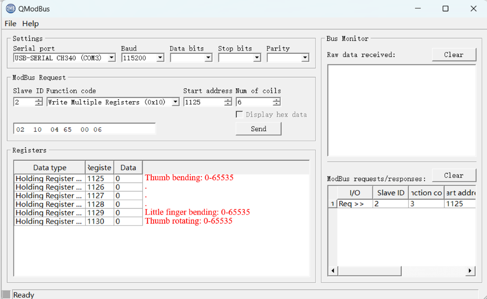

# Quick Start with QModBus

1. Download and upgrade firmware from [https://github.com/oymotion/roh_firmware](https://github.com/oymotion/roh_firmware).
2. Download and insatll [QModBus software](https://sourceforge.net/projects/qmodbus/files/latest/download).
3. Connect the USB-to-RS485 module and find the port number from device manager in Windows.
4. Open QModBus and select the correct port number.
5. The default Slave ID is '2'.
6. Choose function code '0x03'(Read Holding Registers), register start address '1000', num of coils '1', and read device information by clicking button 'Send':

1. Choose function code '0x10'(Write Mulitipue Registers),register start address '1125', num of coils '6'.Filling in the table with finger position (0-65535).The proper order is the rotation of thumb, index finger, middle finger, ring finger and little finger:

Set position of each finger by clicking button 'Send', and be careful not to interfere each finger.
