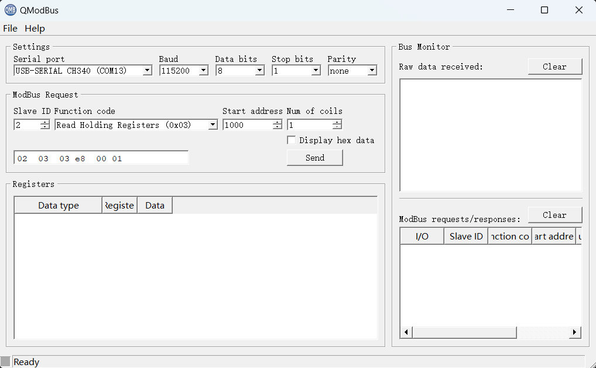
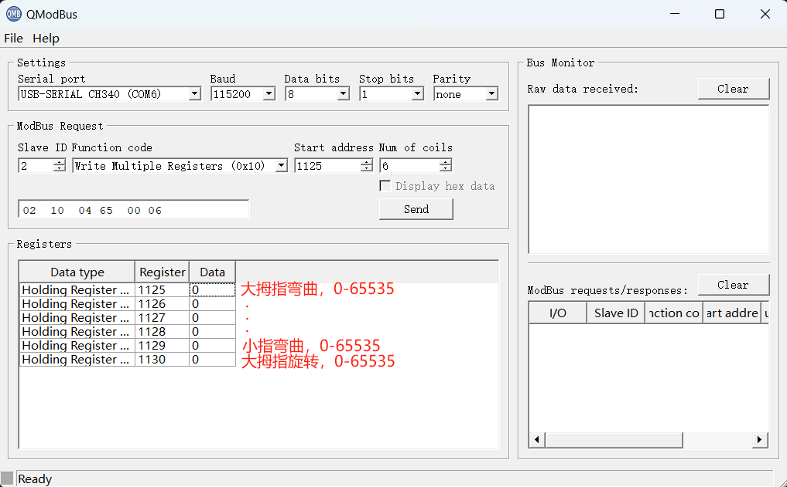

# Quick Start with QModBus

1. 从[https://github.com/oymotion/roh_firmware](https://github.com/oymotion/roh_firmware)下载并升级固件
2. 下载并安装[QModBus软件](https://sourceforge.net/projects/qmodbus/files/latest/download)
3. 连接USB转485模块并在windows的设备管理器里找到串口号
4. 打开QModBus并选择正确串口号
5. Slave ID默认2
6. 功能码选择0x03（读多个寄存器），寄存器1000，数量1，点击“Send”可以读取设备信息：

7. 功能码选择0x10（写多个寄存器），寄存器1125，数量6，在表格中分别填入手指位置（0-65535），依次为大拇指、食指、中指、无名指、小指、大拇指旋转：

点击“Send”可以设置各个手指位置，注意避免手指间相互干涉。
