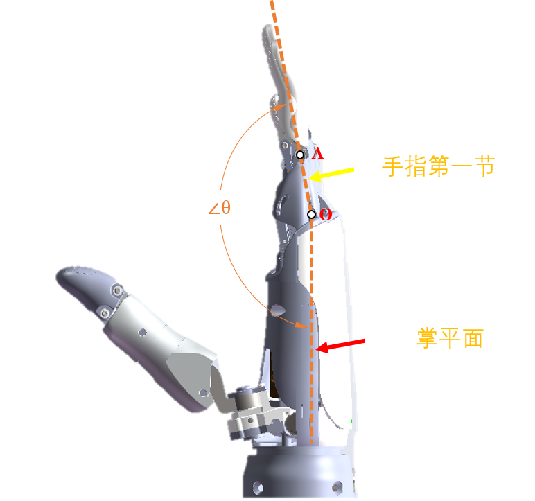
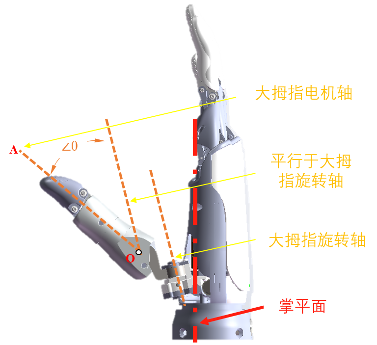

# OHand 通信协议 V3.0

## 1. 通信协议概要

用户主控单元通过发送命令数据实现对灵巧手的状态获取和控制。
上位系统向 ROH 灵巧手发送读指令，ROH 灵巧手收到指令数据并校验成功后，将相应的结果返回给上位系统。

## 2. RS232、RS485 通讯参数

RS232、RS485 通讯参数都是 115200bps、8 数据位、1 停止位、无奇偶校验。

## 3. 灵巧手串口指令帧格式

操作 ROH 灵巧手的指令帧格式如下：

| 字节                           | 数值                     | 说明                                                |
| ------------------------------ | ------------------------ | --------------------------------------------------- |
| byte[0]                        | 0x55                     | 包头                                                |
| byte[1]                        | 0xAA                     | 包头                                                |
| byte[2]                        | HandID                   | ROH 灵巧手 ID 号                                    |
| byte[3]                        | MasterID                 | 主机 ID 号                                          |
| byte[4]                        | Command                  | 操作命令                                            |
| byte[5]                        | DataLen                  | 该帧数据部分长度，即 byte[6]..byte[6 + DataLen - 1] |
| byte[6]..byte[6 + DataLen - 1] | Data[0]..Data[DataLen-1] | 命令数据                                            |
| byte[6 + DataLen]              | Checksum                 | 校验码（参见 4. LRC 校验码计算方式）                |

ROH 灵巧手对指令的回复帧如下：

| 字节                           | 数值                       | 说明                                                                                                       |
| ------------------------------ | -------------------------- | ---------------------------------------------------------------------------------------------------------- |
| byte[0]                        | 0x55                       | 包头                                                                                                       |
| byte[1]                        | 0xAA                       | 包头                                                                                                       |
| byte[2]                        | MasterID                   | 主机 ID 号                                                                                                 |
| byte[3]                        | HandID                     | ROH 灵巧手 ID 号                                                                                           |
| byte[4]                        | Command                    | 操作命令， 如果指令执行错误，那么最高位为 1，低七位为操作命令，Data[0]为错误代码（参见 6. 灵巧手错误代码） |
| byte[5]                        | DataLen                    | 该帧数据部分长度，即 byte[6]..byte[6 + DataLen - 1]                                                        |
| byte[6]..byte[6 + DataLen - 1] | Data[0]..Data[DataLen - 1] | 返回数据                                                                                                   |
| byte[6 + DataLen]              | Checksum                   | 校验码（参见 4. LRC 校验码计算方式）                                                                       |

## 4. LRC 校验码计算方式

灵巧手串口指令帧中 byte[2]..byte[6 + DataLen - 1]的各字节异或值:

```c
uint8_t buf[...];
uint8_t lrc = 0;
uint8_t cmd_data_len = 4/* sizeof(MasterID) + sizeof(HandID) + sizeof(Command) + sizeof(DataLen) */ + DataLen;

/* Fill buf */
buf[0] = 0x55;
buf[1] = 0xAA;
...

for (int i=0; i<cmd_data_len; i++)
    lrc ^= buf[2 + i];

buf[2 + cmd_data_len] = lrc;
```

## 5. 灵巧手指令

| 指令名称                          |   值 | 说明                                                     | 数据字节                                                                                                                                                                                                                                                           | 回复数据                                                                                                                                                                                                                            |
| :-------------------------------- | ---: | :------------------------------------------------------- | :----------------------------------------------------------------------------------------------------------------------------------------------------------------------------------------------------------------------------------------------------------------- | :---------------------------------------------------------------------------------------------------------------------------------------------------------------------------------------------------------------------------------- |
| HAND_CMD_GET_PROTOCOL_VERSION     | 0x00 | 获取协议版本                                             |                                                                                                                                                                                                                                                                    | [PROTOCOL_MINOR_VERSION, PROTOCOL_MAJOR_VERSION]                                                                                                                                                                                    |
| HAND_CMD_GET_FW_VERSION           | 0x01 | 获取固件版本                                             |                                                                                                                                                                                                                                                                    | [FW_REVISION_L, FW_REVISION_H, FW_MINOR_VERSION, FW_MAJOR_VERSION]                                                                                                                                                                  |
| HAND_CMD_GET_HW_VERSION           | 0x02 | 获取硬件版本                                             |                                                                                                                                                                                                                                                                    | [HW_TYPE, HW_VER, BOOT_VER_MAJOR, BOOT_VER_MINOR]                                                                                                                                                                                   |
| HAND_CMD_GET_CALI_DATA            | 0x03 | 获取校正数据                                             | [MOTOR_CNT, THUMB_ROOT_POS_CNT]                                                                                                                                                                                                                                    | [F0_RANGE_END_L, F0_RANGE_END_H, ..., Fn_RANGE_END_L, Fn_RANGE_END_H, F0_RANGE_START_L, F0_RANGE_START_H, ..., Fn_RANGE_START_L, Fn_RANGE_START_H, THUMB_ROOT_POS1_L, THUMB_ROOT_POS1_H, ..., THUMB_ROOT_POSn_L, THUMB_ROOT_POSn_H] |
| HAND_CMD_GET_FINGER_PID           | 0x04 | 获取手指PID值，数据类型 float32                          |                                                                                                                                                                                                                                                                    | [FINGER_ID, P_BYTE0, P_BYTE1, P_BYTE2, P_BYTE3, I_BYTE0, I_BYTE1, I_BYTE2, I_BYTE3, D_BYTE0, D_BYTE1, D_BYTE2, D_BYTE3, G_BYTE0, G_BYTE1, G_BYTE2, G_BYTE3]                                                                         |
| HAND_CMD_GET_FINGER_CURRENT_LIMIT | 0x05 | 获取手指电流限制值，单位mA                               |                                                                                                                                                                                                                                                                    | [FINGER_ID, CURRENT_LIMIT_L, CURRENT_LIMIT_H]                                                                                                                                                                                       |
| HAND_CMD_GET_FINGER_CURRENT       | 0x06 | 获取手指电流值，单位mA                                   |                                                                                                                                                                                                                                                                    | [FINGER_ID, CURRENT_L, CURRENT_H]                                                                                                                                                                                                   |
| HAND_CMD_GET_FINGER_FORCE_LIMIT   | 0x07 | 获取手指力量限制值，单位mN                               |                                                                                                                                                                                                                                                                    | [FINGER_ID, FORCE_LIMIT_L, FORCE_LIMIT_H]                                                                                                                                                                                           |
| HAND_CMD_GET_FINGER_FORCE         | 0x08 | 获取手指当前力量值，单位 mN                              |                                                                                                                                                                                                                                                                    | [FINGER_ID, FORCE_L, FORCE_H]                                                                                                                                                                                                       |
| HAND_CMD_GET_FINGER_POS_LIMIT     | 0x09 | 获取手指绝对位置限制值                                   |                                                                                                                                                                                                                                                                    | [FINGER_ID, POS_LIMIT_L, POS_LIMIT_H]                                                                                                                                                                                               |
| HAND_CMD_GET_FINGER_POS_ABS       | 0x0A | 获取手指当前绝对位置值                                   |                                                                                                                                                                                                                                                                    | [FINGER_ID, ABS_TARGET_POS_L, ABS_TARGET_POS_H, ABSOLUTE_POS_L, ABSOLUTE_POS_H]                                                                                                                                                     |
| HAND_CMD_GET_FINGER_POS           | 0x0B | 获取手指当前逻辑位置值                                   |                                                                                                                                                                                                                                                                    | [FINGER_ID, LOGICAL_TARGET_POS_L, LOGICAL_TARGET_POS_H, LOGICAL_POS_L, LOGICAL_POS_H]                                                                                                                                               |
| HAND_CMD_GET_FINGER_ANGLE         | 0x0C | 获取手指第一关节角度，等于实际值 \* 100                  |                                                                                                                                                                                                                                                                    | [FINGER_ID, TARGET_ANGLE_L, TARGET_ANGLE_H, CURRENT_ANGLE_L, CURRENT_ANGLE_H]                                                                                                                                                       |
| HAND_CMD_GET_THUMB_ROOT_POS       | 0x0D | 获取大拇指旋转预设位置, {0, 1, 2, 255}, 255 为未知       |                                                                                                                                                                                                                                                                    | [PRESET_POS]                                                                                                                                                                                                                        |
| HAND_CMD_GET_FINGER_POS_ABS_ALL   | 0x0E | 获取所有手指当前的绝对位置                               | [MOTOR_CNT]                                                                                                                                                                                                                                                        | [F0_TARGET_ABS_POS_L, F0_TARGET_ABS_POS_H, ..., Fn_TARGET_ABS_POS_L, Fn_TARGET_ABS_POS_H, F0_CURRENT_ABS_POS_L, F0_CURRENT_ABS_POS_H, ..., Fn_CURRENT_ABS_POS_L, Fn_CURRENT_ABS_POS_H]                                              |
| HAND_CMD_GET_FINGER_POS_ALL       | 0x0F | 获取所有手指当前的逻辑位置                               | [MOTOR_CNT]                                                                                                                                                                                                                                                        | [F0_TARGET_LOGICAL_POS_L, F0_TARGET_LOGICAL_POS_H, ..., Fn_TARGET_LOGICAL_POS_L, Fn_TARGET_LOGICAL_POS_H, F0_CURRENT_LOGICAL_POS_L, F0_CURRENT_LOGICAL_POS_H, ..., Fn_CURRENT_LOGICAL_POS_L, Fn_CURRENT_LOGICAL_POS_H]              |
| HAND_CMD_GET_FINGER_ANGLE_ALL     | 0x10 | 获取所有手指第一关节角度，等于实际值 \* 100              | [MOTOR_CNT]                                                                                                                                                                                                                                                        | [F0_TARGET_ANGLE_L, F0_TARGET_ANGLE_H, ..., Fn_TARGET_ANGLE_L, Fn_TARGET_ANGLE_H, F0_CURRENT_ANGLE_L, F0_CURRENT_ANGLE_H, ..., Fn_CURRENT_ANGLE_L, Fn_CURRENT_ANGLE_H]                                                              |
| HAND_CMD_GET_SELF_TEST_SWITCH     | 0x20 | 获取自检开关状态，0：关，1：开                           |                                                                                                                                                                                                                                                                    | [ON_OFF]                                                                                                                                                                                                                            |
| HAND_CMD_GET_BEEP_SWITCH          | 0x21 | 获取蜂鸣器开关状态，0：关，1：开                         |                                                                                                                                                                                                                                                                    | [ON_OFF]                                                                                                                                                                                                                            |
| HAND_CMD_GET_BUTTON_PRESSED_CNT   | 0x22 | 获取按钮按下次数，ROHand请忽略                           |                                                                                                                                                                                                                                                                    | [BTN_PRESSED_CNT]                                                                                                                                                                                                                   |
| HAND_CMD_GET_UID                  | 0x23 | 获取手UID                                                |                                                                                                                                                                                                                                                                    | [UID0_BYTE0, UID0_BYTE1, UID0_BYTE2, UID0_BYTE3, UID1_BYTE0, UID1_BYTE1, UID1_BYTE2, UID1_BYTE3, UID2_BYTE0, UID2_BYTE1, UID2_BYTE2, UID2_BYTE3]                                                                                    |
| HAND_CMD_GET_BATTERY_VOLTAGE      | 0x24 | 获取电池电压，单位mV，ROHand请忽略                       |                                                                                                                                                                                                                                                                    | [BATTERY_VOLTAGE_L, BATTERY_VOLTAGE_H]                                                                                                                                                                                              |
| HAND_CMD_GET_USAGE_STAT           | 0x25 | 获取使用数据，ROHand请忽略                               |                                                                                                                                                                                                                                                                    |                                                                                                                                                                                                                                     |
| HAND_CMD_RESET                    | 0x40 | 重启，MODE=0：重启进入工作状态；MODE=1：重启进入DFU模式  | [MODE]                                                                                                                                                                                                                                                             |                                                                                                                                                                                                                                     | ：重启进入工作状态 | [MODE] |  |
| HAND_CMD_POWER_OFF                | 0x41 | 关机，ROHand请忽略                                       |                                                                                                                                                                                                                                                                    |                                                                                                                                                                                                                                     |
| HAND_CMD_SET_NODE_ID              | 0x42 | 设置手节点ID                                             |                                                                                                                                                                                                                                                                    |                                                                                                                                                                                                                                     |
| HAND_CMD_CALIBRATE                | 0x43 | 校正手，仅限出厂使用                                     | [KEY_L, KEY_H]                                                                                                                                                                                                                                                     |                                                                                                                                                                                                                                     |
| HAND_CMD_SET_CALI_DATA            | 0x44 | 设置校正数据                                             | [MOTOR_CNT, F0_RANGE_END_L, F0_RANGE_END_H, ..., Fn_RANGE_END_L, Fn_RANGE_END_H, F0_RANGE_START_L, F0_RANGE_START_H, ..., Fn_RANGE_START_L, Fn_RANGE_START_H, THUMB_ROOT_POS_CNT, THUMB_ROOT_POS1_L, THUMB_ROOT_POS1_H, ..., THUMB_ROOT_POSn_L, THUMB_ROOT_POSn_H] |                                                                                                                                                                                                                                     |
| HAND_CMD_SET_FINGER_PID           | 0x45 | 设置手指PID值，数据类型 float32                          | [FINGER_ID, P_BYTE0, P_BYTE1, P_BYTE2, P_BYTE3, I_BYTE0, I_BYTE1, I_BYTE2, I_BYTE3, D_BYTE0, D_BYTE1, D_BYTE2, D_BYTE3, G_BYTE0, G_BYTE1, G_BYTE2, G_BYTE3]                                                                                                        |                                                                                                                                                                                                                                     |
| HAND_CMD_SET_FINGER_CURRENT_LIMIT | 0x46 | 设置手指电流限制， [0, 65535]                            | [FINGER_ID, CURRENT_LIMIT_L, CURRENT_LIMIT_H]                                                                                                                                                                                                                      |                                                                                                                                                                                                                                     |
| HAND_CMD_SET_FINGER_FORCE_LIMIT   | 0x47 | 设置手指力量限制， [0, 65535]                            | [FINGER_ID, FORCE_LIMIT_L, FORCE_LIMIT_H]                                                                                                                                                                                                                          |                                                                                                                                                                                                                                     |
| HAND_CMD_SET_FINGER_POS_LIMIT     | 0x48 | 设置手指绝对位置限制， [0, 65535]                        | [FINGER_ID, POS_LIMIT_L, POS_LIMIT_H]                                                                                                                                                                                                                              |                                                                                                                                                                                                                                     |
| HAND_CMD_FINGER_START             | 0x49 | 开始移动手指                                             |                                                                                                                                                                                                                                                                    |                                                                                                                                                                                                                                     |
| HAND_CMD_FINGER_STOP              | 0x4A | 停止移动手指                                             |                                                                                                                                                                                                                                                                    |                                                                                                                                                                                                                                     |
| HAND_CMD_SET_FINGER_POS_ABS       | 0x4B | 移动手指到绝对位置， [0, 65535]                          | [FINGER_ID, ABSOLUTE_POS_L, ABSOLUTE_POS_H, SPEED]                                                                                                                                                                                                                 |                                                                                                                                                                                                                                     |
| HAND_CMD_SET_FINGER_POS           | 0x4C | 移动手指到逻辑位置，[0, 65535]                           | [FINGER_ID, LOGICAL_POS_L, LOGICAL_POS_H, SPEED]                                                                                                                                                                                                                   |                                                                                                                                                                                                                                     |
| HAND_CMD_SET_FINGER_ANGLE         | 0x4D | 设置手指角度， [0, 65535]，等于实际值 \* 100             | [FINGER_ID, TARGET_ANGLE_L, TARGET_ANGLE_H, SPEED]                                                                                                                                                                                                                 |                                                                                                                                                                                                                                     |
| HAND_CMD_SET_THUMB_ROOT_POS       | 0x4E | 旋转大拇指到预设位置，{0,1,2}                            | [PRESET_POS]                                                                                                                                                                                                                                                       |                                                                                                                                                                                                                                     |
| HAND_CMD_SET_FINGER_POS_ABS_ALL   | 0x4F | 设置所有手指的绝对位置                                   | [MOTOR_CNT, F0_ABS_POS_L, F0_ABS_POS_H, F0_SPEED, ..., Fn_ABS_POS_L, Fn_ABS_POS_H, Fn_SPEED]                                                                                                                                                                       | [LOGICAL_POS_L, LOGICAL_POS_H]                                                                                                                                                                                                      |
| HAND_CMD_SET_FINGER_POS_ALL       | 0x50 | 设置所有手指的绝对位置                                   | [MOTOR_CNT, F0_POS_L, F0_POS_H, F0_SPEED, ..., Fn_POS_L, Fn_POS_H, Fn_SPEED]                                                                                                                                                                                       | [LOGICAL_POS_L, LOGICAL_POS_H]                                                                                                                                                                                                      |
| HAND_CMD_SET_FINGER_ANGLE_ALL     | 0x51 | 设置所有手指第一关节角度， [0, 65535]，等于实际值 \* 100 | [MOTOR_CNT, F0_ANGLE_L, F0_ANGLE_H, F0_SPEED, ..., Fn_ANGLE_L, Fn_ANGLE_H, Fn_SPEED]                                                                                                                                                                               | [LOGICAL_POS_L, LOGICAL_POS_H]                                                                                                                                                                                                      |
| HAND_CMD_SET_CUSTOM               | 0x5F | 自定义指令                                               | [MOTOR_CNT, DATA_FLAG, ...]                                                                                                                                                                                                                                        | [...]                                                                                                                                                                                                                               |
| HAND_CMD_SET_SELF_TEST_LEVEL      | 0x60 | 设置自检等级，0：等待指令，1：半自检，2：完整自检        | [SELF_TEST_LEVEL]                                                                                                                                                                                                                                                  |                                                                                                                                                                                                                                     |
| HAND_CMD_SET_BEEP_SWITCH          | 0x61 | 设置蜂鸣器状态，0：关，1：开                             | [ON_OFF]                                                                                                                                                                                                                                                           |                                                                                                                                                                                                                                     |
| HAND_CMD_BEEP                     | 0x62 | 蜂鸣一段时间，单位ms，[0, 65535]                         | [BEEP_PERIOD_L, BEEP_PERIOD_H]                                                                                                                                                                                                                                     |                                                                                                                                                                                                                                     |
| HAND_CMD_SET_BUTTON_PRESSED_CNT   | 0x63 | 设置按钮按下次数，仅限校正                               | [BTN_PRESSED_CNT]                                                                                                                                                                                                                                                  |                                                                                                                                                                                                                                     |
| HAND_CMD_START_INIT               | 0x64 | 开始初始化为了使 SELF_TEST_LEVEL=0                       |                                                                                                                                                                                                                                                                    |                                                                                                                                                                                                                                     |

注：

1. 如果不加说明，单字节数据为 uint8 类型，XXX_L, XXX_H 表示 uint16 类型的低字节和高字节；XXX_BYTE0, XXX_BYTE1, XXX_BYTE2, XXX_BYTE3 表示 uint32 类型自低到高 4 个字节；
2. 若指定为 float32 类型，XXX_BYTE0, XXX_BYTE1, XXX_BYTE2, XXX_BYTE3 表示 float32 类型自低到高 4 个字节。

## 6. 灵巧手错误代码

| 错误名                         | 代码 | 说明                             | 分组 |
| ------------------------------ | ---- | -------------------------------- | ---- |
| ERR_PROTOCOL_WRONG_CRC         | 0x01 | 校验码错误                       | 协议 |
| ERR_COMMAND_INVALID            | 0x11 | 无效的命令                       | 命令 |
| ERR_COMMAND_INVALID_BYTE_COUNT | 0x12 | 字节数不正确                     | 命令 |
| ERR_COMMAND_INVALID_DATA       | 0x13 | 无效的值                         | 命令 |
| ERR_STATUS_INIT                | 0x21 | 正在等待初始化命令或者正在初始化 | 状态 |
| ERR_STATUS_CALI                | 0x22 | 等待校正                         | 状态 |
| ERR_STATUS_STUCK               | 0x23 | 电机堵转                         | 状态 |
| ERR_OP_FAILED                  | 0x31 | 操作失败                         | 操作 |
| ERR_SAVE_FAILED                | 0x32 | 保存失败                         | 操作 |

## 7. 手指角度

角度定义及运动范围说明：
|                           角度                           |                图例说明                 |                                               角度范围                                               |
| :------------------------------------------------------: | :-------------------------------------: | :--------------------------------------------------------------------------------------------------: |
| 食指 </br></br> 中指 </br></br> 无名指 </br></br> 小拇指 |  | 100.22°~178.37° </br></br> 97.81° ~ 176.06° </br></br> 101.38° ~ 176.54° </br></br> 98.84° ~ 174.86° |
|                        大拇指弯曲                        |   |                                            2.26° ~ 36.76°                                            |
|                        大拇指旋转                        |  |                                               0° ~ 90°                                               |
