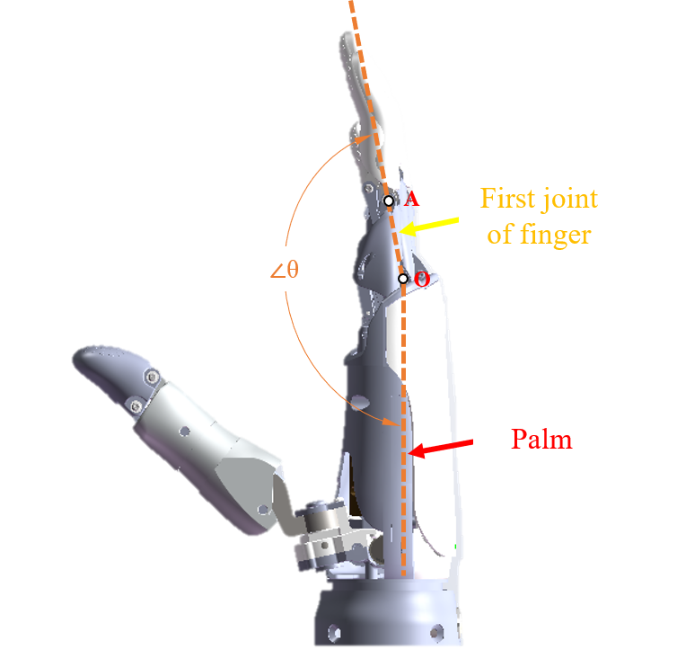
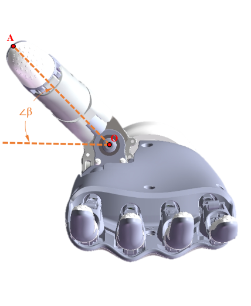

# OHand Conmmunication Protocol V3.0

## 1. Communication Protocol Overview

The user control unit sends command data to control the state of the ROH dexterous hand.
The upper system sends read instructions to the ROH dexterous hand, and the ROH dexterous hand receives the instruction data and returns the corresponding result to the upper system after the instruction data is successfully verified.  

## 2. Parameters of RS232、RS485 Communication

The communication parameters of RS232、RS485 are 115200bps、8 data bits、1 stop bit、no parity.

## 3. OHand Serial Command Frame Format

The instruction frame format for operating the ROH dexterous hand is as follows:

| Byte                           | Value                    | Description                                                                   |
| ------------------------------ | ------------------------ | ----------------------------------------------------------------------------- |
| byte[0]                        | 0x55                     | Header                                                                        |
| byte[1]                        | 0xAA                     | Header                                                                        |
| byte[2]                        | HandID                   | ROH dexterous hand ID number                                                  |
| byte[3]                        | MasterID                 | Host ID number                                                                |
| byte[4]                        | Command                  | Operation command                                                             |
| byte[5]                        | DataLen                  | Length of the data part of the frame, that is, byte[6]..byte[6 + DataLen - 1] |
| byte[6]..byte[6 + DataLen - 1] | Data[0]..Data[DataLen-1] | Command data                                                                  |
| byte[6 + DataLen]              | Checksum                 | Check code(see in 4. LRC check code calculation method)                       |

## 4. Calculation Method of LRC Check Code

The XOR values of each byte in the instruction frame of the dexterous serial port from byte[2] to byte[6 + DataLen - 1]:

```c
uint8_t buf[...];
uint8_t lrc = 0;
uint8_t cmd_data_len = 4/* sizeof(MasterID) + sizeof(HandID) + sizeof(Command) + sizeof(DataLen) */ + DataLen;

/* Fill buf */
buf[0] = 0x55;
buf[1] = 0xAA;
...

for (int i=0; i<cmd_data_len; i++)
    lrc ^= buf[2 + i];

buf[2 + cmd_data_len] = lrc;
```

## 5. Commands

| Command Name                      | Command Value | Command Description                                                               | Command Data Bytes                                                                                                                                                                                                                                                 | Command Response Data                                                                                                                                                                                                               |
| :-------------------------------- | ------------: | :-------------------------------------------------------------------------------- | :----------------------------------------------------------------------------------------------------------------------------------------------------------------------------------------------------------------------------------------------------------------- | :---------------------------------------------------------------------------------------------------------------------------------------------------------------------------------------------------------------------------------- |
| HAND_CMD_GET_PROTOCOL_VERSION     |          0x00 | Get protocol version                                                              |                                                                                                                                                                                                                                                                    | [PROTOCOL_MINOR_VERSION, PROTOCOL_MAJOR_VERSION]                                                                                                                                                                                    |
| HAND_CMD_GET_FW_VERSION           |          0x01 | Get firmware version                                                              |                                                                                                                                                                                                                                                                    | [FW_REVISION_L, FW_REVISION_H, FW_MINOR_VERSION, FW_MAJOR_VERSION]                                                                                                                                                                  |
| HAND_CMD_GET_HW_VERSION           |          0x02 | Get hardware version                                                              |                                                                                                                                                                                                                                                                    | [HW_TYPE, HW_VER, BOOT_VER_MAJOR, BOOT_VER_MINOR]                                                                                                                                                                                   |
| HAND_CMD_GET_CALI_DATA            |          0x03 | Get calibration data                                                              | [MOTOR_CNT, THUMB_ROOT_POS_CNT]                                                                                                                                                                                                                                    | [F0_RANGE_END_L, F0_RANGE_END_H, ..., Fn_RANGE_END_L, Fn_RANGE_END_H, F0_RANGE_START_L, F0_RANGE_START_H, ..., Fn_RANGE_START_L, Fn_RANGE_START_H, THUMB_ROOT_POS1_L, THUMB_ROOT_POS1_H, ..., THUMB_ROOT_POSn_L, THUMB_ROOT_POSn_H] |
| HAND_CMD_GET_FINGER_PID           |          0x04 | Get PID value of finger, PID values are all in float32                            |                                                                                                                                                                                                                                                                    | [FINGER_ID, P_BYTE0, P_BYTE1, P_BYTE2, P_BYTE3, I_BYTE0, I_BYTE1, I_BYTE2, I_BYTE3, D_BYTE0, D_BYTE1, D_BYTE2, D_BYTE3, G_BYTE0, G_BYTE1, G_BYTE2, G_BYTE3]                                                                         |
| HAND_CMD_GET_FINGER_CURRENT_LIMIT |          0x05 | Get current limit of finger in mA                                                 |                                                                                                                                                                                                                                                                    | [FINGER_ID, CURRENT_LIMIT_L, CURRENT_LIMIT_H]                                                                                                                                                                                       |
| HAND_CMD_GET_FINGER_CURRENT       |          0x06 | Get current of finger in mA                                                       |                                                                                                                                                                                                                                                                    | [FINGER_ID, CURRENT_L, CURRENT_H]                                                                                                                                                                                                   |
| HAND_CMD_GET_FINGER_FORCE_LIMIT   |          0x07 | Get force limit of finger in mN                                                   |                                                                                                                                                                                                                                                                    | [FINGER_ID, FORCE_LIMIT_L, FORCE_LIMIT_H]                                                                                                                                                                                           |
| HAND_CMD_GET_FINGER_FORCE         |          0x08 | Get current force of finger in mN                                                 |                                                                                                                                                                                                                                                                    | [FINGER_ID, FORCE_L, FORCE_H]                                                                                                                                                                                                       |
| HAND_CMD_GET_FINGER_POS_LIMIT     |          0x09 | Get absolute pos limit of finger                                                  |                                                                                                                                                                                                                                                                    | [FINGER_ID, POS_LIMIT_L, POS_LIMIT_H]                                                                                                                                                                                               |
| HAND_CMD_GET_FINGER_POS_ABS       |          0x0A | Get current absolute position of finger                                           |                                                                                                                                                                                                                                                                    | [FINGER_ID, ABS_TARGET_POS_L, ABS_TARGET_POS_H, ABSOLUTE_POS_L, ABSOLUTE_POS_H]                                                                                                                                                     |
| HAND_CMD_GET_FINGER_POS           |          0x0B | Get current logical position of finger                                            |                                                                                                                                                                                                                                                                    | [FINGER_ID, LOGICAL_TARGET_POS_L, LOGICAL_TARGET_POS_H, LOGICAL_POS_L, LOGICAL_POS_H]                                                                                                                                               |
| HAND_CMD_GET_FINGER_ANGLE         |          0x0C | Get first joint angle of finger, value = angle \* 100                             |                                                                                                                                                                                                                                                                    | [FINGER_ID, TARGET_ANGLE_L, TARGET_ANGLE_H, CURRENT_ANGLE_L, CURRENT_ANGLE_H]                                                                                                                                                       |
| HAND_CMD_GET_THUMB_ROOT_POS       |          0x0D | Get preset position of thumb root, {0, 1, 2, 255}, 255 as unknown                 |                                                                                                                                                                                                                                                                    | [PRESET_POS]                                                                                                                                                                                                                        |
| HAND_CMD_GET_FINGER_POS_ABS_ALL   |          0x0E | Get current absolute positions of all fingers                                     | [MOTOR_CNT]                                                                                                                                                                                                                                                        | [F0_TARGET_ABS_POS_L, F0_TARGET_ABS_POS_H, ..., Fn_TARGET_ABS_POS_L, Fn_TARGET_ABS_POS_H, F0_CURRENT_ABS_POS_L, F0_CURRENT_ABS_POS_H, ..., Fn_CURRENT_ABS_POS_L, Fn_CURRENT_ABS_POS_H]                                              |
| HAND_CMD_GET_FINGER_POS_ALL       |          0x0F | Get current logical positions of all fingers                                      | [MOTOR_CNT]                                                                                                                                                                                                                                                        | [F0_TARGET_LOGICAL_POS_L, F0_TARGET_LOGICAL_POS_H, ..., Fn_TARGET_LOGICAL_POS_L, Fn_TARGET_LOGICAL_POS_H, F0_CURRENT_LOGICAL_POS_L, F0_CURRENT_LOGICAL_POS_H, ..., Fn_CURRENT_LOGICAL_POS_L, Fn_CURRENT_LOGICAL_POS_H]              |
| HAND_CMD_GET_FINGER_ANGLE_ALL     |          0x10 | Get first joint angles of all fingers, value = angle \* 100 - NOT implemented yet | [MOTOR_CNT]                                                                                                                                                                                                                                                        | [F0_TARGET_ANGLE_L, F0_TARGET_ANGLE_H, ..., Fn_TARGET_ANGLE_L, Fn_TARGET_ANGLE_H, F0_CURRENT_ANGLE_L, F0_CURRENT_ANGLE_H, ..., Fn_CURRENT_ANGLE_L, Fn_CURRENT_ANGLE_H]                                                              |
| HAND_CMD_GET_SELF_TEST_SWITCH     |          0x20 | Get self-test on/off state, 0:OFF, 1:ON                                           |                                                                                                                                                                                                                                                                    | [ON_OFF]                                                                                                                                                                                                                            |
| HAND_CMD_GET_BEEP_SWITCH          |          0x21 | Get beep on/off state, 0:OFF, 1:ON                                                |                                                                                                                                                                                                                                                                    | [ON_OFF]                                                                                                                                                                                                                            |
| HAND_CMD_GET_BUTTON_PRESSED_CNT   |          0x22 | Get button pressed count, ignore for ROH please                                   |                                                                                                                                                                                                                                                                    | [BTN_PRESSED_CNT]                                                                                                                                                                                                                   |
| HAND_CMD_GET_UID                  |          0x23 | Get UID of hand                                                                   |                                                                                                                                                                                                                                                                    | [UID0_BYTE0, UID0_BYTE1, UID0_BYTE2, UID0_BYTE3, UID1_BYTE0, UID1_BYTE1, UID1_BYTE2, UID1_BYTE3, UID2_BYTE0, UID2_BYTE1, UID2_BYTE2, UID2_BYTE3]                                                                                    |
| HAND_CMD_GET_BATTERY_VOLTAGE      |          0x24 | Get battery voltage in mV, ignore for ROH please                                  |                                                                                                                                                                                                                                                                    | [BATTERY_VOLTAGE_L, BATTERY_VOLTAGE_H]                                                                                                                                                                                              |
| HAND_CMD_GET_USAGE_STAT           |          0x25 | Get usage stats, ignore for ROH please                                            |                                                                                                                                                                                                                                                                    |                                                                                                                                                                                                                                     |
| HAND_CMD_RESET                    |          0x40 | Reset, MODE=0: reset to working state; MODE=1: reset to DFU mode                  | [MODE]                                                                                                                                                                                                                                                             |                                                                                                                                                                                                                                     | boot loader | [MODE] |  |
| HAND_CMD_POWER_OFF                |          0x41 | Power off, ignore for ROH please                                                  |                                                                                                                                                                                                                                                                    |                                                                                                                                                                                                                                     |
| HAND_CMD_SET_NODE_ID              |          0x42 | Set hand node ID                                                                  | [NODE_ID]                                                                                                                                                                                                                                                          |                                                                                                                                                                                                                                     | ]           |        |
| HAND_CMD_CALIBRATE                |          0x43 | Calibrate hand, for factory use only                                              | [KEY_L, KEY_H]                                                                                                                                                                                                                                                     |                                                                                                                                                                                                                                     |
| HAND_CMD_SET_CALI_DATA            |          0x44 | Set calibration data                                                              | [MOTOR_CNT, F0_RANGE_END_L, F0_RANGE_END_H, ..., Fn_RANGE_END_L, Fn_RANGE_END_H, F0_RANGE_START_L, F0_RANGE_START_H, ..., Fn_RANGE_START_L, Fn_RANGE_START_H, THUMB_ROOT_POS_CNT, THUMB_ROOT_POS1_L, THUMB_ROOT_POS1_H, ..., THUMB_ROOT_POSn_L, THUMB_ROOT_POSn_H] |                                                                                                                                                                                                                                     |
| HAND_CMD_SET_FINGER_PID           |          0x45 | Set PID value for finger, PID values are all in float32                           | [FINGER_ID, P_BYTE0, P_BYTE1, P_BYTE2, P_BYTE3, I_BYTE0, I_BYTE1, I_BYTE2, I_BYTE3, D_BYTE0, D_BYTE1, D_BYTE2, D_BYTE3, G_BYTE0, G_BYTE1, G_BYTE2, G_BYTE3]                                                                                                        |                                                                                                                                                                                                                                     |
| HAND_CMD_SET_FINGER_CURRENT_LIMIT |          0x46 | Set current limit for finger, [0, 65535]                                          | [FINGER_ID, CURRENT_LIMIT_L, CURRENT_LIMIT_H]                                                                                                                                                                                                                      |                                                                                                                                                                                                                                     |
| HAND_CMD_SET_FINGER_FORCE_LIMIT   |          0x47 | Set force limit for finger, [0, 65535]                                            | [FINGER_ID, FORCE_LIMIT_L, FORCE_LIMIT_H]                                                                                                                                                                                                                          |                                                                                                                                                                                                                                     |
| HAND_CMD_SET_FINGER_POS_LIMIT     |          0x48 | Set absolute pos limit for finger, [0, 65535]                                     | [FINGER_ID, POS_LIMIT_L, POS_LIMIT_H]                                                                                                                                                                                                                              |                                                                                                                                                                                                                                     |
| HAND_CMD_FINGER_START             |          0x49 | Start finger                                                                      |                                                                                                                                                                                                                                                                    |                                                                                                                                                                                                                                     |
| HAND_CMD_FINGER_STOP              |          0x4A | Stop finger                                                                       |                                                                                                                                                                                                                                                                    |                                                                                                                                                                                                                                     |
| HAND_CMD_SET_FINGER_POS_ABS       |          0x4B | Move finger to physical position, [0, 65535]                                      | [FINGER_ID, ABSOLUTE_POS_L, ABSOLUTE_POS_H, SPEED]                                                                                                                                                                                                                 |                                                                                                                                                                                                                                     |
| HAND_CMD_SET_FINGER_POS           |          0x4C | Move finger to logical position, [0, 65535]                                       | [FINGER_ID, LOGICAL_POS_L, LOGICAL_POS_H, SPEED]                                                                                                                                                                                                                   |                                                                                                                                                                                                                                     |
| HAND_CMD_SET_FINGER_ANGLE         |          0x4D | Set angle of finger, [0, 65535], value = angle \* 100                             | [FINGER_ID, TARGET_ANGLE_L, TARGET_ANGLE_H, SPEED]                                                                                                                                                                                                                 |                                                                                                                                                                                                                                     |
| HAND_CMD_SET_THUMB_ROOT_POS       |          0x4E | Move thumb root to preset position, {0,1,2}                                       | [PRESET_POS]                                                                                                                                                                                                                                                       |                                                                                                                                                                                                                                     |
| HAND_CMD_SET_FINGER_POS_ABS_ALL   |          0x4F | Set absolute positions for all fingers                                            | [MOTOR_CNT, F0_ABS_POS_L, F0_ABS_POS_H, F0_SPEED, ..., Fn_ABS_POS_L, Fn_ABS_POS_H, Fn_SPEED]                                                                                                                                                                       | [LOGICAL_POS_L, LOGICAL_POS_H]                                                                                                                                                                                                      |
| HAND_CMD_SET_FINGER_POS_ALL       |          0x50 | Set logical positions for all fingers                                             | [MOTOR_CNT, F0_POS_L, F0_POS_H, F0_SPEED, ..., Fn_POS_L, Fn_POS_H, Fn_SPEED]                                                                                                                                                                                       | [LOGICAL_POS_L, LOGICAL_POS_H]                                                                                                                                                                                                      |
| HAND_CMD_SET_FINGER_ANGLE_ALL     |          0x51 | Set first joint angles for all fingers, [0, 65535], value = angle \* 100          | [MOTOR_CNT, F0_ANGLE_L, F0_ANGLE_H, F0_SPEED, ..., Fn_ANGLE_L, Fn_ANGLE_H, Fn_SPEED]                                                                                                                                                                               | [LOGICAL_POS_L, LOGICAL_POS_H]                                                                                                                                                                                                      |
| HAND_CMD_SET_CUSTOM               |          0x5F | Custom set command                                                                | [MOTOR_CNT, DATA_FLAG, ...]                                                                                                                                                                                                                                        | [...]                                                                                                                                                                                                                               |
| HAND_CMD_SET_SELF_TEST_LEVEL      |          0x60 | Set self-test level, 0: wait command, 1: semi self-test, 2: full self-test        | [SELF_TEST_LEVEL]                                                                                                                                                                                                                                                  |                                                                                                                                                                                                                                     |
| HAND_CMD_SET_BEEP_SWITCH          |          0x61 | Set beep on/off state, 0:OFF, 1:ON                                                | [ON_OFF]                                                                                                                                                                                                                                                           |                                                                                                                                                                                                                                     |
| HAND_CMD_BEEP                     |          0x62 | Beep for a period in ms, [0, 65535]                                               | [BEEP_PERIOD_L, BEEP_PERIOD_H]                                                                                                                                                                                                                                     |                                                                                                                                                                                                                                     |
| HAND_CMD_SET_BUTTON_PRESSED_CNT   |          0x63 | Set button pressed count, for calibration only                                    | [BTN_PRESSED_CNT]                                                                                                                                                                                                                                                  |                                                                                                                                                                                                                                     |
| HAND_CMD_START_INIT               |          0x64 | Start init in case of SELF_TEST_LEVEL=0                                           |                                                                                                                                                                                                                                                                    |                                                                                                                                                                                                                                     |

Note:

1. If not specified, single-byte data is uint8 type, XXX_L, XXX_H represent the low byte and high byte of uint16 type; XXX_BYTE0, XXX_BYTE1, XXX_BYTE2, XXX_BYTE3 represent the 4 bytes from low to high of uint32 type;
2. If specified as float32 type, XXX_BYTE0, XXX_BYTE1, XXX_BYTE2, XXX_BYTE3 represent the 4 bytes from low to high of float32 type.

## 6. Dexterous Hand Error Codes

| Error Name                     | Code | Description         | Group     |
| ------------------------------ | ---- | ------------------- | --------- |
| ERR_PROTOCOL_WRONG_CRC         | 0x01 | CRC error           | Protocol  |
| ERR_COMMAND_INVALID            | 0x11 | Invalid command     | Command   |
| ERR_COMMAND_INVALID_BYTE_COUNT | 0x12 | Invalid byte count  | Command   |
| ERR_COMMAND_INVALID_DATA       | 0x13 | Invalid data        | Command   |
| ERR_STATUS_INIT                | 0x21 | Initializing        | Status    |
| ERR_STATUS_CALI                | 0x22 | Waiting calibration | Status    |
| ERR_STATUS_STUCK               | 0x23 | Motor stuck         | Status    |
| ERR_OP_FAILED                  | 0x31 | Operation failed    | Operation |
| ERR_SAVE_FAILED                | 0x32 | Save failed         | Operation |

## 7. Finger Angle

Description of angle definition and motion range:
|                                         Angle                                         |                  Legend                   |                                             Angle range                                              |
| :-----------------------------------------------------------------------------------: | :---------------------------------------: | :--------------------------------------------------------------------------------------------------: |
| Index finger </br></br> Middle finger </br></br> Ring finger </br></br> Little finger |  | 100.22°~178.37° </br></br> 97.81° ~ 176.06° </br></br> 101.38° ~ 176.54° </br></br> 98.84° ~ 174.86° |
|                                     Thumb bending                                     |   |                                            2.26° ~ 36.76°                                            |
|                                    Thumb rotation                                     |    |                                               0° ~ 90°                                               |
